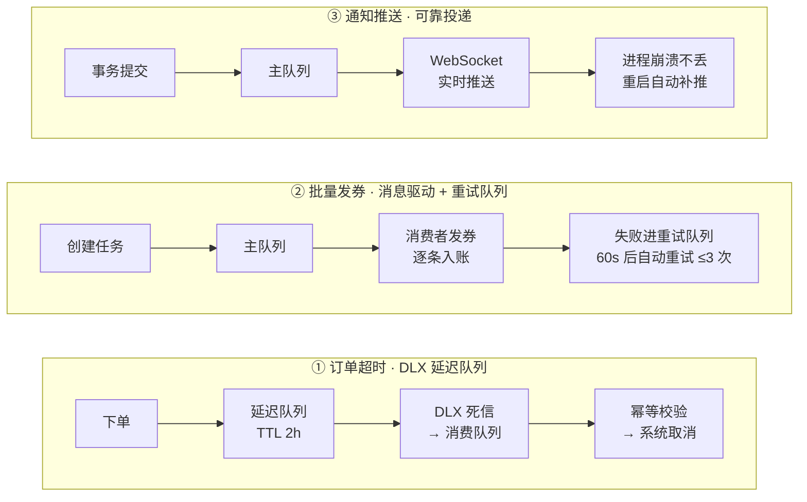
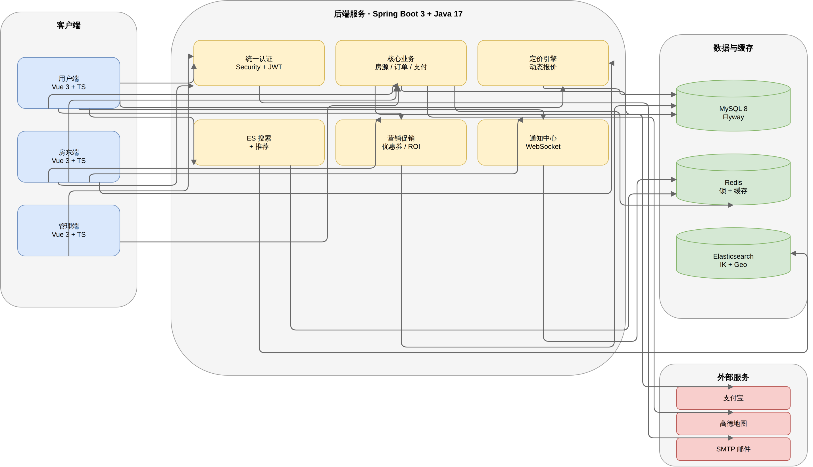

# 民宿预订平台 (Homestay Booking Platform)


**[English](README_EN.md)** | 中文

民宿预订平台是一个连接房客、房东和平台管理员的综合业务系统，覆盖房源发布、平台审核、在线搜索、下单支付、入住退房、评价反馈、收益统计和后台监管等完整流程。

> 25 个业务模块 · 10W+ 行代码 · 267 次 commit · 持续迭代 16 个月 · 50+ 篇项目文档

## 项目背景

Homestay 是一个**单人独立交付**的全栈项目，覆盖 25 个业务模块、10W+ 行代码，后端 Spring Boot 3 + 前端 Vue 3 + MySQL / Redis / Elasticsearch / 支付宝完整链路。

项目从 2025 年 2 月持续迭代至今，我借助 AI 编码工具（Cursor / Claude Code / Kimi Code CLI 等）完成 90% 的编码工作，自己负责**架构设计、需求决策、代码审查、关键模块攻关与质量把控**。

这种工作流让我一个人就能 cover 三端（用户端 / 房东端 / 管理员端）的全部交付，也是 2026 年 AI 时代全栈工程师的一个真实缩影。

> 工具链迭代：Cursor Pro → Claude Code CLI → Kimi Code CLI

## 目录

- [项目亮点](#项目亮点)
- [技术栈](#技术栈)
- [系统架构](#系统架构)
- [系统角色](#系统角色)
- [功能概览](#功能概览)
- [核心业务流程](#核心业务流程)
- [项目结构](#项目结构)
- [快速开始](#快速开始)
- [配置说明](#配置说明)
- [测试与构建](#测试与构建)
- [文档索引](#文档索引)
- [安全说明](#安全说明)
- [许可证](#许可证)

## 项目亮点

- **三端一体**：用户端、房东端、管理员端共用后端能力，分别覆盖消费、经营和平台治理场景。
- **Elasticsearch 房源搜索**：支持全文检索、条件筛选、地理坐标索引与搜索、相似房源推荐，搜索结果可个性化排序。
- **智能个性化推荐引擎**：基于用户历史订单、收藏行为、浏览轨迹构建用户画像，实现热门推荐、个性化推荐、基于位置的推荐和相似房源推荐四种策略，支持三级降级兜底与结果多样化。
- **动态定价引擎**：支持周末溢价、节假日调价、连住折扣、提前预订优惠等多维度定价规则，作用域覆盖全局/城市/房东/房源组/单个房源，支持调休补班识别与订单价格快照锁定。
- **用户行为追踪与画像**：异步埋点采集搜索、浏览、点击、收藏、预订、分享等行为事件，定时聚合用户画像（价格偏好、位置偏好、房型偏好、设施偏好），反哺推荐引擎形成闭环。
- **优惠券营销系统**：支持优惠券模板管理、用户领取（悲观锁防超领）、订单核销、过期清理、批量发放与 ROI 分析。
- **订单自动化状态机**：基于定时任务实现订单自动入住、自动退房、超时取消（待确认/待支付/支付中三级场景），支持历史订单状态批量修复。
- **房源智能特征分析**：从房源类型、价格竞争力、设施组合、位置优势、预订活跃度、周末流行度、用户评价、入住便利性 8 个维度自动生成房源特色标签，并根据用户搜索条件动态提升匹配标签优先级。
- **Redis 分布式锁**：基于 Lua 脚本实现原子解锁，防止误删其他线程的锁，Redis 不可用时自动降级为无锁模式。
- **价格竞争力分析**：同区域/同城市/同类型多级降级比价，结合季节性因子输出竞争力等级与价格建议。
- **地图找房体验**：集成高德地图，支持位置搜索、周边检索、距离计算和地图展示。
- **支付集成**：接入支付宝沙箱支付（页面跳转支付 + 扫码支付），支持订单支付、异步回调、状态查询和退款。
- **工程化后端**：统一响应、全局异常、权限注解、DTO 映射、缓存、数据库迁移和审计日志。

### 近期工程化增强（2026-08）

| 能力 | 实现方式 | 效果/意义 |
|---|---|---|
| 接口限流 | `@RateLimit` 注解 + AOP 切面，Redis Lua 固定窗口计数，超限返回 429，Redis 异常自动降级放行 | 保护敏感接口（支付创建、批量发券等），注解即用 |
| LLM 调用重试 | `LlmClient` 标注 `@Retryable`（3 次、指数退避），`@EnableRetry` 开启 | AI 客服在 LLM 服务抖动时自动重试，不丢请求 |
| 首页统计并行化 | `HomeService` 五路 `CompletableFuture` 并行 count + `allOf().join()` | 首页统计接口 P95 显著下降（压测对比见 vault） |
| AOP 操作日志 | `@OperationLog` 注解（SpEL 动态 detail/resourceId）+ 切面异步落库 | 管理员操作全程可审计，69 处标注点 |
| API 接口文档 | springdoc-openapi 2.2.0 自动生成，Swagger UI 开箱即用 | 启动后访问 `http://localhost:8081/swagger-ui.html` |
| 仪表盘真实环比 | 统计接口补充昨日数据，前端计算真实环比 | 取代随机数趋势，数据可信 |
| 管理后台构建分包 | manualChunks 拆包 + Element Plus 按需引入（unplugin） | 主 chunk 1.1MB → 35KB，白屏修复（移除 transition 包裹懒加载组件） |

### 消息架构（RabbitMQ 三场景）



> 统一模式：主队列 + 重试/延迟队列（TTL 死信回主）、消费者手动 ack + 幂等校验、mq-enabled 开关降级、定时任务兜底。详细图见 `obsidian-vault/03-后端/后端-RabbitMQ 消息架构.md`。

## 技术栈

| 模块 | 技术 |
|---|---|
| 用户端 | Vue 3、TypeScript、Vite、Vue Router、Pinia、Element Plus、Axios、ECharts、高德地图、SockJS、STOMP |
| 管理端 | Vue 3、TypeScript、Vite、Vue Router、Pinia、Element Plus、Axios、ECharts |
| 后端 | Java 17、Spring Boot 3.0.2、Spring Web、Spring Security、Spring Data JPA、Spring Validation |
| 数据与缓存 | MySQL 8.0、Redis、Redisson、Flyway、Elasticsearch |
| 通信与集成 | JWT、WebSocket（STOMP）、RabbitMQ（AMQP）、支付宝 SDK、SMTP 邮件 |
| 工程工具 | Maven、npm、MapStruct、Lombok、Docker Compose |

## 系统架构



> 矢量版：[docs/architecture.svg](docs/architecture.svg)（本地 `docs/architecture.drawio` 为 draw.io 可编辑源，按 .gitignore 约定不入库）。

## 系统角色

| 角色 | 说明 |
|---|---|
| 游客 | 可浏览首页、搜索房源、查看公开房源详情 |
| 房客 | 可收藏房源、提交订单、支付、退款、评价和发送消息 |
| 房东 | 可入驻平台、发布房源、管理订单、处理入住退房、查看收益统计 |
| 管理员 | 可审核房源、管理用户和订单、处理举报争议、查看统计数据和配置平台规则 |

## 功能概览

### 用户端

| 模块 | 主要能力 |
|---|---|
| 账号认证 | 注册、登录、JWT 鉴权、密码重置、个人资料维护 |
| 首页推荐 | 热门民宿、个性化推荐、基于位置的推荐 |
| 房源搜索 | Elasticsearch 关键词搜索、条件筛选、排序分页、URL 参数持久化、相似房源推荐 |
| 地图找房 | 高德地图展示、周边搜索、坐标定位、距离计算 |
| 房源详情 | 图片、设施、智能特色标签、价格、位置、房东信息、评价列表 |
| 在线预订 | 日期选择、动态定价实时计价、订单预览、库存校验 |
| 在线支付 | 支付宝页面跳转或扫码支付、支付状态查询、支付成功回跳 |
| 订单管理 | 订单列表、订单详情、取消订单、退款申请、状态跟踪 |
| 收藏评价 | 收藏/取消收藏、完成订单后评价、查看我的评价 |
| 优惠券中心 | 可领优惠券列表、我的券包、领取（防超领）、订单核销 |
| 邀请返利 | 邀请码分享、被邀请人注册后双方奖励 |
| 实名认证 | 身份认证资料提交与审核状态跟踪 |
| 消息通知 | 房客与房东即时通讯、未读提醒、系统通知（WebSocket 实时推送） |

### 房东端

| 模块 | 主要能力 |
|---|---|
| 房东入驻 | 入驻资料填写、身份认证、房东资料维护 |
| 房东控制台 | 房源、订单、收入、评价和最近订单概览 |
| 房源管理 | 创建、编辑、草稿保存、提交审核、上下架、删除、分组管理 |
| 房源发布 | 基本信息、位置、设施、描述、图片等分步录入 |
| 订单处理 | 查看订单、确认订单、拒绝订单、退款审核、争议处理 |
| 入住退房 | 生成入住凭证、自助入住码、办理入住、退房结算、押金和额外费用 |
| 房东日历 | 日期库存/房价一览、锁房、订单日程、按日期调价 |
| 收益管理 | 总收益、本月收益、未结算收益、日/月趋势统计、数据导出 |
| 评价管理 | 评分分布、评价列表、房东回复、未回复提醒 |
| 消息通知 | 会话列表、聊天记录、订单和审核通知 |

### 管理员端

| 模块 | 主要能力 |
|---|---|
| 审核工作台 | 待审核房源、批量审核、审核历史、审核统计 |
| 房源治理 | 房源列表、强制下架、违规记录、房源类型和设施管理 |
| 用户管理 | 用户列表、启用/禁用、身份认证审核 |
| 订单管理 | 多条件筛选、退款审核、争议解决 |
| 违规管理 | 举报列表、处理/忽略举报、违规扫描、重复举报统计 |
| 数据统计 | 订单、收入、用户、房源概览和趋势分析 |
| 定价规则 | 全局/城市/房东/房源多级定价规则配置与优先级管理 |
| 优惠券管理 | 模板创建、批量发放（MQ 消息驱动 + 重试队列）、使用统计与 ROI 分析 |
| 营销活动 | 活动 campaign 管理、自动启停、A/B 实验（多版本对照与数据回收） |
| 系统配置 | 平台配置、政策配置、费用配置 |
| 公告管理 | 发布系统通知和活动公告 |
| 日志审计 | 管理员操作日志、登录日志 |

### 后端能力

| 能力 | 说明 |
|---|---|
| 统一响应 | 使用 `ApiResponse<T>` 统一返回 `success`、`code`、`message`、`data` 和 `timestamp` |
| 认证授权 | 使用 Spring Security + JWT 实现无状态认证，并按角色控制接口访问 |
| 数据访问 | 使用 Spring Data JPA、Repository 和 Specification 支持复杂查询 |
| 数据迁移 | 使用 Flyway 管理数据库结构演进（V1 ~ V49） |
| 缓存加速 | 使用 Redis 缓存热点数据和推荐数据，Spring Cache 管理推荐缓存 |
| 分布式锁 | 基于 Redis + Lua 脚本实现分布式锁，支持故障降级；`@RedisLock` 注解 + 切面（SpEL key）开箱即用 |
| 接口限流 | `@RateLimit` 注解 + 切面（Redis Lua 固定窗口），超限 429，Redis 异常降级放行 |
| 接口文档 | springdoc-openapi 自动生成 OpenAPI 3 文档，Swagger UI 开箱即用 |
| 性能优化 | 首页统计五路 `CompletableFuture` 并行化、接口耗时统计切面（ApiTimingAspect） |
| 实时通信 | 使用 WebSocket（STOMP 协议）支持聊天消息和通知的实时推送 |
| 搜索服务 | 基于 Elasticsearch 构建房源搜索引擎，支持增量同步与全量重建 |
| 推荐服务 | 多策略推荐引擎 + 用户画像服务 + 行为追踪，支持缓存与降级 |
| 定价引擎 | 多维度动态定价规则引擎，支持日期级与订单级调价，规则优先级与叠加控制 |
| 支付集成 | 接入支付宝沙箱支付，支持页面跳转支付、扫码支付、异步通知、订单查询和退款 |
| 异常处理 | 使用 `@RestControllerAdvice` 统一处理业务异常和系统异常 |
| 对象映射 | 使用 MapStruct 完成 Entity、DTO、Request、Response 转换 |
| 审计记录 | 异步记录管理员操作（`@OperationLog` 注解）、登录行为和关键业务状态变化 |
| 定时任务 | 订单状态自动流转、超时处理、优惠券清理、用户画像聚合 |
| AI 智能客服 | 三层 Agent：FAQ 咨询（只读工具）、订单服务（申请型写操作，起草+确认）、争议辅助（管理员裁决建议草稿） |

### AI 客服 Agent（三层架构）

| 层级 | 能力 | 安全设计 |
|---|---|---|
| 第一层 FAQ 咨询 | 订单/退款/入住/评价等 7 个只读工具，两阶段 LLM 编排 | 白名单硬编码、敏感词直达人工、3 轮转人工 |
| 第二层 订单服务 | 代客申请退款、取消订单、发起争议（3 个申请型写操作） | **只起草不执行**，前端确认卡片 → `/api/support/agent/confirm` 才真正提交；订单客人强校验 |
| 第三层 争议辅助 | 管理员仲裁前一键生成裁决建议草稿（订单时间线+聊天摘要+历史相似案例+LLM 建议） | 仅 ADMIN 可调，**只建议绝不自动仲裁** |

> 详细设计见 `obsidian-vault/04-架构分析/方案-AI客服Agent-三方权限矩阵.md`（v1.0），测试见 `obsidian-vault/04-架构分析/AI客服Agent-测试报告.md`。

## 核心业务流程

### 房源发布与审核

```text
房东创建房源草稿
  -> 补充位置、设施、描述和图片
  -> 提交审核
  -> 管理员审核
  -> 审核通过后上线 / 审核拒绝后退回修改
```

### 订单生命周期

```text
房客提交订单
  -> 待支付
  -> 已支付
  -> 房东确认
  -> 准备入住
  -> 已入住（定时任务自动流转）
  -> 已退房（定时任务自动流转）
  -> 已完成
  -> 房客评价
```

### 退款与争议

```text
房客申请退款
  -> 房东审核
  -> 同意退款 -> 退款中 -> 退款完成
  -> 拒绝退款 -> 用户发起争议 -> 管理员介入处理
```

### 收益结算

```text
订单完成
  -> 生成房东收益
  -> 进入可结算金额
  -> 房东查看收益统计与趋势
```

## 项目结构

```text
homestay3/
├── homestay-front/          # 用户端 + 房东端，Vue 3 + Vite
├── homestay-admin/          # 管理员端，Vue 3 + Vite
├── homestay-backend/        # 后端 API，Spring Boot
├── docs/                    # 项目说明文档
│   └── INSTALL.md           # 安装教程（含 AI Agent 安装指引）
├── tools/                   # 本地工具脚本或辅助工具
├── docker-compose.yml       # Docker Compose 配置（含 Elasticsearch）
├── README.md                # 项目总览（中文）
├── README_EN.md             # 项目总览（英文）
└── .gitignore               # Git 忽略规则
```

后端主要分层：

```text
com.homestay3.homestaybackend
├── config/                  # 安全、缓存、跨域、WebSocket、支付等配置
├── controller/              # REST API 控制器
├── service/                 # 核心业务逻辑
│   ├── search/              # 搜索与推荐相关服务
│   ├── agent/               # AI 客服（工具、LLM 客户端）
│   └── gateway/             # 支付网关
├── repository/              # JPA 数据访问层
├── entity/                  # 数据库实体
├── dto/                     # 数据传输对象
├── mapper/                  # MapStruct 映射
├── model/                   # 枚举和常量
├── annotation/              # 自定义注解（@RateLimit / @OperationLog / @RedisLock）
├── aspect/                  # AOP 切面（限流 / 操作日志 / 分布式锁 / 接口耗时）
├── mq/                      # RabbitMQ 生产者与消费者
├── exception/               # 全局异常处理
├── security/                # JWT 与认证授权
├── util/                    # 通用工具类
└── job/                     # 定时任务
```

## 快速开始

> 完整的安装教程（含 AI Agent 自动安装指引）见 [docs/INSTALL.md](docs/INSTALL.md)。

### 环境要求

| 环境 | 推荐版本 | 必需 |
|---|---|---|
| JDK | 17+ | ✅ |
| Maven | 3.6+ | ✅ |
| MySQL | 8.0+ | ✅ |
| Redis | 6.0+ | ✅ |
| Elasticsearch | 8.5+ | ✅（后端启动依赖 ES 客户端连接，即使 `elasticsearch.enabled=false` 也需容器在线） |
| RabbitMQ | 3.13+（management） | ❌（可选，订单超时延迟队列依赖） |
| Node.js | 18+ | ✅ |
| npm | 9+ | ✅ |
| Docker + Docker Compose | 最新稳定版 | ❌（仅用于启动 ES / RabbitMQ） |

### 1. 克隆项目

```bash
git clone https://github.com/goaltang/homestay3.git
cd homestay3
```

### 2. 启动基础设施

**MySQL** — 创建数据库：

```bash
mysql -u root -p -e "CREATE DATABASE homestay_db CHARACTER SET utf8mb4 COLLATE utf8mb4_unicode_ci;"
```

**Redis** — 确保 Redis 在 `localhost:6379` 运行：

```bash
redis-server --daemonize yes
```

**Elasticsearch（可选）** — 通过 Docker Compose 启动：

```bash
docker-compose up -d elasticsearch
```

> 注意：`elasticsearch.enabled=false` 仅关闭索引同步与 ES 搜索降级为 JPA，但 ElasticsearchRepository 仍会初始化，**ES 容器必须保持在线**，否则后端启动失败。

**RabbitMQ（可选，订单超时延迟队列）** — 通过 Docker Compose 启动：

```bash
docker-compose up -d rabbitmq
```

> 管理台地址：`http://localhost:15672`（默认账号 `homestay / homestay123`，可在 compose 中修改）。订单超时采用「RabbitMQ 延迟队列为主 + 定时轮询兜底」双保险：MQ 不可用时，轮询任务仍会取消超时订单，因此不启动 RabbitMQ 也不影响系统正确性。

### 3. 配置后端

复制配置模板并修改：

```bash
cd homestay-backend
cp src/main/resources/application.example.properties src/main/resources/application-local.properties
```

编辑 `application-local.properties`，填入本地的 MySQL 密码、Redis 密码、JWT 密钥等。

> 也可以直接修改 `application.properties`，但请注意不要将敏感信息提交到仓库。

### 4. 启动后端

```bash
cd homestay-backend
mvn clean compile
mvn spring-boot:run
```

后端默认运行在 `http://localhost:8081`。Flyway 会自动执行全部数据库迁移（V1 ~ V49，共 41 个脚本），无需手动建表。

### 5. 启动用户端和房东端

```bash
cd homestay-front
cp .env.example .env.local   # 可选，配置高德地图 Key
npm install
npm run dev
```

访问 `http://localhost:5173`。Vite 已配置代理，`/api` 请求自动转发到后端 `http://127.0.0.1:8081`。

### 6. 启动管理员端

```bash
cd homestay-admin
npm install
npm run dev
```

访问 `http://localhost:5174`。Vite 已配置代理，`/api` 请求自动转发到后端。

### 首次使用

首次启动后端时，`DataInitializer` 会自动初始化默认设施数据，`AdminServiceImpl` 会自动创建默认管理员账号 **admin / admin888**（`ROLE_ADMIN`，仅当 `admin` 用户不存在时创建）。

- **管理员**：直接用 `admin / admin888` 登录管理端（`localhost:5174`）。
- **房客 / 房东**：在用户端 (`localhost:5173`) 注册账号即可使用。

## 配置说明

后端配置文件位于：

```text
homestay-backend/src/main/resources/application.properties
```

本地运行需要关注这些配置：

| 配置 | 说明 |
|---|---|
| `spring.datasource.*` | MySQL 连接地址、用户名和密码 |
| `spring.data.redis.*` | Redis 地址、端口、密码和数据库编号 |
| `spring.elasticsearch.*` | Elasticsearch 连接地址（可选） |
| `elasticsearch.enabled` | 设为 `false` 可跳过 ES，降级为 JPA 搜索 |
| `spring.rabbitmq.*` | RabbitMQ 连接地址、端口、账号（可选，订单超时延迟队列依赖） |
| `order.timeout.mq-enabled` | 订单超时 MQ 消费开关，设为 `false` 时仅靠轮询兜底 |
| `order.timeout.*` | 订单超时时长（pending / confirmed / payment-pending 小时数、预警提前分钟数） |
| `jwt.secret` | JWT 签名密钥 |
| `spring.mail.*` | 邮件服务配置 |
| `payment.alipay.*` | 支付宝沙箱应用、公钥、私钥、网关和回调地址 |
| `file.upload-dir` | 上传文件保存目录 |
| `agent.llm.*` | AI 客服 LLM 配置（开关、模型、超时、API Key） |
| `*.mq-enabled` | 三个 MQ 场景开关：`order.timeout` / `coupon.batch` / `notification.push`，设为 `false` 走定时任务/降级路径 |
| `springdoc.*` | 接口文档配置（可选，默认 `/swagger-ui.html` + `/v3/api-docs`） |

前端环境变量：

| 文件 | 说明 |
|---|---|
| `homestay-front/.env.example` | 用户端环境变量模板（高德地图 Key 等） |

## 测试与构建

### 后端

```bash
cd homestay-backend
mvn test
mvn clean package
```

测试构成（60 个测试类，全部 H2 内存库）：
- 单元测试：`src/test/java/.../mq/`（MQ 消费者：订单超时/批量发券/通知推送）、`service/impl/`（订单/支付/券/争议/通知/审核等核心规则）、`service/agent/`（AI 客服：工具注册/写工具只读校验/两阶段编排）、`service/search/`（ES 降级/画像聚合）、`aspect/`（@RateLimit/@RedisLock/@OperationLog 三个切面）
- API 自动化测试：`src/test/java/.../api/`（AuthApiTest / OrderApiTest / CouponApiTest / NotificationApiTest，验证认证、下单、发券、通知全链路，H2 内存库 + MQ 降级路径）
- 集成测试：`src/test/java/.../integration/`（BookingWorkflow / ConcurrentBooking 并发防超卖等）

> ⚠️ 测试安全红线：所有测试必须走 `application-test.properties`（H2 内存库），禁止连接真实 MySQL（历史曾发生测试清空生产数据事故）。

### 用户端

```bash
cd homestay-front
npm run build
```

### 管理员端

```bash
cd homestay-admin
npm run build
```

## 文档索引

| 文档 | 说明 |
|---|---|
| [安装教程](docs/INSTALL.md) | 详细安装指南，含 AI Agent 自动安装指引 |
| [项目结构总览](docs/项目结构总览.md) | 项目目录和模块职责 |
| [项目技术栈说明](docs/项目技术栈说明.md) | 技术选型和依赖说明 |
| [开发环境配置指南](docs/开发环境配置指南.md) | 本地开发环境准备 |
| [homestay-admin 详细结构](docs/homestay-admin%20详细结构.md) | 管理端目录结构说明 |
| [用户端说明](homestay-front/README.md) | 用户端和房东端前端说明 |
| [管理端说明](homestay-admin/README.md) | 管理端前端说明 |

## 安全说明

本仓库不包含任何真实密钥：`application.properties` 已被 `.gitignore` 排除，仓库内仅提供
`application.example.properties` 模板（数据库密码、JWT 密钥、支付宝私钥、LLM API Key 等均为占位符）。
请复制为 `application-local.properties` 并填入本地真实值，切勿将真实密钥提交到仓库。

## 许可证

MIT License
