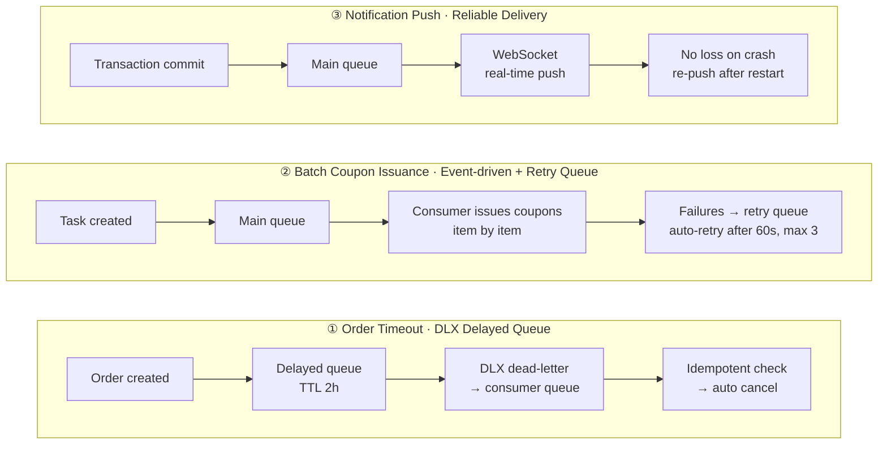

# Homestay Booking Platform


English | **[中文](README.md)**

A full-featured homestay booking platform connecting guests, hosts, and platform administrators. It covers the complete lifecycle: property listing, platform review, online search, booking & payment, check-in / check-out, reviews, earnings analytics, and back-office governance.

> 25 business modules · 100K+ lines of code · 267 commits · 16 months of continuous iteration · 50+ project docs

## Background

Homestay is a **solo-delivered** full-stack project spanning 25 business modules and 100K+ lines of code, with a Spring Boot 3 backend, Vue 3 frontends, and full integrations with MySQL / Redis / Elasticsearch / Alipay.

Development started in February 2025 and continues to this day. I use AI coding tools (Cursor / Claude Code / Kimi Code CLI, etc.) for ~90% of the coding, while I handle **architecture design, product decisions, code review, critical module implementation, and quality control**.

This workflow lets a single engineer deliver all three frontends (guest / host / admin) end-to-end — a real snapshot of what full-stack engineering looks like in the AI era of 2026.

> Toolchain evolution: Cursor Pro → Claude Code CLI → Kimi Code CLI

## Table of Contents

- [Highlights](#highlights)
- [Tech Stack](#tech-stack)
- [Architecture](#architecture)
- [User Roles](#user-roles)
- [Feature Overview](#feature-overview)
- [Core Business Flows](#core-business-flows)
- [Project Structure](#project-structure)
- [Quick Start](#quick-start)
- [Configuration](#configuration)
- [Testing & Building](#testing--building)
- [Documentation Index](#documentation-index)
- [Security Notes](#security-notes)
- [License](#license)

## Highlights

- **Three frontends, one backend**: Guest, host, and admin apps share a unified API layer covering consumption, operations, and platform governance.
- **Elasticsearch property search**: Full-text search, faceted filtering, geo-coordinate indexing, similar-property recommendations, and personalized ranking.
- **Personalized recommendation engine**: Builds user profiles from order history, favorites, and browsing behavior. Four strategies — trending, personalized, location-based, and similar listings — with three-tier graceful degradation and result diversification.
- **Dynamic pricing engine**: Weekend surcharges, holiday adjustments, multi-night discounts, early-booking discounts. Scope covers global / city / host / property-group / individual listing. Supports make-up workday detection and order price snapshot locking.
- **User behavior tracking & profiling**: Async event collection for search, browse, click, favorite, booking, and share events. Scheduled profile aggregation (price / location / room-type / amenity preferences) feeds back into the recommendation engine.
- **Coupon marketing system**: Template management, user claiming (pessimistic locking to prevent over-claiming), order redemption, expiry cleanup, batch issuance, and ROI analytics.
- **Automated order state machine**: Scheduled tasks for auto check-in, auto check-out, and timeout cancellation (three-tier: pending confirmation / pending payment / payment in progress). Supports bulk historical order status repair.
- **Intelligent property feature analysis**: Auto-generates property feature tags across 8 dimensions — type, price competitiveness, amenity mix, location advantage, booking activity, weekend popularity, guest reviews, and check-in convenience. Dynamically boosts matching tag priority based on search criteria.
- **Redis distributed locking**: Atomic unlock via Lua scripts prevents accidental deletion of other threads' locks. Auto-degrades to lock-free mode when Redis is unavailable.
- **Price competitiveness analysis**: Multi-tier comparison (same area / same city / same type) with seasonal factors, outputting competitiveness grades and pricing suggestions.
- **Map-based search**: AMap (Gaode) integration for location search, nearby discovery, distance calculation, and map display.
- **Payment integration**: Alipay sandbox payments (page redirect + QR code), with order payment, async callbacks, status queries, and refunds.
- **Production-grade backend**: Unified responses, global exception handling, permission annotations, DTO mapping, caching, database migrations, and audit logging.

### Recent Engineering Enhancements (2026-08)

| Capability | Implementation | Impact |
|---|---|---|
| API rate limiting | `@RateLimit` annotation + AOP aspect (Redis Lua fixed-window counter), 429 on overflow, graceful degradation if Redis fails | Protects sensitive endpoints (payment creation, batch coupon issue); annotation-based |
| LLM call retry | `@Retryable` on `LlmClient` (3 attempts, exponential backoff) with `@EnableRetry` | AI support agent survives LLM service hiccups without losing requests |
| Home stats parallelization | `HomeService` runs five `CompletableFuture` counts in parallel with `allOf().join()` | Significant P95 reduction (benchmark comparison in vault) |
| AOP operation logging | `@OperationLog` annotation (SpEL dynamic detail/resourceId) + aspect async persistence | Full audit trail for admin actions, 69 annotated points |
| API docs | springdoc-openapi 2.2.0 auto-generates OpenAPI 3 docs, Swagger UI out of the box | Visit `http://localhost:8081/swagger-ui.html` after startup |
| Dashboard real MoM | Stats API exposes yesterday's data; frontend computes genuine MoM trends | Replaces random-number trends with trustworthy data |
| Admin build splitting | manualChunks + Element Plus on-demand imports (unplugin) | Main chunk 1.1MB → 35KB, white-screen fix (removed transition wrapper around lazy components) |
| Observability stack | Actuator + Micrometer + Prometheus + Grafana, 6 business metric types (rate limit / MQ / order timeout / LLM / home stats) | Rate-limit triggers, MQ retry backlog, API P95 all visible in Grafana — degradation/retry/parallelism effects are provable |

### Message Architecture (RabbitMQ - Three Scenarios)



> Common pattern across all three: main queue + retry/delayed queue (TTL dead-letter back to main), manual consumer ack + idempotency check, `mq-enabled` toggle for graceful degradation, scheduled tasks as fallback. Full diagrams: `obsidian-vault/03-后端/后端-RabbitMQ 消息架构.md`.

## Tech Stack

| Layer | Technologies |
|---|---|
| Guest Frontend | Vue 3, TypeScript, Vite, Vue Router, Pinia, Element Plus, Axios, ECharts, AMap, SockJS, STOMP |
| Admin Frontend | Vue 3, TypeScript, Vite, Vue Router, Pinia, Element Plus, Axios, ECharts |
| Backend | Java 17, Spring Boot 3.0.2, Spring Web, Spring Security, Spring Data JPA, Spring Validation |
| Data & Cache | MySQL 8.0, Redis, Redisson, Flyway, Elasticsearch |
| Communication & Integration | JWT, WebSocket (STOMP), RabbitMQ (AMQP), Alipay SDK, SMTP email |
| Observability | Spring Boot Actuator, Micrometer, Prometheus, Grafana |
| Engineering Tools | Maven, npm, MapStruct, Lombok, Docker Compose |

## Architecture


> Vector version: [docs/architecture.svg](docs/architecture.svg) (local `docs/architecture.drawio` is the editable draw.io source, excluded from git per .gitignore).

## User Roles

| Role | Description |
|---|---|
| Guest (anonymous) | Browse homepage, search listings, view public property details |
| Guest (registered) | Favorite listings, place orders, pay, request refunds, write reviews, send messages |
| Host | Register as host, publish listings, manage orders, handle check-in/check-out, view earnings |
| Administrator | Review listings, manage users and orders, handle reports and disputes, view analytics, configure platform rules |

## Feature Overview

### Guest App

| Module | Capabilities |
|---|---|
| Authentication | Registration, login, JWT auth, password reset, profile management |
| Homepage Recommendations | Trending listings, personalized recommendations, location-based suggestions |
| Property Search | Elasticsearch keyword search, faceted filters, sorting, pagination, URL param persistence, similar listings |
| Map Search | AMap display, nearby search, coordinate positioning, distance calculation |
| Property Details | Photos, amenities, smart feature tags, pricing, location, host info, review list |
| Online Booking | Date selection, real-time dynamic pricing, order preview, inventory validation |
| Online Payment | Alipay page redirect or QR code payment, payment status query, success redirect |
| Order Management | Order list, order details, cancellation, refund requests, status tracking |
| Favorites & Reviews | Add/remove favorites, post-order reviews, view my reviews |
| Coupon Center | Claimable coupon list, my wallet, claim (anti-over-claim), order redemption |
| Invite Rewards | Invite-code sharing, rewards for both referrer and referee on signup |
| Identity Verification | Submit identity materials, track review status |
| Notifications | Guest-host instant messaging, unread badges, system notifications (WebSocket real-time push) |

### Host App

| Module | Capabilities |
|---|---|
| Host Onboarding | Registration form, identity verification, host profile management |
| Host Dashboard | Listings, orders, revenue, reviews, and recent orders overview |
| Listing Management | Create, edit, draft save, submit for review, list/delist, delete, group management |
| Listing Publishing | Step-by-step input: basic info, location, amenities, description, photos |
| Order Processing | View orders, confirm/reject orders, refund review, dispute handling |
| Check-in / Check-out | Generate check-in credentials, self-service codes, process check-in, checkout settlement, deposits and extra charges |
| Host Calendar | Daily inventory/price overview, blocking, order schedule, per-date pricing |
| Earnings Management | Total earnings, monthly earnings, unsettled balance, daily/monthly trend charts, data export |
| Review Management | Rating distribution, review list, host replies, unreplied reminders |
| Notifications | Conversation list, chat history, order and review notifications |

### Admin App

| Module | Capabilities |
|---|---|
| Review Workbench | Pending listings, batch review, review history, review statistics |
| Listing Governance | Listing management, forced delisting, violation records, property type and amenity management |
| User Management | User list, enable/disable, identity verification review |
| Order Management | Multi-condition filtering, refund approval, dispute resolution |
| Violation Management | Report list, process/dismiss reports, violation scanning, duplicate report stats |
| Analytics | Orders, revenue, users, listings overview and trend analysis |
| Pricing Rules | Global / city / host / property multi-level pricing rule configuration with priority management |
| Coupon Management | Template creation, batch issuance (MQ-driven + retry queue), usage statistics, ROI analysis |
| Marketing Campaigns | Campaign management, auto start/stop, A/B experiments (multi-variant comparison & data collection) |
| System Config | Platform settings, policy configuration, fee configuration |
| Announcements | Publish system notifications and event announcements |
| Audit Logs | Admin operation logs, login logs |

### Backend Capabilities

| Capability | Description |
|---|---|
| Unified Response | `ApiResponse<T>` wrapping `success`, `code`, `message`, `data`, and `timestamp` |
| Auth & Authorization | Spring Security + JWT stateless authentication with role-based access control |
| Data Access | Spring Data JPA with Repository and Specification for complex queries |
| Database Migration | Flyway-managed schema evolution (V1 – V49, 41 scripts) |
| Caching | Redis for hot data and recommendation caching; Spring Cache with Caffeine |
| Distributed Locking | Redis + Lua script atomic unlock with fault-tolerant degradation; `@RedisLock` annotation + aspect (SpEL key) ready to use |
| Rate Limiting | `@RateLimit` annotation + aspect (Redis Lua fixed-window counter), 429 on overflow, degrades gracefully if Redis fails |
| API Documentation | springdoc-openapi auto-generates OpenAPI 3 docs; Swagger UI out of the box |
| Performance | Home stats parallelized with five `CompletableFuture` calls; API timing aspect (ApiTimingAspect) |
| Observability | Actuator health/metrics endpoints + Micrometer business metrics (rate limit / MQ / order timeout / LLM / home stats), Prometheus scrape + Grafana dashboards |
| Real-time Communication | WebSocket (STOMP) for chat messages and notification push |
| Search Service | Elasticsearch-based property search with incremental sync and full rebuild |
| Recommendation Service | Multi-strategy engine + user profiling + behavior tracking, with caching and degradation |
| Pricing Engine | Multi-dimensional dynamic pricing rules with date-level and order-level adjustments, priority and stacking control |
| Payment Integration | Alipay sandbox: page redirect, QR code, async notifications, order queries, refunds |
| Exception Handling | `@RestControllerAdvice` for unified business and system exception handling |
| Object Mapping | MapStruct for Entity / DTO / Request / Response conversion |
| Audit Logging | Async recording of admin operations (`@OperationLog` annotation), login events, and key business state changes |
| Scheduled Tasks | Auto order state transitions, timeout handling, coupon cleanup, user profile aggregation |

## Core Business Flows

### Listing Publication & Review

```text
Host creates listing draft
  -> Add location, amenities, description, photos
  -> Submit for review
  -> Admin reviews
  -> Approved: goes live / Rejected: returned for edits
```

### Order Lifecycle

```text
Guest places order
  -> Pending Payment
  -> Paid
  -> Host Confirms
  -> Ready for Check-in
  -> Checked In (auto via scheduled task)
  -> Checked Out (auto via scheduled task)
  -> Completed
  -> Guest Reviews
```

### Refunds & Disputes

```text
Guest requests refund
  -> Host reviews
  -> Approved -> Refund in progress -> Refund completed
  -> Rejected -> Guest files dispute -> Admin intervenes
```

### Earnings Settlement

```text
Order completed
  -> Host earnings generated
  -> Added to settleable balance
  -> Host views earnings stats and trends
```

## Project Structure

```text
homestay3/
├── homestay-front/          # Guest + Host app, Vue 3 + Vite
├── homestay-admin/          # Admin app, Vue 3 + Vite
├── homestay-backend/        # Backend API, Spring Boot
├── docs/                    # Project documentation
│   └── INSTALL.md           # Installation guide (with AI Agent instructions)
├── tools/                   # Local utility scripts
├── docker-compose.yml       # Docker Compose config (Elasticsearch)
├── README.md                # Project overview (Chinese)
├── README_EN.md             # Project overview (English)
└── .gitignore               # Git ignore rules
```

Backend layering:

```text
com.homestay3.homestaybackend
├── config/                  # Security, cache, CORS, WebSocket, payment configs
├── controller/              # REST API controllers
├── service/                 # Core business logic
│   ├── search/              # Search & recommendation services
│   ├── agent/               # AI support agent (tools, LLM client)
│   └── gateway/             # Payment gateway
├── repository/              # JPA data access layer
├── entity/                  # Database entities
├── dto/                     # Data transfer objects
├── mapper/                  # MapStruct mappings
├── model/                   # Enums and constants
├── annotation/              # Custom annotations (@RateLimit / @OperationLog / @RedisLock)
├── aspect/                  # AOP aspects (rate limiting / operation log / distributed lock / API timing)
├── mq/                      # RabbitMQ producers and consumers
├── exception/               # Global exception handling
├── security/                # JWT & auth
├── util/                    # Utility classes
└── job/                     # Scheduled tasks
```

## Quick Start

> For the full installation guide (including AI Agent automated setup instructions), see [docs/INSTALL.md](docs/INSTALL.md).

### Prerequisites

| Dependency | Recommended Version | Required |
|---|---|---|
| JDK | 17+ | ✅ |
| Maven | 3.6+ | ✅ |
| MySQL | 8.0+ | ✅ |
| Redis | 6.0+ | ✅ |
| Elasticsearch | 8.5+ | ✅ (backend requires an ES client connection at startup; container must be online even with `elasticsearch.enabled=false`) |
| Node.js | 18+ | ✅ |
| npm | 9+ | ✅ |
| Docker + Docker Compose | Latest stable | ❌ (only for Elasticsearch) |

### 1. Clone the Repository

```bash
git clone https://github.com/goaltang/homestay3.git
cd homestay3
```

### 2. Start Infrastructure

**MySQL** — Create the database:

```bash
mysql -u root -p -e "CREATE DATABASE homestay_db CHARACTER SET utf8mb4 COLLATE utf8mb4_unicode_ci;"
```

**Redis** — Ensure Redis is running on `localhost:6379`:

```bash
redis-server --daemonize yes
```

**Elasticsearch (optional)** — Start via Docker Compose:

```bash
docker-compose up -d elasticsearch
```

> Note: `elasticsearch.enabled=false` only disables index sync (search falls back to JPA), but ElasticsearchRepository still initializes — **the ES container must stay online**, otherwise the backend fails to start.

**Monitoring (optional, Prometheus + Grafana)** — start via Docker Compose:

```bash
docker-compose up -d prometheus grafana
```

> Prometheus UI: `http://localhost:9090`; Grafana: `http://localhost:3000` (default `admin / admin123`, datasource and dashboard auto-provisioned). Prometheus scrapes the backend at `host.docker.internal:8081/actuator/prometheus`, so run the backend on the host with `mvn spring-boot:run`.

### 3. Configure the Backend

Copy the config template and customize:

```bash
cd homestay-backend
cp src/main/resources/application.example.properties src/main/resources/application-local.properties
```

Edit `application-local.properties` with your local MySQL password, Redis password, JWT secret, etc.

> You can also edit `application.properties` directly, but do not commit sensitive values to the repository.

### 4. Start the Backend

```bash
cd homestay-backend
mvn clean compile
mvn spring-boot:run
```

The backend runs at `http://localhost:8081` by default. Flyway automatically runs all database migrations (V1 – V49, 41 scripts) on startup — no manual table creation needed.

### 5. Start the Guest & Host App

```bash
cd homestay-front
cp .env.example .env.local   # Optional: configure AMap API keys
npm install
npm run dev
```

Open `http://localhost:5173`. Vite proxies `/api` requests to `http://127.0.0.1:8081`.

### 6. Start the Admin App

```bash
cd homestay-admin
npm install
npm run dev
```

Open `http://localhost:5174`. Vite proxies `/api` requests to the backend.

### First-Time Setup

On first backend startup, `DataInitializer` automatically seeds default amenity data, and `AdminServiceImpl` creates the default admin account **admin / admin888** (`ROLE_ADMIN`, only if the `admin` user doesn't already exist).

- **Admin**: log in directly with `admin / admin888` on the admin app (`localhost:5174`).
- **Guest / Host**: register an account on the guest app (`localhost:5173`).

## Configuration

Backend configuration file:

```text
homestay-backend/src/main/resources/application.properties
```

Key settings for local development:

| Setting | Description |
|---|---|
| `spring.datasource.*` | MySQL connection URL, username, password |
| `spring.data.redis.*` | Redis host, port, password, database index |
| `spring.elasticsearch.*` | Elasticsearch connection URI (optional) |
| `elasticsearch.enabled` | Set to `false` to disable ES sync and fall back to JPA search (ES container must still be online at startup) |
| `jwt.secret` | JWT signing secret |
| `spring.mail.*` | SMTP email service configuration |
| `payment.alipay.*` | Alipay sandbox app ID, keys, gateway URL, callbacks |
| `file.upload-dir` | Uploaded file storage directory |
| `agent.llm.*` | AI support agent LLM config (enabled, model, timeout, API key) |
| `*.mq-enabled` | Per-scenario MQ switches: `order.timeout` / `coupon.batch` / `notification.push`; set to `false` to use scheduled/degraded paths |
| `springdoc.*` | API docs config (optional; defaults to `/swagger-ui.html` + `/v3/api-docs`) |
| `management.*` | Actuator endpoint config (`/actuator/prometheus` exposes health/info/prometheus/metrics by default) |

Frontend environment variables:

| File | Description |
|---|---|
| `homestay-front/.env.example` | Guest app env template (AMap API keys, etc.) |

## Testing & Building

### Backend

```bash
cd homestay-backend
mvn test
mvn clean package
```

Test suite (60 test classes, all on the H2 in-memory DB):
- Unit tests: `src/test/java/.../mq/` (MQ consumers: order timeout / batch coupon / notification push), `service/impl/` (core rules for orders, payments, coupons, disputes, notifications, reviews), `service/agent/` (AI agent: tool registry / read-only write-tools / two-phase orchestration), `service/search/` (ES fallback, profile aggregation), `aspect/` (the three aspects: @RateLimit / @RedisLock / @OperationLog)
- API automation tests: `src/test/java/.../api/` (AuthApiTest / OrderApiTest / CouponApiTest / NotificationApiTest — full chains for auth, booking, coupon issue and notifications, H2 + MQ-degraded paths)
- Integration tests: `src/test/java/.../integration/` (BookingWorkflow, ConcurrentBooking anti-overselling, etc.)

> ⚠️ Test safety rule: every test must use `application-test.properties` (H2 in-memory), never the real MySQL (there was a past incident where tests wiped production data).

### Guest App

```bash
cd homestay-front
npm run build
```

### Admin App

```bash
cd homestay-admin
npm run build
```

## Documentation Index

| Document | Description |
|---|---|
| [Installation Guide](docs/INSTALL.md) | Detailed setup instructions with AI Agent automation guide |
| [Project Structure Overview](docs/项目结构总览.md) | Directory layout and module responsibilities |
| [Tech Stack Guide](docs/项目技术栈说明.md) | Technology choices and dependency notes |
| [Dev Environment Setup](docs/开发环境配置指南.md) | Local development environment preparation |
| [Admin App Structure](docs/homestay-admin%20详细结构.md) | Admin frontend directory details |
| [Guest App Docs](homestay-front/README.md) | Guest & host frontend documentation |
| [Admin App Docs](homestay-admin/README.md) | Admin frontend documentation |

## Security Notes

This repository contains no real secrets: `application.properties` is excluded via `.gitignore`;
only the `application.example.properties` template is committed (database password, JWT secret,
Alipay private keys, LLM API key, etc. are all placeholders).
Copy it to `application-local.properties` and fill in your real local values — never commit real keys.

## License

MIT License
