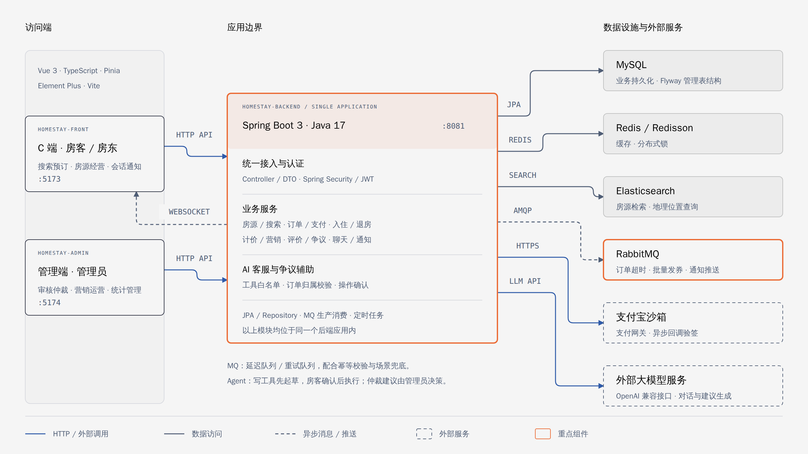

# Homestay Booking Platform


English | **[中文](README.md)**

A homestay booking system for guests, hosts, and administrators, covering listing review, search and recommendations, booking and payment, stays, refunds, disputes, and earnings management.

This solo full-stack project serves as a learning and interview portfolio, with development starting in February 2025. AI coding tools assist implementation; the author owns architecture, product decisions, code review, critical modules, and quality control.

[Installation guide](docs/INSTALL.md#english-version) · [Architecture gallery](docs/diagrams/README.md) · [Feature documentation](obsidian-vault/02-功能模块/) · [Documentation home](obsidian-vault/00-首页.md)

## Contents

- [Highlights](#highlights)
- [Architecture](#architecture)
- [Roles and Features](#roles-and-features)
- [Tech Stack](#tech-stack)
- [Project Structure](#project-structure)
- [Quick Start](#quick-start)
- [Testing and Building](#testing-and-building)
- [Documentation](#documentation)
- [Security Notes](#security-notes)
- [License](#license)

## Highlights

- **Orders and payments**: Alipay sandbox page and QR payments, asynchronous callbacks, status queries, timeout handling, and refund flows coordinate booking and after-sales states.
- **Three RabbitMQ scenarios**: Order timeouts use TTL and dead-letter queues (DLX); batch coupons track tasks and items; persisted notifications are consumed and pushed. Each scenario has its own retry, scheduled scan, or HTTP retrieval path.
- **AI support with permission boundaries**: A tool whitelist handles read-only queries. Refund requests, cancellations, and dispute requests are drafted before user confirmation and checked for order ownership. Administrator advice remains a draft.
- **Pricing and marketing**: Weekend, holiday, multi-night, and advance-booking rules support multiple scopes and execution priorities. Coupons support claiming, redemption, and batch issuance; orders retain price snapshots.
- **Search and recommendations**: Elasticsearch provides keyword, filtered, and geographic search. Profiles from orders, favorites, and browsing support trending, personalized, location-based, and similar-property recommendations.
- **Engineering and observability**: Flyway migrations, annotation-based rate limiting and auditing, and Actuator / Micrometer metrics with Prometheus / Grafana. GitHub Actions runs backend tests and type-checks and builds both frontends.

## Architecture



Guests and hosts share `homestay-front`; administrators use `homestay-admin`. Both connect to one Spring Boot backend integrating storage, caching, search, messaging, Alipay sandbox, and an LLM service. Diagram labels are in Chinese; ports are for local development.

### Selected Diagrams

| Topic | Diagrams |
|---|---|
| Orders and payments | [Order lifecycle](docs/diagrams/order-lifecycle.png) · [Booking transaction](docs/diagrams/booking-sequence.png) · [Payment callbacks](docs/diagrams/payment-sequence.png) |
| Concurrency and consistency | [Date locks and transactions](docs/diagrams/booking-concurrency.png) · [Consistency and compensation](docs/diagrams/transaction-consistency.png) |
| RabbitMQ | [Timeouts](docs/diagrams/mq-order-timeout.png) · [Batch coupons](docs/diagrams/mq-coupon-batch.png) · [Notifications](docs/diagrams/mq-notification.png) |
| AI support | [Orchestration and confirmation](docs/diagrams/agent-workflow.png) · [Permission boundaries](docs/diagrams/agent-control-boundaries.png) |
| Pricing and recommendations | [Pricing flow](docs/diagrams/pricing-flow.png) · [Pricing rules](docs/diagrams/pricing-rules.png) · [Search and recommendations](docs/diagrams/search-recommendation.png) |
| Data model | [Booking and payment entities](docs/diagrams/er-booking.png) · [Coupon entities](docs/diagrams/er-coupons.png) |

See the [full gallery](docs/diagrams/README.md) for other workflows, deployment diagrams, and module relationships. After downloading the project, open [docs/diagrams/index.html](docs/diagrams/index.html) in a browser for HTML diagrams and code references.

**Implementation boundaries**: Database commits and MQ publishing have no atomic outbox guarantee. Date locks do not span the outer transaction's full commit cycle. Arbitration approval has a status-precondition conflict. See the [implementation notes](docs/diagrams/README.md#绘图核对中发现的实现限制) for scope and other known limitations.

## Roles and Features

| Role | Main capabilities | Entry point |
|---|---|---|
| Guest | Search and maps, favorites, bookings, payments, coupons, refund requests, reviews, chat, and AI support | Customer app |
| Host | Onboarding, listings, orders, calendar inventory, check-in/out, earnings analytics, and review replies | Host center in the customer app |
| Administrator | Listing and identity review, user and order management, disputes, pricing and marketing settings, analytics, and auditing | Admin app |

Visitors can browse public listings. See the [feature documentation](obsidian-vault/02-功能模块/) and [business swimlane](docs/diagrams/business-swimlane.png) for details.

## Tech Stack

| Layer | Main technologies |
|---|---|
| Both frontends | Vue 3, TypeScript, Vite, Vue Router, Pinia, Element Plus, Axios, ECharts |
| Backend | Java 17, Spring Boot 3.0.2, Spring Security / JWT, Spring Data JPA, MapStruct |
| Data and messaging | MySQL 8, Redis / Redisson, Elasticsearch / IK, RabbitMQ, Flyway |
| Integrations | Alipay sandbox, AMap, OpenAI-compatible LLM API, SMTP, WebSocket / STOMP |
| Engineering and monitoring | Maven, npm, Docker Compose, GitHub Actions, Actuator, Micrometer, Prometheus, Grafana |

## Project Structure

```text
homestay3/
├── homestay-front/      # Guest + host app, Vue 3
├── homestay-admin/      # Admin app, Vue 3
├── homestay-backend/    # Spring Boot API, migrations, and tests
├── docs/               # Installation guide and architecture gallery
├── obsidian-vault/     # Features, design notes, and engineering reports
├── tools/              # Load testing, monitoring, and diagnostics
└── docker-compose.yml  # Applications, data services, and monitoring
```

See the [structure guide](docs/项目结构总览.md) for directory responsibilities.

## Quick Start

For local development, prepare Java 17, Maven, Node.js 20, MySQL 8, Redis, and Elasticsearch with the IK plugin. Start RabbitMQ to demonstrate the three messaging scenarios. See the [installation guide](docs/INSTALL.md#english-version) for infrastructure setup and configuration.

> Elasticsearch is disabled by default; the backend starts with JPA search. To enable ES, start ES with IK, set `ELASTICSEARCH_ENABLED=true`, and restart the backend, then rebuild the index via the admin-only `POST /api/admin/search/index/rebuild` endpoint. Compose profiles `search` and `monitoring` control optional ES and monitoring services. Docker entry ports are shown in the [deployment diagram](docs/diagrams/deployment-apps.png).

### 1. Clone and Configure

```bash
git clone https://github.com/goaltang/homestay-booking-platform.git homestay3
cd homestay3/homestay-backend
cp src/main/resources/application.example.properties src/main/resources/application-local.properties
```

Edit `application-local.properties`: set `server.port=8081`, your MySQL and Redis settings, and a random JWT secret. Configure payment, maps, email, and the LLM as needed; AI support is disabled by default.

### 2. Start the Backend

In the backend directory from step 1, explicitly activate local configuration:

```bash
mvn spring-boot:run -Dspring-boot.run.profiles=local
```

Backend: `http://localhost:8081`. Flyway runs database migrations at startup. API docs: `http://localhost:8081/swagger-ui.html`.

### 3. Start Both Frontends

Open separate terminals, each starting at the project root:

```bash
# Guest and host app
cd homestay-front
npm ci
npm run dev
```

```bash
# Admin app
cd homestay-admin
npm ci
npm run dev
```

Customer app: `http://localhost:5173`. Admin app: `http://localhost:5174`. Both proxy `/api` requests to the backend.

Guests and hosts register in the customer app. The backend creates a development administrator, `admin / admin888`, when the `admin` user does not exist.

## Testing and Building

[](https://github.com/goaltang/homestay-booking-platform/actions/workflows/ci.yml)

Run each block separately from the project root:

```bash
# Backend unit and integration tests
cd homestay-backend
mvn test
```

```bash
# Customer app type-check and build
cd homestay-front
npm ci
npm run build
```

```bash
# Admin app type-check and build
cd homestay-admin
npm ci
npm run build
```

Spring Boot integration tests must use `@ActiveProfiles("test")` and an isolated H2 in-memory datasource, never a real MySQL database. ES integration tests use Testcontainers and an IK image; they skip locally without Docker. Image build instructions are in the [installation guide](docs/INSTALL.md#english-version).

See [ci.yml](.github/workflows/ci.yml) for CI configuration and the reports below for test and performance results. Historical counts are not current run results.

## Documentation

The following design and engineering documents are in Chinese; the installation guide includes English instructions.

| Topic | Documents |
|---|---|
| Installation and configuration | [Installation guide, including agent instructions](docs/INSTALL.md#english-version) |
| Architecture and workflows | [Full gallery and implementation boundaries](docs/diagrams/README.md) |
| Documentation routes | [Documentation home](obsidian-vault/00-首页.md) · [Full catalog](<obsidian-vault/00-索引/Homestay 项目索引.md>) |
| Modules and directories | [Project structure](docs/项目结构总览.md) · [Feature documentation](obsidian-vault/02-功能模块/) |
| AI support design and validation | [Permission matrix](obsidian-vault/03-技术设计/AI客服/AI客服Agent-权限与工具边界.md) · [Test report](obsidian-vault/04-验证与复盘/AI客服Agent-测试报告.md) |
| Performance evidence | [Parallel home statistics](obsidian-vault/04-验证与复盘/性能压测报告-首页统计并行化对比.md) · [Admin build optimization](obsidian-vault/04-验证与复盘/前端性能优化-管理后台构建体积.md) |
| CI implementation | [CI engineering report](obsidian-vault/04-验证与复盘/CI-CD攻坚-从零到全绿.md) |
| Frontend documentation | [Customer app](homestay-front/README.md) · [Admin app](homestay-admin/README.md) |

## Security Notes

Local `application.properties` and `application-local.properties` files are Git-ignored. Use the [configuration template](homestay-backend/src/main/resources/application.example.properties); keep database passwords, JWT secrets, payment keys, and LLM API keys in local configuration. Do not commit real credentials.

The default administrator and Compose accounts are for development demos; change them before exposing a deployment.

## License

MIT License
