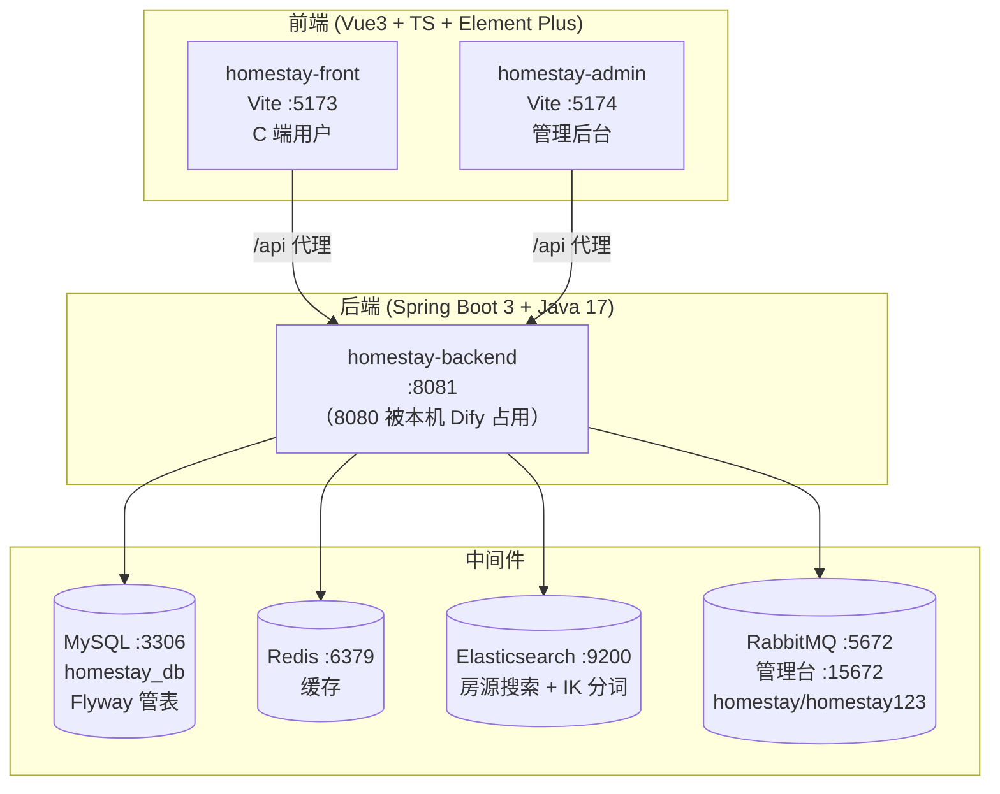

# 开发环境配置

> [!tip] 配置指南
> 快速搭建 Homestay 项目开发环境

## 部署架构



> Docker Compose 管理 ES 与 RabbitMQ（`docker-compose.yml`，容器 `homestay-es` / `homestay-rabbitmq`）；MySQL、Redis 为本机服务。

## 环境要求

### 通用工具
- **Git** >= 2.30.0
- **Node.js** >= 18.0.0
- **npm** >= 9.0.0 或 **pnpm** >= 8.0.0

### 后端专属
- **Java** >= 17
- **Maven** >= 3.8.0
- **MySQL** >= 8.0
- **Redis** >= 6.0

## 初始化步骤

### 1. 克隆项目

```bash
git clone <repository-url>
cd homestay3
```

### 2. 后端服务

```bash
cd homestay-backend

# 编译安装依赖
mvn clean install -DskipTests

# 配置数据库（编辑 src/main/resources/application.yml）
# 填入 MySQL 和 Redis 连接信息

# 启动开发服务器
mvn spring-boot:run
```

后端默认地址: http://localhost:8080

### 3. 前端应用

```bash
cd homestay-front

# 安装依赖
npm install

# 配置环境变量
cp .env.example .env
# 编辑 .env 填入 VITE_AMAP_API_KEY 等配置

# 启动开发服务器
npm run dev
```

前端默认地址: http://localhost:5173

### 4. 管理后台

```bash
cd homestay-admin

# 安装依赖
npm install

# 启动开发服务器
npm run dev
```

管理后台默认地址: http://localhost:5174

## 常用命令

### 前端/管理后台

| 命令 | 说明 |
|------|------|
| `npm run dev` | 启动开发服务器 |
| `npm run build` | 构建生产版本 |
| `npm run preview` | 预览生产构建 |

### 后端

| 命令 | 说明 |
|------|------|
| `mvn spring-boot:run` | 启动开发服务器 |
| `mvn clean package -DskipTests` | 打包 Jar |
| `mvn test` | 运行测试 |

## IDE 推荐

- **VS Code** + Vue 官方插件 + Java Extension Pack
- **Vue DevTools** 浏览器扩展
- **ESLint + Prettier** 代码格式化

## 相关笔记

- [[Homestay 项目索引]]
- [[项目技术栈]]
- [[Homestay Admin 管理后台]]
- [[Homestay Backend 后端服务]]
- [[Homestay Front 前端应用]]
