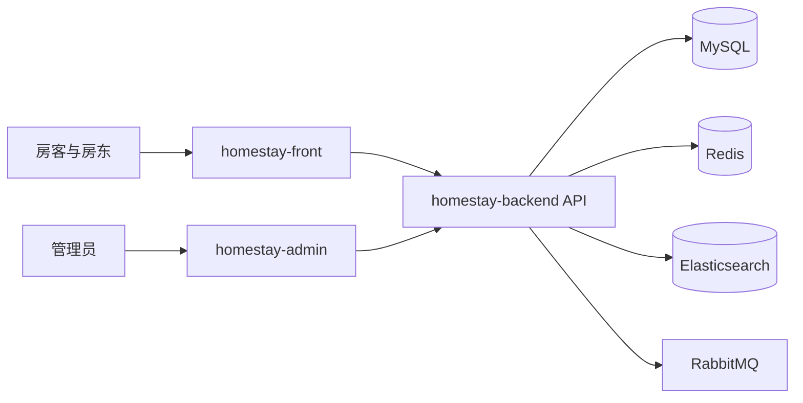

# Homestay 项目结构总览

## 仓库组成

| 目录 | 职责 | 入口 |
|---|---|---|
| homestay-front/ | 房客与房东共用 Vue 应用 | [[Homestay Front 前端应用]] |
| homestay-admin/ | 管理后台 | [[Homestay Admin 管理后台]] |
| homestay-backend/ | Spring Boot API | [[Homestay Backend 后端服务]] |
| docs/ | 安装、架构图与交付文档 | [安装教程](../../docs/INSTALL.md)、[图集](../../docs/diagrams/README.md) |
| obsidian-vault/ | 项目说明、业务、设计、验证与方案 | [[00-首页]]、[[Homestay 项目索引]] |
| tools/ | 压测与诊断等脚本 | 仓库对应目录 |

完整代码目录树继续维护在 [仓库项目结构说明](../../docs/项目结构总览.md)，本页维护三端职责和笔记导航。

## 三端关系

了解项目时从首页选择路径，不需要按文件顺序通读。业务模块回答用户与规则问题，技术设计解释机制，报告保留证据，历史方案追溯过去的选择。
