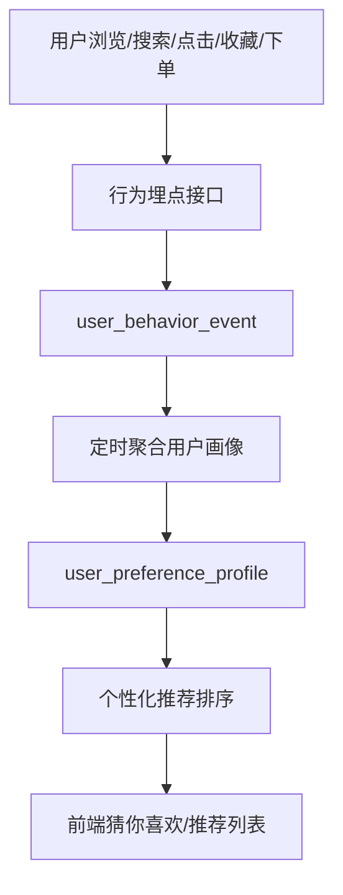

# 个性化推荐模块

> [!info] 模块概述
> 个性化推荐模块负责根据用户浏览、搜索、点击、收藏、下单等行为生成偏好画像，并在首页、房源列表和详情页向用户展示更可能感兴趣的房源。当前系统已有热门、精选、相似、位置和个性化推荐接口，下一步重点是把行为埋点和用户画像真正接入推荐排序。

## 模块边界

- 本模块关注推荐内容的生成、排序、展示和效果闭环。
- 收藏功能本身见 [[功能模块-收藏与推荐]]。
- 主动搜索能力见 [[功能模块-房源搜索]]。
- ES 搜索和推荐技术方案见 [[方案-ES搜索与个性化推荐]]。

## 涉及用户端

- **C 端用户** — 在首页、列表页、详情页查看推荐房源
- **系统** — 采集行为事件、聚合用户画像、计算推荐结果
- **运营/管理员** — 关注推荐结果质量、热门房源曝光和数据质量

## 推荐类型

| 推荐类型 | 场景 | 主要依据 |
|------|------|------|
| 热门推荐 | 首页默认展示 | 订单量、评分、评论数、近期活跃度 |
| 精选推荐 | 首页推荐区 | 房源质量、性价比、新房源扶持 |
| 个性化推荐 | 登录用户首页、猜你喜欢 | 用户画像、订单、收藏、行为事件 |
| 位置推荐 | 用户选择目的地后 | 省市编码匹配 |
| 相似推荐 | 房源详情页底部 | 同城、同房型、价格相近、评分相近 |
| 自定义推荐 | 按条件请求推荐 | 用户传入的筛选条件 |

## 功能清单

### 1. 行为埋点
- **浏览行为** — 记录用户进入房源详情或浏览房源卡片
- **搜索行为** — 记录关键词、城市和房型条件
- **点击行为** — 记录用户点击某个推荐或搜索结果
- **收藏行为** — 记录收藏房源产生的偏好信号
- **下单行为** — 记录真实转化偏好
- **分享行为** — 预留传播行为信号

### 2. 用户画像
- **城市偏好** — 根据行为事件聚合城市权重
- **房型偏好** — 根据行为事件聚合房型权重
- **设施偏好** — 根据浏览、收藏、下单房源聚合设施权重
- **价格区间** — 根据用户行为中的房源价格计算最小值和最大值
- **最后活跃时间** — 用于判断画像是否需要刷新

### 3. 推荐排序
- **基础质量分** — 评分、评论数、订单活跃度、性价比、新房源扶持
- **偏好匹配分** — 城市、房型、设施、价格区间与用户画像匹配
- **多样性控制** — 避免推荐结果全部集中在同一城市、房型或价格段
- **兜底策略** — 新用户或画像不足时使用热门/精选推荐兜底

### 4. 推荐展示
- **首页推荐** — 展示精选推荐、热门推荐和猜你喜欢
- **列表页推荐入口** — 支持从“猜你喜欢”查看更多进入房源列表
- **详情页相似推荐** — 在房源详情页底部展示相似房源
- **空状态** — 未登录或数据不足时给出明确提示

## 前端页面与组件

| 页面/组件 | 路径 | 说明 |
|------|------|------|
| `Home.vue` | `/` | 首页展示推荐区 |
| `RecommendedHomestays.vue` | 首页组件 | 精选推荐 |
| `PopularHomestays.vue` | 首页组件 | 热门推荐 |
| `PersonalizedRecommendations.vue` | 首页组件 | 登录用户猜你喜欢 |
| `HomestayDetail.vue` | `/homestays/:id` | 展示相似推荐 |
| `tracking.ts` | `src/api/tracking.ts` | 行为埋点 API 封装 |

## 后端 API

### 推荐接口

| 方法 | 路径 | 说明 |
|------|------|------|
| GET | `/api/recommendations/popular` | 热门房源，支持 limit 和分页 |
| GET | `/api/recommendations/recommended` | 精选推荐，支持 limit 和分页 |
| GET | `/api/recommendations/personalized/{userId}` | 个性化推荐 |
| GET | `/api/recommendations/location` | 基于省市的推荐 |
| GET | `/api/recommendations/similar/{homestayId}` | 相似房源推荐 |
| POST | `/api/recommendations/custom` | 自定义条件推荐 |
| POST | `/api/recommendations/refresh-cache` | 刷新推荐缓存 |

### 行为埋点接口

| 方法 | 路径 | 说明 |
|------|------|------|
| POST | `/api/tracking/view/{homestayId}` | 记录浏览 |
| POST | `/api/tracking/search` | 记录搜索 |
| POST | `/api/tracking/click/{homestayId}` | 记录点击 |

## 数据模型

### `user_behavior_event`

| 字段 | 说明 |
|------|------|
| `user_id` | 登录用户 ID，未登录可为空 |
| `session_id` | 会话 ID，用于匿名行为聚合预留 |
| `event_type` | `VIEW` / `SEARCH` / `CLICK` / `FAVORITE` / `BOOKING` / `SHARE` |
| `homestay_id` | 行为涉及的房源 |
| `keyword` | 搜索关键词 |
| `city_code` | 城市编码 |
| `type` | 房源类型 |
| `price` | 行为发生时房源价格快照 |
| `extra_json` | 扩展字段 |

### `user_preference_profile`

| 字段 | 说明 |
|------|------|
| `user_id` | 用户 ID |
| `preferred_city_json` | 城市偏好权重 |
| `preferred_type_json` | 房型偏好权重 |
| `preferred_amenity_json` | 设施偏好权重 |
| `min_price` | 偏好价格下限 |
| `max_price` | 偏好价格上限 |
| `last_active_at` | 最近活跃时间 |

## 数据流

## 当前实现状态

| 能力 | 状态 | 说明 |
|------|------|------|
| 热门推荐接口 | 已实现 | 已有 `/popular` 接口和前端组件 |
| 精选推荐接口 | 已实现 | 已有 `/recommended` 接口和前端组件 |
| 相似推荐接口 | 已实现 | 根据房源特征计算相似度 |
| 个性化推荐接口 | 已实现 | 当前主要基于订单和收藏分析 |
| 行为表与画像表 | 已实现 | Flyway 已创建 `user_behavior_event` 和 `user_preference_profile` |
| 行为埋点服务 | 部分实现 | 后端服务方法完整，前端封装存在，但页面接入不足 |
| 用户画像聚合 | 部分实现 | 定时任务存在，但活跃用户查询和设施偏好聚合仍需修正 |
| 画像接入推荐排序 | 待完善 | 推荐服务尚未真正读取 `user_preference_profile` |
| 个性化接口权限 | 待完善 | 不应允许任意用户读取其他用户的个性化推荐 |

## 验收标准

- 用户搜索、浏览、点击、收藏、下单后能产生对应行为事件。
- 定时任务能聚合最近活跃登录用户的画像。
- 个性化推荐排序能读取用户画像，并影响城市、房型、价格和设施匹配。
- 新用户或画像不足时，推荐结果能稳定回退到热门或精选推荐。
- 个性化接口只能返回当前登录用户自己的推荐结果。
- 推荐结果具备基础多样性，不长期集中在单一房型或城市。

## 待办事项

- [ ] 将 `trackView` 接入房源详情页和列表卡片曝光场景
- [ ] 将 `trackSearch` 接入首页搜索、列表搜索和地图搜索
- [ ] 将 `trackClick` 接入搜索结果和推荐卡片点击
- [ ] 在收藏和下单业务流程中写入 `FAVORITE`、`BOOKING` 行为
- [ ] 修复活跃用户画像聚合查询
- [ ] 补齐设施偏好聚合逻辑
- [ ] 在推荐服务中读取 `UserPreferenceProfile`
- [ ] 调整个性化推荐接口权限，避免传入任意 `userId`
- [ ] 为推荐排序和画像聚合补充单元测试/集成测试

## 相关模块

- [[功能模块-收藏与推荐]] — 收藏行为和用户兴趣信号
- [[功能模块-房源搜索]] — 搜索行为来源
- [[功能模块-房源管理]] — 推荐候选房源来源
- [[功能模块-订单管理]] — 下单行为和真实转化偏好
- [[功能模块-评价管理]] — 评分和评论质量
- [[方案-ES搜索与个性化推荐]] — 技术方案与落地计划
