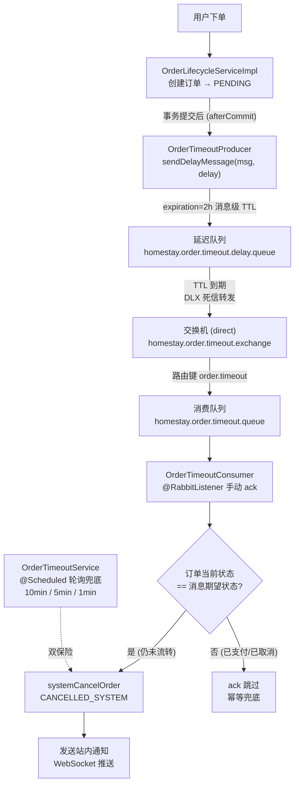

# 订单超时处理

> 对超时未确认/未支付/支付中的订单自动取消并通知用户，采用 RabbitMQ 延迟队列为主、定时轮询兜底的双保险机制。路由：无独立页面（通知走通知中心） | 权限：系统自动执行

## 一、功能清单

### 1.1 用户可见功能

| 功能 | 说明 |
|------|------|
| 查看超时配置 | 通过订单接口获取当前超时时长配置 |
| 接收超时取消通知 | 订单被系统自动取消后收到站内通知（WebSocket 实时推送） |
| 接收超时预警通知 | 临近超时前 30 分钟收到提醒（站内通知） |

### 1.2 管理/系统功能

| 功能 | 说明 |
|------|------|
| 超时自动取消（MQ 延迟队列） | 订单进入 PENDING/CONFIRMED/PAYMENT_PENDING 时发送延迟消息，到期精准取消 |
| 超时自动取消（轮询兜底） | 原有定时任务保留，MQ 消息丢失时兜底取消 |
| 超时预警通知 | 每 5 分钟扫描即将超时订单发送提醒 |

## 二、核心业务规则

三种超时场景，各自独立计时与取消：

| 场景 | 触发状态 | 超时时长配置 | 取消原因 |
|------|---------|-------------|---------|
| 待确认超时 | PENDING | `order.timeout.pending-hours`（2h） | 系统自动取消：超时未确认 |
| 已确认未支付超时 | CONFIRMED | `order.timeout.confirmed-hours`（2h） | 系统自动取消：超时未支付 |
| 支付中超时 | PAYMENT_PENDING | `order.timeout.payment-pending-hours`（2h） | 系统自动取消：支付超时 |

- 取消动作统一走 `orderService.systemCancelOrder(id, CANCELLED_SYSTEM, 原因)`，并发送 ORDER_STATUS_CHANGED 通知
- 超时预警：`order.timeout.warning-before-minutes`（30min）提前提醒
- **幂等规则**：MQ 消费者收到消息后校验订单当前状态，只有当前状态 == 消息携带的期望状态才执行取消，否则直接 ack 跳过（已支付/已取消/状态已流转时不误取消）
- **开关**：`order.timeout.mq-enabled=true`，为 false 时消费者忽略消息，仅靠轮询兜底
- **双保险**：MQ 消息丢失时，轮询任务（每 10 分钟）仍会取消超时订单，保证不出现"超时未取消"的漏网订单

## 三、页面与组件

### 3.1 路由

无独立页面。取消/预警结果通过通知中心展示。

### 3.2 组件结构

无。

### 3.3 状态管理

无。

## 四、后端接口

| 方法 | 路径 | 说明 |
|------|------|------|
| GET | `/api/orders/timeout-config` | 获取超时配置（pending/confirmed/payment-pending/warning） |

### 4.1 核心 Service

| 类 | 职责 |
|----|------|
| `mq/OrderTimeoutProducer` | 发送延迟消息（消息级 expiration），事务提交后调用 |
| `mq/OrderTimeoutConsumer` | 消费消息，幂等校验 + 取消订单 + 通知，手动 ack |
| `config/RabbitMQConfig` | 交换机/队列/绑定声明（DLX 死信方案），Jackson2JsonMessageConverter |
| `service/impl/OrderTimeoutService` | 原有轮询任务（兜底保留）：10min 超时处理、5min 预警、1min 紧急检查 |
| `service/impl/OrderLifecycleServiceImpl` | 状态转换点（创建/确认/支付中）事务提交后发送延迟消息 |

## 五、数据模型

### 5.1 数据库表

无新增表。复用 `orders` 表状态字段。

### 5.2 DTO / 类型定义

| 类型 | 字段 | 说明 |
|------|------|------|
| `OrderTimeoutMessage` | orderId Long | 订单 ID |
| | orderStatus String | 期望状态（PENDING/CONFIRMED/PAYMENT_PENDING） |
| | expireAt LocalDateTime | 期望到期时间（信息性） |

## 六、实时同步 / 特殊机制

### RabbitMQ 延迟队列（DLX 死信方案）

- 交换机 `homestay.order.timeout.exchange`（direct）
- 延迟队列 `homestay.order.timeout.delay.queue`：消息在此等待 TTL 到期，通过死信交换机转发
- 消费队列 `homestay.order.timeout.queue`：`@RabbitListener` 手动 ack
- 消息级 `expiration`（不设队列级 TTL），三种状态共用一条延迟队列（当前时长一致 2h，队头阻塞风险低；未来时长不同时由消费者状态校验兜底）
- 消息体 JSON 序列化：Jackson2JsonMessageConverter（**必须注册 JavaTimeModule**，否则 LocalDateTime 字段序列化报错——冒烟测试实测发现的坑）
- 生产者：事务 afterCommit 后发送，避免事务回滚导致消息误发；发送失败不影响正确性（轮询兜底）

**消息流转图：**

### 定时任务（兜底保留）

| 任务 | 频率 | 说明 |
|------|------|------|
| handleTimeoutOrders | 每 10 分钟 | 处理三类超时订单 |
| sendTimeoutWarnings | 每 5 分钟 | 超时预警通知 |
| handleImminentTimeouts | 每 1 分钟 | 即将超时（最后 5 分钟）紧急处理 |

## 七、实现记录

| 日期 | 功能 | 说明 |
|------|------|------|
| 2026-08-09 | MQ 延迟队列改造 | opencode（qwen3.7-max）实现：RabbitMQConfig/Producer/Consumer/消息体，下单状态转换点发延迟消息，7 个单元测试 |
| 2026-08-09 | 冒烟测试 + 修复序列化 bug | 全链路验证通过：下单→延迟队列→消费→取消→通知。修复 Jackson2JsonMessageConverter 缺少 JavaTimeModule 导致 LocalDateTime 序列化失败 |

**验证结果**
- 后端编译/测试：✅（mvn compile BUILD SUCCESS；OrderTimeoutConsumerTest 7/7、OrderServiceImplTest 22/22 无回归）
- 冒烟测试：✅（订单 8314 通过 MQ 链路 CONFIRMED → CANCELLED_SYSTEM，WebSocket 通知送达）
- 前端构建：不涉及

## 相关模块

- [[功能模块-订单管理]]
- [[功能模块-通知中心]]
