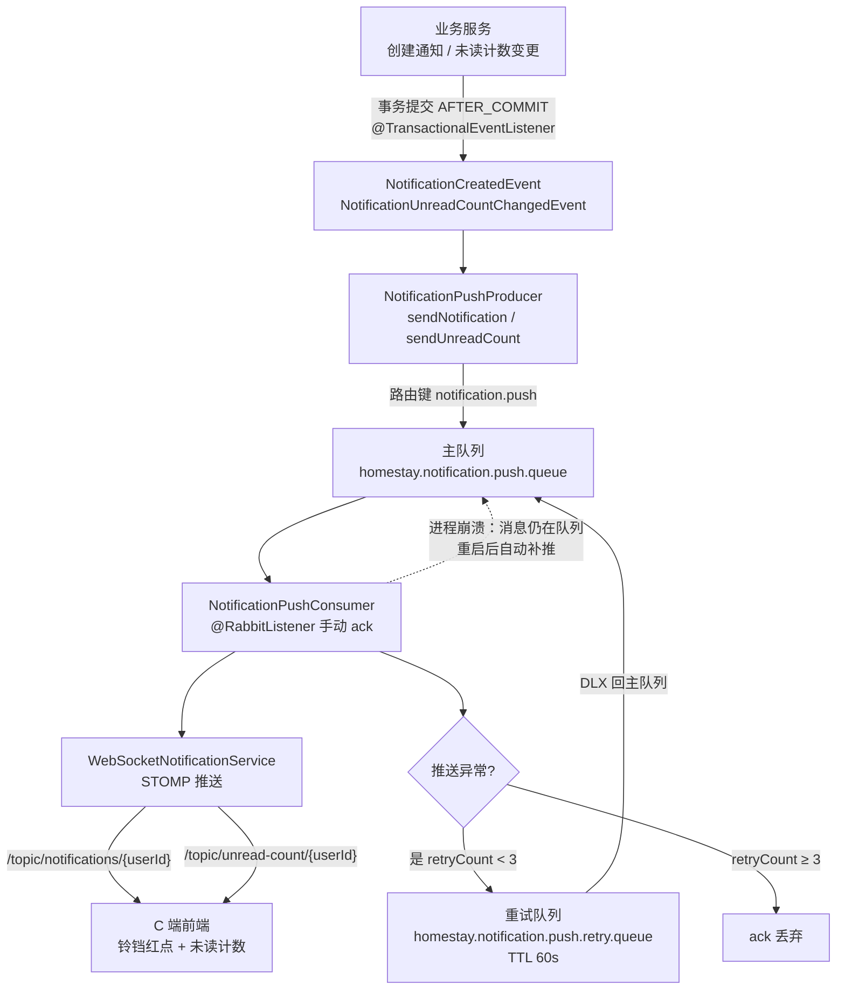

# 通知中心

> 为平台用户提供个性化消息通知的统一入口，支持订单、评价、房源审核、聊天、优惠券等多类通知的接收、查看与管理。路由：`/user/notifications`、`/host/notifications`、`/notifications`（Admin） | 权限：已登录用户

## 一、功能清单

### 1.1 用户可见功能（C 端用户/房东）

| 功能 | 说明 |
|------|------|
| 查看通知列表 | 分页展示个人通知，支持全部/未读/已读筛选 |
| 查看通知详情 | 点击通知卡片，根据类型跳转到对应业务页面 |
| 标记已读 | 单条标记已读、批量标记已读、全部标记已读 |
| 删除通知 | 删除单条通知 |
| 实时接收 | 通过 WebSocket 实时接收新通知，顶部铃铛红点提示 |
| 查看未读数 | 导航栏铃铛显示未读数量，新通知到达时触发晃动动画 |

### 1.2 管理/系统功能（Admin）

| 功能 | 说明 |
|------|------|
| 查看通知列表 | 分页展示管理员收到的通知（房源审核、系统公告等） |
| 按类型筛选 | 按 `HOMESTAY_SUBMITTED`、`HOMESTAY_APPROVED`、`SYSTEM_ANNOUNCEMENT` 等类型筛选 |
| 按状态筛选 | 按未读/已读状态筛选 |
| 标记已读 | 单条标记已读、全部标记已读 |
| 删除通知 | 删除单条通知 |
| 点击跳转 | 房源类通知跳转审核工作台/审核历史 |

## 二、核心业务规则

### 2.1 通知分类映射

| 分类 | 包含通知类型 | 典型触发场景 |
|------|-------------|-------------|
| order | `BOOKING_REQUEST`、`BOOKING_ACCEPTED`、`BOOKING_REJECTED`、`BOOKING_CANCELLED`、`ORDER_CONFIRMED`、`PAYMENT_RECEIVED`、`ORDER_CANCELLED_BY_HOST`、`ORDER_CANCELLED_BY_GUEST`、`ORDER_COMPLETED`、`ORDER_STATUS_CHANGED`、`REFUND_REQUESTED`、`REFUND_APPROVED`、`REFUND_REJECTED`、`REFUND_COMPLETED` 及历史别名 | 订单生命周期各阶段 |
| message | `NEW_MESSAGE` | 收到新聊天消息 |
| review | `NEW_REVIEW`、`REVIEW_REPLIED` | 收到新评价/评价回复 |
| homestay | `HOMESTAY_APPROVED`、`HOMESTAY_REJECTED`、`HOMESTAY_SUBMITTED` | 房源审核结果/提交 |
| coupon | `COUPON_EXPIRING`、`COUPON_ISSUED` | 优惠券发放/即将过期 |
| system | `SYSTEM_ANNOUNCEMENT`、`WELCOME_MESSAGE`、`PASSWORD_CHANGED`、`EMAIL_VERIFIED` | 系统公告、欢迎、账号安全 |

### 2.2 已读状态定义

| 状态 | 数据库值 | 触发条件 |
|------|---------|---------|
| 未读 | `is_read = FALSE` | 通知创建时默认状态 |
| 已读 | `is_read = TRUE` | 用户点击标记已读、点击跳转、批量/全部标记 |

### 2.3 通知创建规则

- 通知创建由业务 Service 调用 `NotificationService.createNotification()` 触发
- 创建成功后通过 `WebSocketNotificationService` 实时推送至接收方
- 推送异常被捕获且不抛错，确保不影响主业务事务

## 三、页面与组件

### 3.1 路由

C 端：

| 路径 | 组件 | 说明 |
|------|------|------|
| `/user/notifications` | `views/user/NotificationCenter.vue` | 用户通知中心页面 |
| `/host/notifications` | `views/user/NotificationCenter.vue` | 房东通知中心页面（复用同一组件） |

Admin：

| 路径 | 组件 | 说明 |
|------|------|------|
| `/notifications` | `views/notifications/index.vue` | Admin 通知中心页面 |

### 3.2 组件结构

C 端：

```
NotificationBell.vue（顶部导航栏）
├── el-popover
│   ├── 通知头部（标题 + 全部已读按钮）
│   ├── el-scrollbar
│   │   └── notification-item × N
│   │       ├── 图标 + 标题 + 内容摘要
│   │       └── 相对时间 + 未读红点
│   └── footer：查看全部通知

NotificationCenter.vue（页面）
├── 筛选栏（全部/未读/已读 radio + 全部标记已读按钮）
├── 通知卡片列表
│   └── notification-card × N
│       ├── 图标（按分类染色）
│       ├── 标题 tag + 时间
│       ├── 内容文本
│       └── 标记已读 / 删除按钮
└── el-pagination
```

Admin：

```
views/notifications/index.vue
├── page-header（标题 + 全部已读 + 刷新）
├── filter-section（类型筛选 + 状态筛选 + 搜索/重置）
└── notifications-list
    └── notification-item × N
        ├── 图标
        ├── 标题 + 时间 + 内容
        ├── entity meta（如房源ID tag）
        └── 标记已读 / 删除
    └── el-pagination
```

### 3.3 状态管理

C 端：`stores/notification.ts`（Pinia）

| 项 | 说明 |
|----|------|
| State | `unreadCount`、`notifications`、`loading`、`pagination` |
| Getters | `hasUnread` |
| Actions | `fetchUnreadCount`、`fetchNotifications`、`markAsRead`、`markAllAsRead`、`deleteNotification` |

Admin：无全局 Store，页面独立维护 `loading`、`notifications`、`unreadCount`、`currentPage`、`pageSize`、`total`、`filterForm`。

## 四、后端接口

| 方法 | 路径 | 说明 |
|------|------|------|
| GET | `/api/notifications` | 获取当前用户通知列表（分页，支持 `isRead` / `type` 筛选） |
| GET | `/api/notifications/unread-count` | 获取当前用户未读通知数量 |
| POST | `/api/notifications/{id}/read` | 单条标记已读 |
| POST | `/api/notifications/read-multiple` | 批量标记已读（请求体传 ID 列表） |
| POST | `/api/notifications/read-all` | 全部标记已读 |
| DELETE | `/api/notifications/{id}` | 删除单条通知 |

### 4.1 核心 Service

| 接口/类 | 职责 |
|---------|------|
| `NotificationService` | 接口定义：创建、查询、标记已读、删除、清理 |
| `NotificationServiceImpl` | 核心实现：批量查询优化（一次性查 actor/user/order/homestay/review 避免 N+1）、DTO 展示元数据注入（category/title/deepLink/payload）、WebSocket 推送调用 |
| `OrderNotificationServiceImpl` | 订单生命周期通知专用封装（预订、支付、完成、取消、退款、争议） |
| `WebSocketNotificationServiceImpl` | WebSocket 推送解耦层，异常安全 |
| `NotificationCleanupService` | 定时清理已读过期通知（每天凌晨 3 点，默认保留 30 天） |
| `CheckInReminderService` | 定时入住提醒（每天上午 9 点，为次日入住订单发送） |

## 五、数据模型

### 5.1 数据库表

`notifications`（Flyway V44）

| 字段 | 类型 | 说明 |
|------|------|------|
| `id` | BIGINT PK | 自增主键 |
| `user_id` | BIGINT FK | 接收者用户ID，`ON DELETE CASCADE` |
| `actor_id` | BIGINT FK | 触发者用户ID，`ON DELETE SET NULL` |
| `type` | VARCHAR(50) | 通知类型（枚举字符串） |
| `entity_type` | VARCHAR(50) | 关联实体类型（枚举字符串） |
| `entity_id` | VARCHAR(255) | 关联实体ID（支持字符串形式） |
| `content` | TEXT | 通知内容 |
| `is_read` | BOOLEAN | 是否已读，默认 `FALSE` |
| `read_at` | DATETIME | 标记已读时间 |
| `created_at` | DATETIME | 创建时间 |
| `updated_at` | DATETIME | 更新时间 |

索引：`idx_notification_user_id`、`idx_notification_type`、`idx_notification_user_read`、`idx_notification_user_created`、`idx_notification_actor_id`

### 5.2 DTO / 类型定义

后端 `NotificationDTO`：

```java
Long id, userId, actorId;
String actorUsername;
NotificationType type;
String rawType;
EntityType entityType;
String rawEntityType;
String entityId, entityTitle;
String category, title, deepLink;
Map<String, Object> payload;
String content;
boolean isRead;
LocalDateTime readAt, createdAt;
```

前端 `NotificationDto`（TypeScript）字段与后端对应，增加 `read` 布尔字段兼容。

## 六、实时同步 / 特殊机制

### 6.1 WebSocket 推送

- C 端使用 **SockJS + STOMP** 连接后端 `/ws`
- 订阅频道：
  - `/topic/notifications/${userId}` — 实时推送单条通知
  - `/topic/unread-count/${userId}` — 实时推送未读计数更新
- 收到消息后写入 Pinia Store，触发铃铛红点与晃动动画

**推送链路（MQ 消息驱动，可靠投递）：**



### 6.2 定时任务

| 任务 | 调度 | 职责 |
|------|------|------|
| `NotificationCleanupService` | `0 0 3 * * ?` | 清理已读且超过保留天数的通知 |
| `CheckInReminderService` | `0 0 9 * * ?` | 为次日入住订单向房东和房客发送提醒 |

### 6.3 枚举兼容

- `NotificationType` 含 8 个 `@Deprecated` 历史别名（`PAID`、`CANCELLED`、`COMPLETED` 等），提供 `canonicalType()` 归一化
- `EntityType` 兼容旧值 `MESSAGE` → `MESSAGE_THREAD`
- Flyway V45 一次性清洗历史数据

## 七、实现记录

| 日期 | 功能 | 说明 |
|------|------|------|
| 2026-04-27 | 基础通知中心 | Flyway V44 建表，实现 `NotificationController` + `NotificationService` + C 端 Bell/Center 组件 |
| 2026-04-27 | 历史数据兼容 | Flyway V45 归一化遗留枚举值；枚举增加 `canonicalType()` |
| 2026-04-27 | WebSocket 实时推送 | SockJS + STOMP 接入，支持实时通知与未读计数更新 |
| 2026-04-27 | 订单通知封装 | `OrderNotificationServiceImpl` 封装订单全生命周期通知 |
| 2026-04-27 | 批量查询优化 | `NotificationServiceImpl` 一次性批量查询关联实体，避免 N+1 |
| 2026-04-27 | Admin 通知中心 | `homestay-admin` 增加 `/notifications` 页面，支持类型筛选与跳转审核工作台 |
| 2026-04-27 | 定时任务 | `NotificationCleanupService`（每日清理）、`CheckInReminderService`（入住提醒） |
| 2026-05-05 | 消除前后端重复解析逻辑 | 后端 `NotificationServiceImpl` 已统一注入 `category`/`title`/`deepLink`；C 端 `types/notification.ts` 精简 `normalizeNotification`，组件直接信任后端字段；Admin `NotificationDto` 补充字段并移除本地 `getNotificationTitle` |
| 2026-05-05 | 移除前端硬编码兜底跳转 | 删除 C 端 `resolveNotificationCategory` / `resolveNotificationTitle` / `resolveNotificationDeepLink`；`NotificationCenter.vue` / `Bell.vue` / `NotificationManage.vue` 移除 `switch(entityType)` 硬编码跳转，跳转完全由后端 `deepLink` 控制 |
| 2026-05-05 | 枚举按业务域拆分 | 新增 `NotificationDomain` 枚举（ORDER / MESSAGE / REVIEW / HOMESTAY / COUPON / SYSTEM）；`NotificationType` 增加 `domain` + `defaultTitle` 字段；`NotificationServiceImpl.resolveCategory` / `resolveTitle` 从 switch 简化为配置驱动 |
| 2026-05-05 | 通知偏好设置 | 新增 `notification_preferences` 表（V46）；`NotificationPreferenceService` 管理按业务域开关；`NotificationServiceImpl.createNotification` 增加偏好过滤；C 端通知中心增加设置弹窗（6 域开关，system 强制开启） |
| 2026-08-09 | 推送 MQ 消息驱动（可靠投递） | 通知 WebSocket 推送从事务事件直接推送改为 RabbitMQ 消息驱动：NotificationWebSocketEventListener（AFTER_COMMIT）发 MQ 消息，NotificationPushConsumer 消费推送；消息带完整 NotificationDTO；主队列 + 重试队列（TTL 60s，x-retry-count 最多 3 次）；notification.push.mq-enabled 开关降级直接推送。进程崩溃消息不丢，重启后补推。冒烟验证：消费者线程（ntContainer）推送成功 |

**验证结果**
- 后端编译/测试：✅
- 前端构建：✅
- 2026-08-09 通知推送 MQ 改造：✅ NotificationPushConsumerTest 9 用例全过，CouponBatch/Order/Coupon 共 61 用例无回归；冒烟：管理端发系统通知 → 消费者线程推送成功

## 相关模块

- [[功能模块-订单管理]] — 订单生命周期触发通知
- [[功能模块-聊天消息]] — `NEW_MESSAGE` 通知类型联动
- [[功能模块-公告通知]] — 系统级公告（与个性化通知中心独立）
- [[功能模块-通知与仪表盘]] — Admin 端 Dashboard 与通知入口
