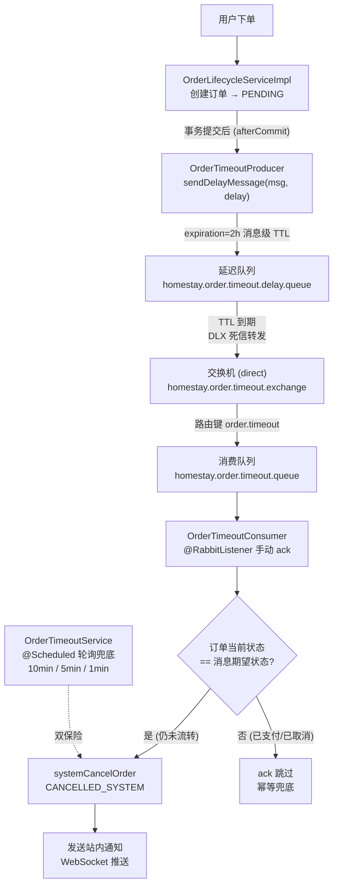
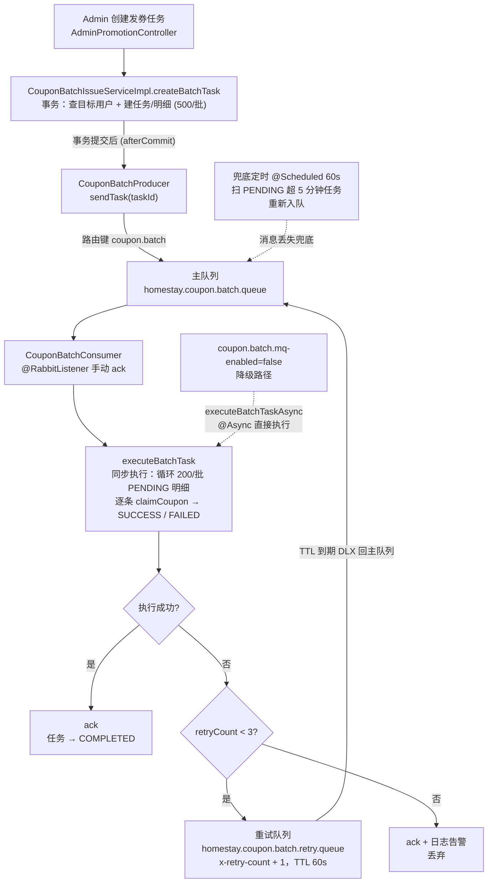
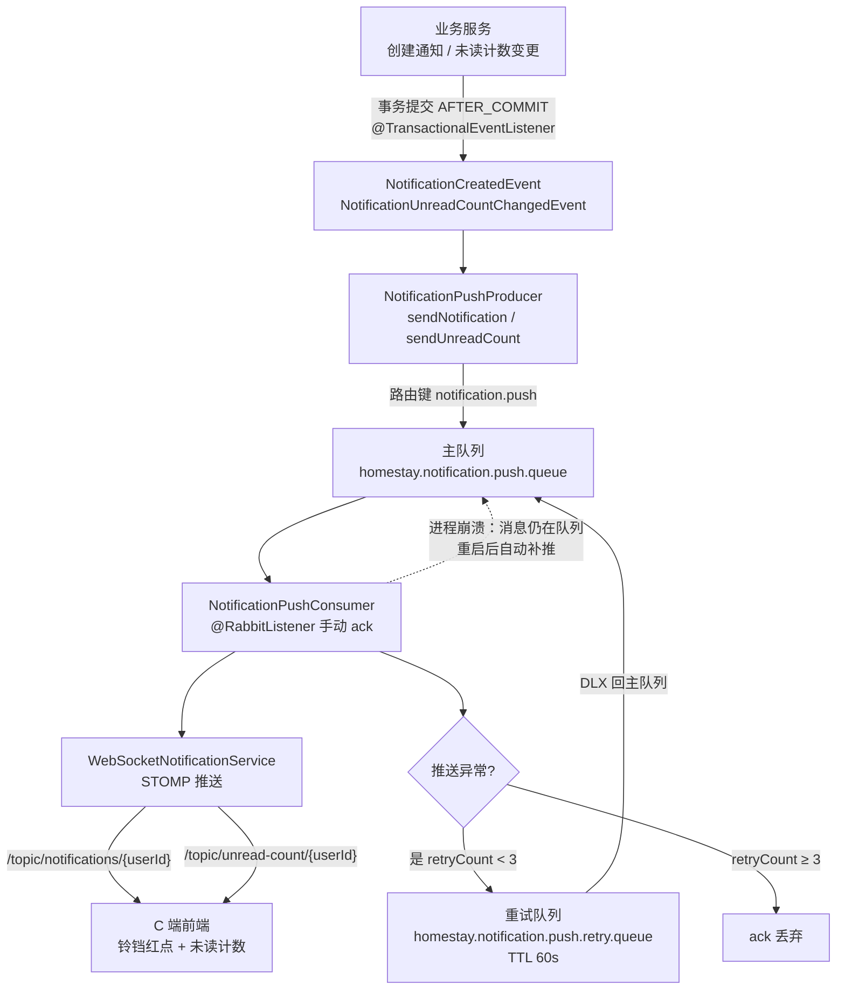

# 后端 RabbitMQ 消息架构

> 项目三大 MQ 场景汇总：订单超时延迟队列（DLX）、批量发券消息驱动、通知推送可靠投递。
> 共同模式：主队列 + 重试/延迟队列（TTL 死信回主）、消费者手动 ack + 幂等校验、mq-enabled 开关降级、定时任务兜底。

## 基础设施

| 组件 | 说明 |
|------|------|
| 容器 | `homestay-rabbitmq`（rabbitmq:3.13-management，docker-compose 管理） |
| 端口 | 5672（AMQP）/ 15672（管理台，homestay/homestay123） |
| 序列化 | Jackson2JsonMessageConverter（注册 JavaTimeModule，LocalDateTime 序列化坑已修） |
| 可靠性 | publisher-confirm=correlated + publisher-returns=true |

## 场景一：订单超时延迟队列（DLX 死信方案）

| 要素 | 实现 |
|------|------|
| 交换机 | `homestay.order.timeout.exchange`（direct，durable） |
| 延迟队列 | `homestay.order.timeout.delay.queue`：消息级 expiration，DLX 指回主交换机，死信路由键 `order.timeout` |
| 消费队列 | `homestay.order.timeout.queue`，绑定路由键 `order.timeout` |
| 触发点 | 状态转换后 afterCommit 发延迟消息（PENDING / CONFIRMED / PAYMENT_PENDING，各 2h） |
| 幂等根基 | 消费时校验订单当前状态 == 消息期望状态，不一致直接 ack（消息可能过期/状态已流转） |
| 兜底 | 三个 @Scheduled 轮询任务全部保留（最长 10min 延迟容忍） |
| 开关 | `order.timeout.mq-enabled=false` 时消费者直接 ack，轮询兜底继续工作 |

## 场景二：批量发券（消息驱动 + 重试队列）

| 要素 | 实现 |
|------|------|
| 交换机 | `homestay.coupon.batch.exchange`（direct，durable） |
| 主队列 | `homestay.coupon.batch.queue`，路由键 `coupon.batch`（首次发送直入，无延迟） |
| 重试队列 | `homestay.coupon.batch.retry.queue`：x-message-ttl=60000，DLX 指回主交换机 |
| 重试上限 | x-retry-count header，≥3 次后 ack 丢弃并告警 |
| 幂等 | executeBatchTask 任务状态校验（非 PENDING 直接 return） |
| 兜底 | @Scheduled 60s 扫 PENDING 且 createdAt < now-5min 的任务重新入队 |
| 降级 | `coupon.batch.mq-enabled=false` → Controller 改调 executeBatchTaskAsync（@Async） |

## 场景三：通知推送（可靠投递）

| 要素 | 实现 |
|------|------|
| 交换机 | `homestay.notification.exchange`（direct，durable） |
| 主队列 | `homestay.notification.push.queue`，路由键 `notification.push` |
| 重试队列 | `homestay.notification.push.retry.queue`：x-message-ttl=60000，DLX 回主 |
| 消息体 | NotificationPushMessage（type: NOTIFICATION / UNREAD_COUNT + 完整 NotificationDTO） |
| 可靠投递 | 事务提交后消息已入队；进程在提交后、推送前崩溃也不丢，重启补推 |
| 重试上限 | x-retry-count ≥ 3 丢弃（推送服务内部吞异常，重试只针对反序列化/并发异常） |
| 降级 | `notification.push.mq-enabled=false` → 事件监听器直接调 WebSocket 服务推送 |

## 三个场景对比

| 维度 | 订单超时 | 批量发券 | 通知推送 |
|------|---------|---------|---------|
| 核心诉求 | 精准定时（2h 后取消） | 异步解耦 + 失败自动重试 | 进程崩溃不丢消息 |
| 延迟机制 | 消息级 TTL + DLX（最长 2h） | 重试队列 TTL 60s | 重试队列 TTL 60s |
| 重试上限 | 无（状态幂等兜底） | x-retry-count 最多 3 次 | x-retry-count 最多 3 次 |
| 手动 ack | ✅ | ✅ | ✅ |
| 幂等策略 | 订单状态校验 | 任务状态校验 | 推送无副作用（防御性重试） |
| 降级开关 | order.timeout.mq-enabled | coupon.batch.mq-enabled | notification.push.mq-enabled |
| 兜底机制 | 3 个定时任务 | 60s 定时扫 PENDING | 消息队列本身保证 |

## 相关笔记

- [[功能模块-订单超时处理]]
- [[功能模块-营销促销]]
- [[功能模块-通知中心]]
- [[后端-架构总览]]
