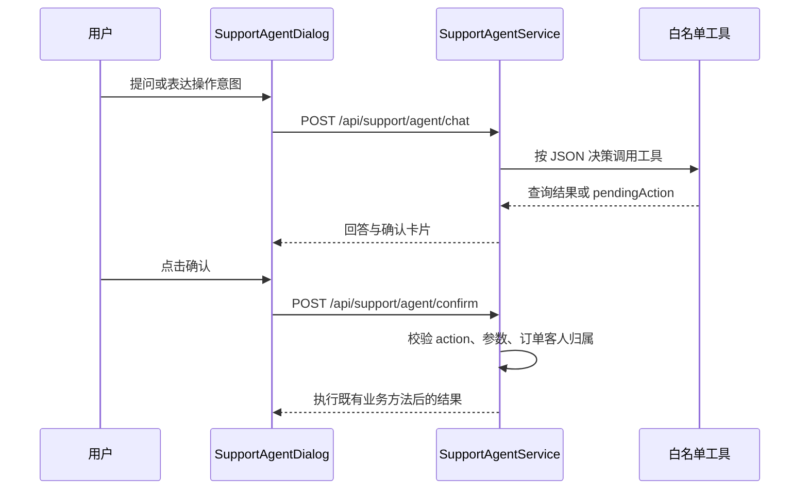

# AI客服Agent-权限与工具边界

本页对照注册表、Controller、订单校验与编排服务，说明现有工具和边界。历史设计见 [[历史设计-AI客服Agent-权限矩阵-v0.2]]，测试证据见 [[AI客服Agent-测试报告]]。

## 三层职责

| 层 | 当前行为 | 边界 |
|---|---|---|
| FAQ | 查询订单、退款预览、履约信息、房源、评价、价格 | 白名单只读工具 |
| 订单服务 | 起草退款申请、取消、房客争议 | 返回 pendingAction，用户确认后执行 |
| 管理员争议辅助 | 组装时间线、聊天、相似案例并生成建议 | 只提供草稿，不执行仲裁 |

## 工具白名单

AgentToolRegistry 构造函数固定注册 10 个工具，不开放动态注册。

| 工具 | 类型 | 作用 |
|---|---|---|
| query_my_order | 只读 | 查询可访问订单 |
| get_refund_preview | 只读 | 退款预览 |
| get_check_in_info | 只读 | 入住信息 |
| get_check_out_info | 只读 | 退房与押金信息 |
| get_homestay_detail | 只读 | 房源信息 |
| get_review_stats | 只读 | 评价统计 |
| calculate_price | 只读 | 查询价格 |
| request_user_refund | 起草 | 退款申请提案 |
| cancel_order_with_reason | 起草 | 取消订单提案 |
| raise_dispute_by_guest | 起草 | 房客争议提案 |

白名单没有代发聊天消息工具。退款审批、直接退款、押金操作、支付确认、删除订单等方法没有注册。

## 对话与确认

“两阶段”指决策和回答阶段，决策阶段可以连续调用多个工具。写工具只校验并起草，实际写入发生在确认接口，并受既有业务状态规则约束。

## 权限与边界

| 位置 | 当前行为 |
|---|---|
| 订单只读工具 | requireAccessibleOrder 校验订单客人或房源房东 |
| 三个写工具与确认 | requireGuestOrder 限制为订单客人 |
| 管理员建议 | 管理端角色校验，建议不改变订单状态 |
| LLM / 工具异常 | 编排服务处理，提示与转人工逻辑以实现为准 |
| 功能开关 | 示例 agent.llm.enabled=false，关闭时 chat 返回 503 |
| 交易结果 | 生成建议或提交请求不等于退款成功，跨服务状态边界见 [架构图集](../../../docs/diagrams/README.md) |

OrderAccessGuard 是 Agent 订单工具共享校验，不是全站所有接口必经入口。

## 代码入口

后端路径相对 Java 包 com/homestay3/homestaybackend：

| 文件 | 职责 |
|---|---|
| service/agent/AgentToolRegistry.java | 白名单 |
| service/agent/tools/OrderAccessGuard.java | 订单归属 |
| service/agent/tools/ | 只读与申请工具 |
| service/agent/impl/SupportAgentServiceImpl.java | 决策、执行、回答、确认分发 |
| controller/SupportAgentController.java | chat 与 confirm |
| service/impl/DisputeAdvisorServiceImpl.java | 管理员建议 |
| 前端 src/components/chat/SupportAgentDialog.vue | 待确认卡片 |

本次核对代码边界，没有重新运行测试或真实 LLM 联调；历史数量与结果保留在原报告中。
