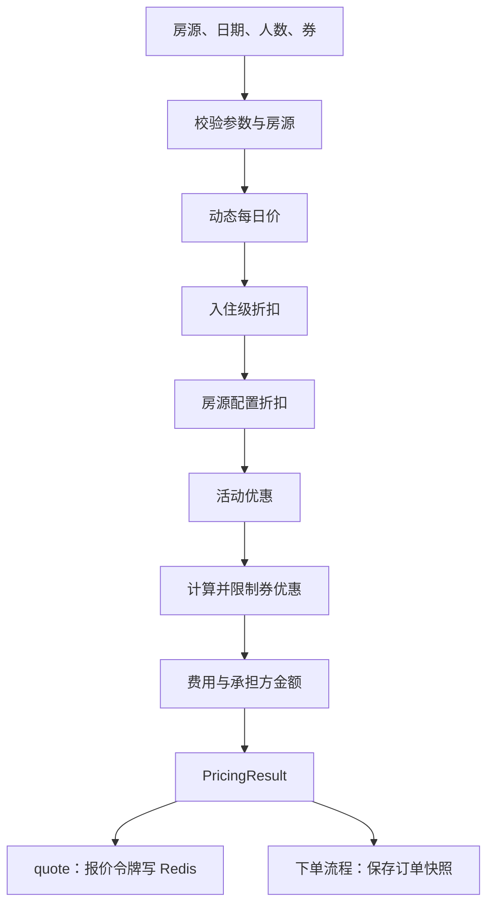

# 技术设计-统一计价与优惠券

本页维护当前报价、下单重算与快照的分工。业务见 [[功能模块-营销促销]]、[[功能模块-定价引擎]]；设计过程见 [[系统架构分析-营销促销系统落地方案]]。

## 三种动作

| 动作 | 入口 | 输出或副作用 |
|---|---|---|
| 计算价格 | PricingService.calculate | 每日价、入住折扣、活动、券、费用与承担方金额 |
| 发出报价 | PricingService.quote | 报价与 quoteToken，尝试写 Redis，TTL 10 分钟 |
| 保存订单价格 | PricingService.savePriceSnapshot | 订单确定时保存价格快照 |

报价接口不直接保存订单价格快照。Redis 写入失败会被记录，不能宣称缓存必然成功。

## 计算顺序

动态规则见 [[技术设计-动态定价规则]]。活动匹配由 PromotionMatchServiceImpl 负责，券匹配与核销由 CouponServiceImpl 负责。

## 报价与下单

validateQuoteToken 读取令牌，核对房源、日期和人数，用当前选择的券重算金额。金额变化时抛 PriceChangedException，携带新报价交前端确认。

用户曾经看到的价格不能直接作为下单金额。快照保存订单确定时的结果，报价缓存只保存短期验证数据。

## 记录与交易边界

| 记录 | 作用 |
|---|---|
| coupon_template | 券模板和规则 |
| user_coupon | 用户券与领取时快照 |
| order_price_snapshot | 订单金额、优惠、承担方快照 |
| promotion_usage | 活动和券的使用记录 |

券的锁定、核销、释放依赖实际交易路径。退款申请不能直接画成资金退款成功或券已归还。活动预算回退存在异常边界，见 [架构图集](../../../docs/diagrams/README.md)。

## 两种缓存

| 缓存 | 介质 | 用途 |
|---|---|---|
| pricingRules | Caffeine，TTL 5 分钟 | 定价规则读取 |
| pricing:quote:{quoteToken} | Redis，TTL 10 分钟 | 短期报价验证 |

## 核对入口

PricingServiceImpl 的 quote、calculate、savePriceSnapshot、validateQuoteToken；PricingEngineServiceImpl；CacheConfig。均位于后端 Java 包下的 service/impl 或 config。

本次为静态核对，未执行真实支付、退款或性能测试。
