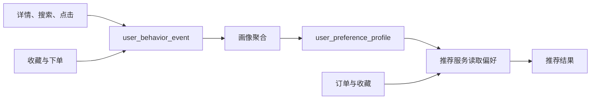

# 技术设计-搜索与推荐

本页区分搜索、地图和推荐链路。早期“未引入 ES”的描述属于历史方案。

## 搜索与地图

| 场景 | HomestaySearchServiceImpl 入口 | 机制 |
|---|---|---|
| 普通搜索与视口 | 搜索相关方法 | 根据关键词 / 视口条件尝试 ES，保留 JPA 路径 |
| 附近与地标 | searchNearbyByElasticsearch | 地理距离查询 |
| 地图视口 | searchViewportByElasticsearch | 视口范围查询 |
| 地图聚类 | getMapClustersByElasticsearch | ES 聚合，保留内存路径 |
| 索引同步 | 索引服务与 repository | 独立于查询，不保证提交后强一致 |

各分支以服务实现为准。查询可以降级与后端能否在没有 ES 时启动是独立条件，启动要求见 [[开发环境配置]]。

## 行为、画像与推荐

| 机制 | 当前实现 |
|---|---|
| 页面埋点 | 详情 trackView；SearchBar、列表、地图 trackSearch；卡片和地图 trackClick |
| 业务埋点 | 收藏服务记录 FAVORITE；订单生命周期服务记录 BOOKING |
| 定时任务 | UserProfileAggregationJob 每小时聚合 |
| 活跃查询 | 查询最近 7 天登录用户 ID，去重后聚合 |
| 维度 | 城市、房型、设施、价格范围 |
| 偏好读取 | analyzeUserPreference 先调用 applyProfilePreferences，再合并订单与收藏 |
| 数据不足 | 无画像时尝试聚合，保留默认偏好；结果不足时放宽过滤并合并候选 |
| 多样性 | diversifyPersonalizedResults |

代码调用不能证明推荐效果提升。点击率、转化率和线上效果需单独测量。

## 个性化接口权限

| 接口 | 约束 |
|---|---|
| GET /api/recommendations/personalized/me | 从认证信息取得用户 ID |
| GET /api/recommendations/personalized/{userId} | ID 必须等于当前用户，越权返回 403 |
| 无当前用户 | Controller 返回 401 |

## 继续阅读

- 功能：[[功能模块-房源搜索]]、[[功能模块-地图找房]]、[[功能模块-个性化推荐]]。
- 历史：[[方案-ES搜索与个性化推荐]]、[[方案-地图找房与ES搜索结合]]。
- 实施记录：[[复盘-地图找房与ES搜索改造]]。
- 查询与索引边界：[架构图集](../../../docs/diagrams/README.md)。

核对范围为 ES 方法、推荐服务、Controller、画像聚合与前端埋点调用，未运行在线数据或效果评估。
