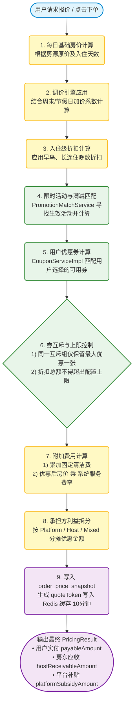
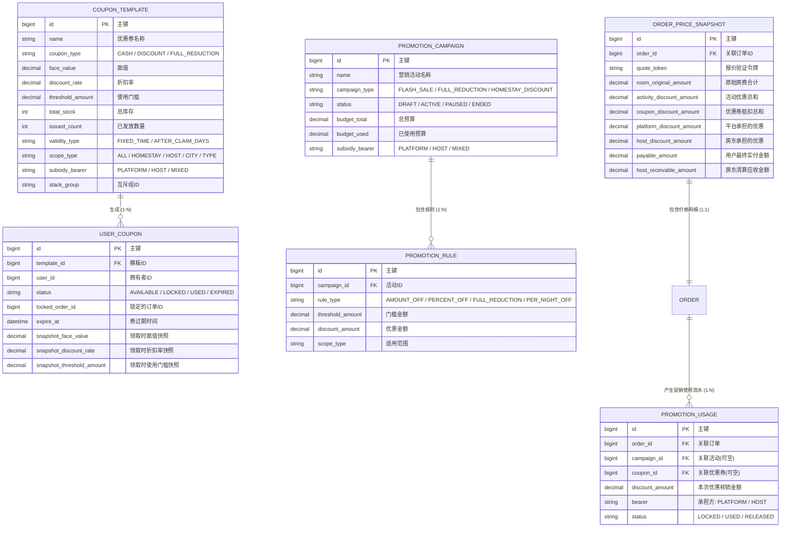
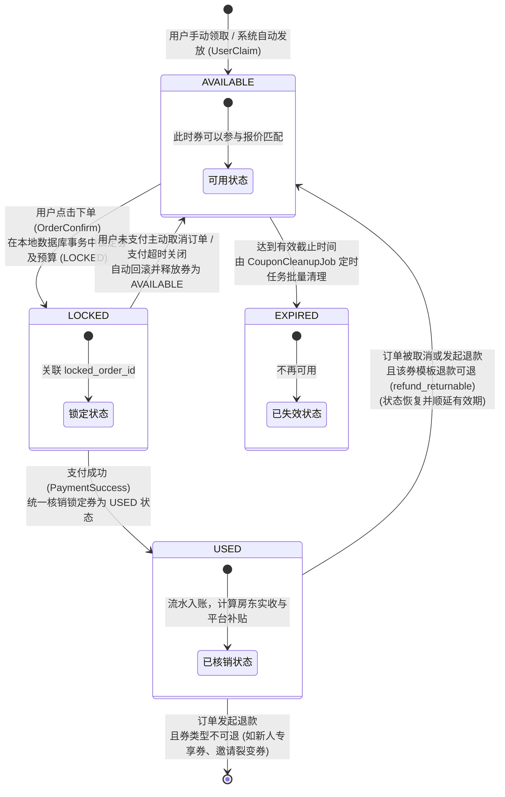

# 图解：营销促销与计价引擎架构

> 本文档专为开发与运营人员直观理解 homestay3 民宿平台的优惠券、促销活动和计价引擎而设计。
> 建议在 Obsidian 中开启**预览/实时阅览模式**以获得最佳的 Mermaid 图形呈现效果。

---

## 一、 统一计价与匹配引擎全景图 (Mermaid Flowchart)

该流程展示了一个报价/下单请求从输入（房源、入住日期、人数、选择的优惠券）开始，经过每日价溢价、连住折扣、活动匹配、券互斥及上限控制，再到费用计算、分摊核算，最终生成价格快照并输出的完整步骤：

---

## 二、 核心数据库实体关系图 (Mermaid ER Diagram)

营销促销涉及多张表相互关联（主要在 `V31__create_promotion_tables.sql` 中定义）。以下实体关系图展示了模板、用户领取的券、促销活动、规则、价格快照以及最终流水之间的逻辑脉络：

---

## 三、 优惠券状态机与交易流转状态图 (Mermaid State Diagram)

该图展示了优惠券从**被用户领取**开始，在交易的**下单锁定**、**支付核销**、**取消释放**以及**退款还原**等生命周期中的流转逻辑：

