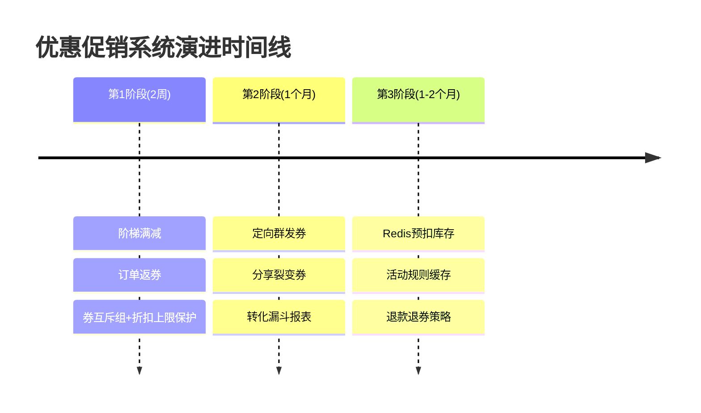

# 方案：优惠促销系统后续演进

> 分析日期：2026-04-28
> 关联：[[系统架构分析-营销促销系统落地方案]]、[[方案-定价引擎]]

---

## 一、当前能力基线

系统已完成**核心交易骨架**：

| 维度 | 已实现 | 待演进 |
|------|--------|--------|
| 活动类型 | 限时折扣、满减、房源折扣 | 阶梯满减、秒杀、拼团、连住递减 |
| 券类型 | 现金券、折扣券、满减券 | 兑换券、运费券（清洁费/服务费） |
| 券生命周期 | 领取 → 锁定 → 核销 → 过期回收 | 退款退券 |
| 预算控制 | 乐观锁扣减 + 预警 | Redis 预扣库存（高并发） |
| 承担方 | 平台 / 房东 / 混合 | 更细的分摊规则 |
| 定价引擎 | 节假日、周末、早鸟、连住 | 动态供需调价 |
| 数据报表 | GMV / ROI / 核销率 | 转化漏斗、渠道归因、AB测试 |
| 发放渠道 | 主动领取、注册自动发 | 定向群发、裂变、订单返券 |

---

## 二、短期（1-2个月）：玩法丰富度 + 资损防护

### 2.1 阶梯满减 & 连住递减

> [!info] 业务价值高，技术改动小

**现状**：`FULL_REDUCTION` 为单档（满 500 减 50），`PER_NIGHT_OFF` 为每晚固定减免。

**演进**：
- **阶梯满减**：配置多档规则，系统自动取最优档
  - 例：满 300 减 30 / 满 500 减 60 / 满 1000 减 150
- **连住递减**：第 1 晚原价，第 2 晚 9 折，第 3 晚 8 折…
  - 适合长住场景，鼓励用户延长入住
- **N 晚 M 折**：连住 3 晚总价 7 折（区别于每晚单独折扣）

```sql
-- 扩展 promotion_rule 支持阶梯配置
ALTER TABLE promotion_rule 
ADD COLUMN tier_config_json TEXT COMMENT '阶梯配置JSON';
-- [{"threshold":300,"discount":30},{"threshold":500,"discount":60}]
```

### 2.2 限时秒杀

**现状**：`FLASH_SALE` 类型已存在，但缺少库存倒计时、抢购排队体验。

**演进**：
- 秒杀活动独立入口（首页 Banner）
- `promotion_campaign` 增加 **`item_stock`** 字段（区别于预算，控制可售间夜数）
- 前端倒计时 + 库存实时显示（WebSocket 推送）
- 未支付订单 10 分钟内占库存，超时自动释放

### 2.3 券互斥组 & 全局折扣上限

> [!warning] 当前存在潜在资损风险

**现状**：多券叠加按顺序递减计算，无互斥控制。用户可能叠加使用"平台满减券"+"房东折扣券"，优惠金额超过房费。

**演进**：
1. `coupon_template` 增加 **`stack_group`** 字段（互斥组 ID，同组不可叠加）
2. 全局配置 `max_discount_rate`（如优惠金额不得超过订单金额的 50%）
3. 报价接口增加前置校验：计算总优惠后若超过上限，按比例截断或拒绝使用

---

## 三、中期（2-4个月）：精准运营 & 数据驱动

### 3.1 订单返券 & 定向发券

> [!info] 提升复购率的关键手段

| 发放方式 | 场景 | 触发点 |
|---------|------|--------|
| **订单返券** | 入住完成后自动发"下次立减 50 元" | `OrderLifecycleService.checkOut()` |
| **定向群发** | 给"30 天未下单用户"批量发召回券 | 管理后台标签筛选 + 异步任务 |
| **分享裂变** | 分享链接给好友，双方得券 | 分享时绑定 `referral_code` |
| **签到领券** | 连续签到 3 天得小额券 | 新增签到记录表 |

**定向发券技术要点**：
- 管理后台选择用户标签 → 预览人群数量 → 一键发放
- 大批量发放走 MQ 异步处理，避免阻塞主流程
- 发放结果通过任务进度条展示（成功/失败/跳过）

### 3.2 用户标签 + 精准匹配

```java
// 用户标签体系（与优惠券模板打通）
enum UserTag {
    HIGH_VALUE,      // 高价值用户（客单价 > 1000）
    AT_RISK,         // 流失风险（30 天未登录）
    NEW_USER,        // 新注册用户
    LONG_STAY_PREF,  // 偏好长住（平均晚数 > 5）
    PRICE_SENSITIVE  // 价格敏感（频繁浏览低价房源）
}
```

**自动化规则示例**：
> "AT_RISK 用户且收藏了房源但未下单" → 自动推送"收藏房源立减券"

### 3.3 渠道归因 & 转化漏斗

**现状**：ROI 分析只能看到"活动带动了多少钱"，看不到"用户从哪一步流失"。

**演进**：
- `coupon_template` / 发放记录增加 `claim_channel` 字段
  - 取值：HOME_BANNER / HOMESTAY_DETAIL / SMS_PUSH / WECHAT_MSG / SHARE_LINK
- 建立转化漏斗报表：

```
曝光 → 点击 → 领取 → 锁定（下单） → 支付核销
  │      │       │        │            │
  │      │       │        │            └── 核销率
  │      │       │        └── 领取→下单转化率
  │      │       └── 曝光→领取转化率
  │      └── 点击率
  └── 曝光量（UV/PV）
```

**数据表扩展**：
```sql
CREATE TABLE coupon_analytics (
    id BIGINT PRIMARY KEY AUTO_INCREMENT,
    template_id BIGINT,
    channel VARCHAR(50),
    event_type VARCHAR(20), -- IMPRESSION / CLICK / CLAIM / LOCK / USE
    user_id BIGINT,
    homestay_id BIGINT,
    created_at DATETIME NOT NULL,
    INDEX idx_template_event (template_id, event_type),
    INDEX idx_channel_created (channel, created_at)
);
```

### 3.4 AB 测试框架

**场景**：同一批用户，50% 发"满 500 减 50"，50% 发"无门槛减 30"，对比核销率和 ROI。

**实现**：
- 优惠券模板增加 `ab_test_group` 字段（A / B / Control）
- 用户分桶策略：`user_id % 2` 或 Hash 取模
- 报表自动对比两组的关键指标（GMV、核销率、客单价、ROI）

---

## 四、长期（3-6个月）：高性能架构 & 平台化

### 4.1 高并发发券架构（Redis 预扣 + 异步落库）

> [!warning] 当前瓶颈：数据库乐观锁扛不住大促峰值

**现状**：`claimCoupon()` 使用 `incrementIssuedCount` 数据库乐观锁，高并发时大量锁竞争导致性能骤降。

**目标架构**：

```
用户请求领取
    │
    ▼
Redis DECR coupon_stock:{templateId}  ← 预扣库存（O(1)）
    │
    ├── 库存充足 ──→ 写入 MQ（发券任务）
    │                    │
    │                    ▼
    │              异步消费：
    │              1. INSERT user_coupon
    │              2. UPDATE template issued_count
    │              （失败可补偿重试）
    │
    └── 库存不足 ──→ 直接返回"优惠券已领完"
```

**优势**：
- Redis 单线程原子操作抗住突发流量（万级 QPS）
- 数据库异步平滑写入，削峰填谷
- 库存预扣后，即使用户未最终完成领取，通过 TTL 或定时任务回收超发

**关键实现**：
```java
// 发券前：Redis 预扣
Long remaining = redisTemplate.opsForValue().decrement("coupon:stock:" + templateId);
if (remaining < 0) {
    redisTemplate.opsForValue().increment("coupon:stock:" + templateId); // 回滚
    throw new IllegalStateException("优惠券已领完");
}

// 异步落库
mqProducer.send(new ClaimCouponMessage(userId, templateId));
```

### 4.2 活动规则缓存（报价性能优化）

> [!info] 现状：每次报价都要查数据库匹配活动

**优化策略**：

| 层级 | 内容 | 过期策略 |
|------|------|---------|
| **本地缓存** (Caffeine) | 热点活动规则 | 5 分钟 TTL + 最大 500 条 |
| **分布式缓存** (Redis) | 全部生效中的活动 | 活动结束时间作为 TTL |
| **数据库** | 持久化存储 | 最终一致性 |

**刷新机制**：
- 活动发布/修改/暂停时，通过 Redis Pub/Sub 通知各节点刷新本地缓存
- `@CacheEvict` + `@Cacheable` 注解接入 Spring Cache

### 4.3 第三方券码体系 & 异业合作

**场景**：与航空公司/信用卡合作，用户输入"航司会员码"可兑换本平台优惠券。

**扩展**：
- `coupon_template` 增加 `external_code_prefix`（如 `CA-` 表示国航合作券）
- 支持批量导入外部券码（CSV → Redis Set，避免重复）
- 核销时校验外部券码有效性（调用合作方 API 或本地 Redis 校验）

### 4.4 退款退券策略（生命周期闭环）

> [!warning] 现状：取消订单释放券，但支付后退款时券已核销，缺少退券策略

**策略矩阵**：

| 券类型 | 退款策略 | 说明 |
|--------|---------|------|
| 现金券 / 满减券 | **退回账户** | 支付后退款 → 券退回，延长 7 天有效期 |
| 新人券 | **不退回** | 仅限首单，退款后资格不恢复 |
| 活动赠送券 | **不退回** | 一次性权益 |
| 裂变获得券 | **不退回** | 防止羊毛党刷单套利 |

**实现**：
- `coupon_template` 增加 `refund_returnable` TINYINT(1) 字段
- `OrderLifecycleService.processCancelOrder()` / 退款流程中，根据策略判断是否调用 `restoreCoupon()`
- 退回的券状态设为 `AVAILABLE`，`expire_at` 顺延

---

## 五、推荐的最小可行演进路线



### 关键决策原则

1. **先补闭环，再追丰富**：退款退券、过期回收、资损防护是底线，必须在加新玩法前完成
2. **先精准，再广泛**：定向发券的 ROI 远高于全员撒券，优先建设标签+投放能力
3. **先缓存，再拆分**：活动规则缓存能解决 80% 的报价性能问题，微服务拆分优先级较低
4. **数据先行**：所有新玩法上线必须配套 `coupon_analytics` 埋点，否则无法衡量效果

---

## 六、与现有系统的依赖关系

| 演进项 | 依赖模块 | 影响面 |
|--------|---------|--------|
| 阶梯满减 | `promotion_rule` 表扩展 | 报价接口、管理后台表单 |
| 订单返券 | `OrderLifecycleService` | 订单完成事件监听 |
| 定向发券 | 用户标签体系、MQ | 用户中心、消息队列 |
| Redis 预扣 | Redis、MQ | 发券接口、库存校验 |
| 退款退券 | `processCancelOrder`、退款流程 | 订单中心、支付中心 |
| 活动缓存 | Redis、Spring Cache | 报价接口、活动管理后台 |

---

## 七、风险与规避

| 风险 | 影响 | 规避措施 |
|------|------|---------|
| 券叠加导致资损 | 财务损失 | 上线互斥组 + 全局折扣上限 |
| Redis 预扣超发 | 库存不准确 | 预扣后设置 TTL + 定时对账补偿 |
| 定向群发压垮 DB | 服务不可用 | 批量发放走 MQ 异步，限流 500/s |
| 活动缓存不一致 | 报价错误 | Cache Evict 绑定所有活动变更操作 |
| 退款退券被薅羊毛 | 营销成本失控 | 新人券/裂变券设置不退回策略 |
