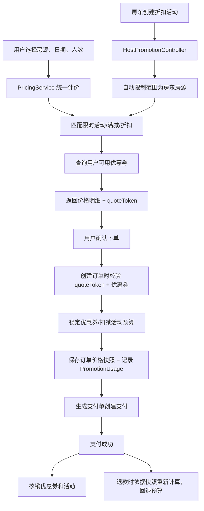

# 营销促销系统落地方案

> [!summary] 摘要
> 实现平台优惠券、限时活动、满减折扣等营销能力的统一管理系统。引入统一计价服务 `PricingService` 解决"实时报价"与"下单价格"不一致的问题，并通过价格快照 `order_price_snapshot` 保证订单全流程价格可追溯。

> [!note] 实施状态
> **第一期 MVP 已实现并部署**（2026-04-24）：统一计价、价格快照、平台优惠券、满减活动、取消/退款释放优惠券、房东收益优先读取快照。
> **第二期已实现并部署**（2026-04-25）：房东限时折扣活动、优惠券/活动承担方拆分、活动预算精细化（预警+耗尽自动结束）、营销报表、Admin 搜索筛选编辑删除、房东端活动管理。

## 一、项目目标

### 第一期目标（MVP，已实现）

- [x] 支持平台优惠券（现金券、折扣券、满减券）。
- [x] 保证"房源选择 → 实时报价 → 订单确认价 → 支付金额 → 退款金额 → 房东收益"全链路价格一致。
- [x] 支持后台创建活动、优惠券模板、查看适用范围和生效效果。
- [x] 支持取消/退款时自动释放优惠券。
- [x] 房东收益计算优先读取价格快照中的 `hostReceivableAmount`。

### 第二期目标（已实现）

- [x] 限时活动（房东折扣）：房东可在房东端给自己房源设置限时折扣。
- [x] 房东优惠承担：优惠券支持配置承担方（平台/房东/混合），`PricingService` 按承担方拆分。
- [x] 活动预算精细化：预算预警阈值、预算耗尽自动结束活动、预算回退。
- [x] 营销报表：Admin 和房东端均可查看活动效果数据（优惠金额、核销率、承担方占比）。
- [x] Admin 后台增强：活动/券模板支持搜索筛选、编辑、删除。

### 后续目标（待实现）

- [ ] 用户分群发券
- [ ] 裂变券自动发放
- [ ] 新人券
- [ ] 活动 ROI 分析
- [ ] A/B 测试

## 二、当前系统改造

当前系统已具备民宿预订的基础能力，本次改造聚焦解决以下问题：

| 问题 | 改造前现状 | 影响 |
|---|---|---|
| 下单计价 | `OrderLifecycleServiceImpl.createOrder` 用 `单价 * 天数 + 清洁费 + 服务费` 计算 | 不支持活动、周末/节假日加价 |
| 实时报价 | `OrderServiceImpl.calculatePrice` 不支持满减、折扣、券 | 用户看到的价格和实际支付可能不一致 |
| 价格明细 | `orders` 只有 `price`、`total_amount` 等少数字段 | 缺少优惠明细和价格快照，难以追溯 |
| 房东收益 | `EarningServiceImpl` 用 `order.totalAmount * hostShareRate` 计算 | 无法区分平台承担和房东承担的优惠 |
| 管理后台 | 无活动管理、优惠券管理模块 | 不适合运营人员维护营销活动 |
| 房东营销 | 房东无法自主设置房源折扣 | 房东缺乏促销手段 |
| 预算控制 | 活动预算只有字段，无实际扣减 | 预算超支风险 |

**核心改造文件：**

- `homestay-backend/src/main/java/.../service/PricingService.java`
- `homestay-backend/src/main/java/.../service/impl/OrderLifecycleServiceImpl.java`
- `homestay-backend/src/main/java/.../service/impl/OrderServiceImpl.java`
- `homestay-backend/src/main/java/.../service/impl/EarningServiceImpl.java`
- `homestay-backend/src/main/java/.../service/impl/CouponServiceImpl.java`
- `homestay-backend/src/main/java/.../service/impl/PromotionMatchServiceImpl.java`
- `homestay-backend/src/main/java/.../controller/HostPromotionController.java`（新增）
- `homestay-backend/src/main/java/.../controller/AdminPromotionController.java`
- `homestay-backend/src/main/resources/db/migration/V32__promotion_phase2.sql`（新增）
- `homestay-front/src/views/host/HostPromotionManage.vue`（新增）
- `homestay-front/src/views/host/HostPromotionStats.vue`（新增）
- `homestay-front/src/views/host/HostLayout.vue`
- `homestay-front/src/api/hostPromotion.ts`（新增）
- `homestay-admin/src/views/marketing/CampaignList.vue`
- `homestay-admin/src/views/marketing/CouponTemplateList.vue`
- `homestay-admin/src/views/marketing/MarketingDashboard.vue`（新增）
- `homestay-admin/src/config/menu.ts`
- `homestay-admin/src/router/index.ts`

## 三、系统架构

### 价格计算链路



### 推荐服务分层

| 服务 | 职责 |
|---|---|
| `PricingService` | 唯一计价入口，计算价格明细和生成快照 |
| `PromotionMatchService` | 匹配活动规则，计算房源折扣/满减，预算扣减/回退 |
| `CouponService` | 领券/查券/计算/锁定/释放/核销，返回承担方信息 |
| `OrderPriceSnapshotService` | 订单价格快照持久化 |
| `PromotionAdminService` | 管理后台活动/券模板维护 |
| `HostPromotionController` | 房东端活动管理和统计 |

## 四、优惠类型设计

### 1. 平台优惠券（已实现 MVP）

用户领取后使用。

支持类型：

- 现金券（如 500 减 50）
- 折扣券（如 9 折，最高减 100）
- 满减券（如满 800 减 80）

关键流程：

- 用户领取后写入 `user_coupon`
- 下单前可查询可用券
- 下单过程中锁定券
- 支付成功后核销券
- 未支付取消时释放券
- 支付后退款时券默认不退（简化处理）

**承担方支持（第二期新增）：**
- 券模板增加 `subsidy_bearer` 字段（`PLATFORM`/`HOST`/`MIXED`）
- 默认 `PLATFORM`（兼容历史数据）
- `PricingService` 按承担方将券金额拆分到 `platformDiscountAmount` / `hostDiscountAmount`

### 2. 满减活动（已实现）

订单满额自动减免。

示例：

- 满 800 减 80
- 连住 3 晚减 100
- 指定房源满 1000 减 120

### 3. 限时活动（房东折扣，第二期已实现）

活动期间的房源折扣。

示例：

- 五一预售：指定房源 8.5 折
- 周末特惠：周五到周日下单减 50
- 新客首单：指定房源类型首单 9 折

关键能力：

- 房东在房东端创建活动（`HostPromotionController`）
- 自动限制范围为该房东的所有房源
- `subsidyBearer` 强制为 `HOST`
- 支持预算上限、预警、耗尽自动结束

### 4. 房东优惠承担（第二期已实现）

房东维度的促销。

关键能力：

- 房东折扣不影响房源展示价
- 平台收益按折扣前计算
- `hostReceivableAmount` = 原始房费 - 房东承担优惠
- 管理后台展示优惠承担方

## 五、统一计价模型

统一计价顺序（固定不变）：

```text
每日基础房价
  -> 周末/节假日加价系数
  -> 房源/活动折扣
  -> 满减
  -> 优惠券（按承担方拆分）
  -> 清洁费
  -> 服务费
  -> 实付金额
```

### 计价结果字段

| 字段 | 说明 |
|---|---|
| `roomOriginalAmount` | 未优惠前房费合计 |
| `dailyPriceJson` | 每日价格明细 |
| `activityDiscountAmount` | 限时活动优惠 |
| `fullReductionAmount` | 满减优惠 |
| `couponDiscountAmount` | 优惠券优惠 |
| `platformDiscountAmount` | 平台承担的优惠（活动+券） |
| `hostDiscountAmount` | 房东承担的优惠（活动+券） |
| `discountedRoomAmount` | 优惠后房费 |
| `cleaningFee` | 清洁费 |
| `serviceFee` | 服务费 |
| `payableAmount` | 用户最终支付金额 |
| `hostReceivableAmount` | 房东应收到金额 |
| `platformSubsidyAmount` | 平台补贴成本 |

### 计价公式

```text
roomOriginalAmount = sum(dailyPrices)
discountedRoomAmount = max(roomOriginalAmount - activityDiscount - fullReduction - couponDiscount, 0)
serviceFee = discountedRoomAmount * serviceFeeRate
payableAmount = discountedRoomAmount + cleaningFee + serviceFee
hostReceivableAmount = roomOriginalAmount - hostDiscountAmount
platformSubsidyAmount = platformDiscountAmount
```

> [!warning] 统一计价改造核心
> 当前"实时计算"和"下单计算"使用不同逻辑。营销系统落地前已把 `OrderLifecycleServiceImpl.createOrder` 和 `OrderServiceImpl.calculatePrice` 全部收敛到统一 `PricingService`，彻底解决报价不一致问题。

## 六、数据模型

### 1. 活动表 `promotion_campaign`

| 字段 | 类型 | 说明 |
|---|---|---|
| `id` | BIGINT | 主键 |
| `name` | VARCHAR | 活动名称 |
| `campaign_type` | VARCHAR | `FLASH_SALE`、`FULL_REDUCTION`、`HOMESTAY_DISCOUNT` |
| `status` | VARCHAR | `DRAFT`、`ACTIVE`、`PAUSED`、`ENDED` |
| `start_at` | DATETIME | 开始时间 |
| `end_at` | DATETIME | 结束时间 |
| `priority` | INT | 优先级，数值越大越优先 |
| `stackable` | BOOLEAN | 是否可与其他活动叠加 |
| `budget_total` | DECIMAL | 总预算，可为空 |
| `budget_used` | DECIMAL | 已使用预算 |
| `budget_alert_threshold` | DECIMAL(5,2) | 预算预警阈值，默认 0.80（第二期新增） |
| `budget_alert_triggered` | BOOLEAN | 是否已触发预算预警（第二期新增） |
| `subsidy_bearer` | VARCHAR | `PLATFORM`、`HOST`、`MIXED` |
| `host_id` | BIGINT | 房东用户ID，平台活动为 NULL（第二期新增） |
| `created_by` | VARCHAR | 创建人 |
| `created_at` | DATETIME | 创建时间 |
| `updated_at` | DATETIME | 更新时间 |

### 2. 活动规则表 `promotion_rule`

| 字段 | 类型 | 说明 |
|---|---|---|
| `id` | BIGINT | 主键 |
| `campaign_id` | BIGINT | 活动 ID |
| `rule_type` | VARCHAR | `AMOUNT_OFF`、`PERCENT_OFF`、`FULL_REDUCTION`、`PER_NIGHT_OFF` |
| `threshold_amount` | DECIMAL | 门槛金额 |
| `discount_amount` | DECIMAL | 固定优惠金额 |
| `discount_rate` | DECIMAL | 折扣率，如 0.9 |
| `max_discount` | DECIMAL | 最大优惠金额 |
| `min_nights` | INT | 最小入住天数 |
| `max_nights` | INT | 最大入住天数 |
| `scope_type` | VARCHAR | `ALL`、`CITY`、`HOMESTAY`、`GROUP`、`HOST`、`TYPE` |
| `scope_value_json` | TEXT | 适用范围 JSON |
| `first_order_only` | BOOLEAN | 是否首单 |

### 3. 优惠券模板表 `coupon_template`

| 字段 | 类型 | 说明 |
|---|---|---|
| `id` | BIGINT | 主键 |
| `name` | VARCHAR | 券名称 |
| `coupon_type` | VARCHAR | `CASH`、`DISCOUNT`、`FULL_REDUCTION` |
| `face_value` | DECIMAL | 面值 |
| `discount_rate` | DECIMAL | 折扣率 |
| `threshold_amount` | DECIMAL | 使用门槛 |
| `max_discount` | DECIMAL | 最大优惠金额 |
| `total_stock` | INT | 总库存 |
| `issued_count` | INT | 已领取数量 |
| `per_user_limit` | INT | 每用户领取上限 |
| `valid_type` | VARCHAR | `FIXED_TIME`、`AFTER_CLAIM_DAYS` |
| `valid_days` | INT | 领取后有效天数 |
| `valid_start_at` | DATETIME | 固定有效期开始 |
| `valid_end_at` | DATETIME | 固定有效期结束 |
| `scope_type` | VARCHAR | 适用范围 |
| `scope_value_json` | TEXT | 适用范围 JSON |
| `status` | VARCHAR | `DRAFT`、`ACTIVE`、`PAUSED`、`EXPIRED` |
| `subsidy_bearer` | VARCHAR | `PLATFORM`/`HOST`/`MIXED`，默认 `PLATFORM`（第二期新增） |
| `host_id` | BIGINT | 房东用户ID，平台券为 NULL（第二期新增） |

### 4. 用户优惠券表 `user_coupon`

| 字段 | 类型 | 说明 |
|---|---|---|
| `id` | BIGINT | 主键 |
| `template_id` | BIGINT | 券模板 ID |
| `user_id` | BIGINT | 用户 ID |
| `coupon_code` | VARCHAR | 券码 |
| `status` | VARCHAR | `AVAILABLE`、`LOCKED`、`USED`、`EXPIRED` |
| `locked_order_id` | BIGINT | 锁定订单 |
| `locked_at` | DATETIME | 锁定时间 |
| `used_order_id` | BIGINT | 使用订单 |
| `used_at` | DATETIME | 使用时间 |
| `expire_at` | DATETIME | 过期时间 |
| `snapshot_face_value` | DECIMAL(12,2) | 领取时模板面值快照 |
| `snapshot_discount_rate` | DECIMAL(3,2) | 领取时折扣率快照 |
| `snapshot_threshold_amount` | DECIMAL(12,2) | 领取时门槛金额快照 |
| `snapshot_max_discount` | DECIMAL(12,2) | 领取时最大优惠快照 |
| `snapshot_scope_type` | VARCHAR(50) | 领取时适用范围类型快照 |
| `snapshot_scope_value_json` | TEXT | 领取时适用范围值快照 |
| `snapshot_subsidy_bearer` | VARCHAR(50) | 领取时承担方快照 |
| `created_at` | DATETIME | 创建时间 |

### 5. 订单价格快照表 `order_price_snapshot`

| 字段 | 类型 | 说明 |
|---|---|---|
| `id` | BIGINT | 主键 |
| `order_id` | BIGINT | 订单 ID |
| `quote_token` | VARCHAR | 报价令牌 |
| `room_original_amount` | DECIMAL | 原始房费 |
| `daily_price_json` | TEXT | 每日价格 |
| `activity_discount_amount` | DECIMAL | 活动优惠 |
| `full_reduction_amount` | DECIMAL | 满减优惠 |
| `coupon_discount_amount` | DECIMAL | 券优惠 |
| `platform_discount_amount` | DECIMAL | 平台承担 |
| `host_discount_amount` | DECIMAL | 房东承担 |
| `cleaning_fee` | DECIMAL | 清洁费 |
| `service_fee` | DECIMAL | 服务费 |
| `payable_amount` | DECIMAL | 实付金额 |
| `host_receivable_amount` | DECIMAL | 房东应收金额 |
| `pricing_detail_json` | TEXT | 详细计价明细 |
| `created_at` | DATETIME | 创建时间 |

### 6. 优惠使用流水表 `promotion_usage`

| 字段 | 类型 | 说明 |
|---|---|---|
| `id` | BIGINT | 主键 |
| `order_id` | BIGINT | 订单 ID |
| `user_id` | BIGINT | 用户 ID |
| `campaign_id` | BIGINT | 活动 ID |
| `coupon_id` | BIGINT | 用户券 ID |
| `discount_amount` | DECIMAL | 优惠金额 |
| `bearer` | VARCHAR | `PLATFORM` 或 `HOST` |
| `status` | VARCHAR | `LOCKED`、`USED`、`RELEASED`、`REFUNDED` |
| `created_at` | DATETIME | 创建时间 |

### 推荐索引

- `promotion_campaign(status, start_at, end_at)`
- `promotion_campaign(host_id, status)`（第二期新增）
- `promotion_rule(campaign_id, rule_type)`
- `coupon_template(status, valid_start_at, valid_end_at)`
- `coupon_template(host_id, status)`（第二期新增）
- `user_coupon(user_id, status, expire_at)`
- `promotion_usage(order_id)`
- `promotion_usage(user_id, campaign_id)`
- `order_price_snapshot(order_id)`

## 七、后端接口设计

### 用户端接口

| 方法 | 路径 | 说明 |
|---|---|---|
| `POST` | `/api/pricing/quote` | 统一实时报价 |
| `GET` | `/api/coupons/available` | 查询当前可用优惠券 |
| `GET` | `/api/coupons/mine` | 查询我的优惠券 |
| `POST` | `/api/coupons/{templateId}/claim` | 领取优惠券 |
| `POST` | `/api/orders` | 创建订单（携带 `quoteToken` 和 `couponIds`） |

### 房东端接口（第二期新增）

| 方法 | 路径 | 说明 |
|---|---|---|
| `GET` | `/api/host/promotions/campaigns` | 查询当前房东的活动列表 |
| `POST` | `/api/host/promotions/campaigns` | 创建房东折扣活动 |
| `PUT` | `/api/host/promotions/campaigns/{id}` | 修改活动（仅自己创建） |
| `POST` | `/api/host/promotions/campaigns/{id}/pause` | 暂停活动 |
| `POST` | `/api/host/promotions/campaigns/{id}/end` | 结束活动 |
| `GET` | `/api/host/promotions/statistics` | 房东自己的活动效果统计 |

创建活动时的限制：
- `campaignType` 只允许 `HOMESTAY_DISCOUNT` 或 `FLASH_SALE`
- `subsidyBearer` 强制为 `HOST`
- 规则 `scope_type` 自动设为 `HOST`，范围自动填入房东所有房源ID
- `budget_total` 可为空（表示无限制）

### 管理端接口

| 方法 | 路径 | 说明 |
|---|---|---|
| `GET` | `/api/admin/promotions/campaigns` | 活动列表（支持搜索/筛选） |
| `POST` | `/api/admin/promotions/campaigns` | 创建活动 |
| `PUT` | `/api/admin/promotions/campaigns/{id}` | 更新活动 |
| `POST` | `/api/admin/promotions/campaigns/{id}/publish` | 发布活动 |
| `POST` | `/api/admin/promotions/campaigns/{id}/pause` | 暂停活动 |
| `DELETE` | `/api/admin/promotions/campaigns/{id}` | 删除活动（仅 DRAFT） |
| `GET` | `/api/admin/coupons/templates` | 券模板列表（支持搜索/筛选） |
| `POST` | `/api/admin/coupons/templates` | 创建券模板 |
| `PUT` | `/api/admin/coupons/templates/{id}` | 更新券模板 |
| `DELETE` | `/api/admin/coupons/templates/{id}` | 删除券模板（仅 DRAFT） |
| `GET` | `/api/admin/promotions/usages` | 优惠使用流水 |
| `GET` | `/api/admin/promotions/statistics` | 活动效果统计（支持时间/类型/承担方筛选） |

## 八、实施阶段与完成状态

### 阶段 0：统一计价改造 ✅ 已完成

**目标：** 解决当前实时报价和下单价格不一致的问题。

**已完成：**

- [x] 创建 `PricingService` 和 `PricingResult`
- [x] 将 `OrderServiceImpl.calculatePrice` 的周末价、节假日价、满减逻辑迁移到 `PricingService`
- [x] 修改 `OrderLifecycleServiceImpl.createOrder`，下单时调用 `PricingService`
- [x] 创建订单时不再直接传 `totalAmount`
- [x] 价格明细供 `BookingCard` 和 `OrderConfirm` 使用

### 阶段 1：订单价格快照 ✅ 已完成

**目标：** 让每次订单的价格可追溯。

**已完成：**

- [x] 创建 `order_price_snapshot` 表（Flyway V31）
- [x] 下单成功后保存价格快照
- [x] `OrderDTO` 携带 `priceSnapshot` 和 `priceDetails`
- [x] 订单详情页/支付页/退款页可以展示快照
- [x] 退款逻辑优先读取快照中的 `hostReceivableAmount`

### 阶段 2：优惠券 MVP ✅ 已完成

**目标：** 支持平台发券、用户领券、下单用券。

**已完成：**

- [x] 创建 `coupon_template`、`user_coupon` 表
- [x] 实现领券/查券/计算/锁定/释放/核销
- [x] 下单流程中校验用户券可用性
- [x] 支付成功后核销券
- [x] 取消订单未支付时释放券
- [x] 券模板增加 `subsidy_bearer` 字段（第二期）
- [x] `PricingService` 按承担方拆分优惠券金额（第二期）

### 阶段 3：满减与限时活动 ✅ 已完成

**目标：** 支持后台创建活动规则。

**已完成：**

- [x] 创建 `promotion_campaign`、`promotion_rule`、`promotion_usage` 表
- [x] `PromotionMatchService` 根据房源、日期、用户匹配活动
- [x] `PricingService` 按优先级应用活动折扣
- [x] 支持活动预算控制（数据库乐观锁扣减）
- [x] 活动使用记录写入 `promotion_usage`
- [x] 房东可在房东端创建自己的折扣活动（第二期）
- [x] 预算预警和耗尽自动结束（第二期）

### 阶段 4：取消/退款改造 ✅ 已完成

**目标：** 让取消和退款链路正确。

**已完成：**

- [x] `EarningServiceImpl.generatePendingEarningForOrder` 不再直接使用 `order.totalAmount * hostShareRate`
- [x] 房东应收改为 `hostReceivableAmount`
- [x] 平台补贴金额计入平台成本
- [x] 取消时释放已锁定优惠券
- [x] 退款时释放已锁定优惠券
- [x] `calculateRefundAmount` 优先读取快照 `payableAmount`（第二期）
- [x] 取消/退款时回退活动预算并更新 `promotion_usage` 状态（第二期）

### 阶段 5：房东端活动管理 ✅ 已完成（第二期）

**目标：** 让房东可以自主设置房源折扣。

**已完成：**

- [x] 新增 `HostPromotionController`，HOST 角色可访问
- [x] 房东只能创建 `subsidyBearer = HOST` 的活动
- [x] 活动范围自动限制为房东自己的房源
- [x] 房东可查看/修改/暂停/结束自己创建的活动
- [x] 房东端新增"营销活动"和"营销数据"菜单
- [x] 创建 `HostPromotionManage.vue` 活动管理页面
- [x] 创建 `HostPromotionStats.vue` 营销数据页面

### 阶段 6：Admin 后台增强 ✅ 已完成（第二期）

**目标：** 让运营人员更方便地管理营销活动。

**已完成：**

- [x] 活动列表增加搜索筛选（名称/状态/类型/承担方）
- [x] 活动列表增加编辑和删除功能
- [x] 券模板列表增加搜索筛选和编辑删除
- [x] 券模板增加承担方字段
- [x] 创建 `MarketingDashboard.vue` 营销报表页面
- [x] 营销报表展示优惠金额、核销率、承担方占比

## 九、前端改造方案

### 用户端 `homestay-front`

**改造页面：**

| 页面 | 改造内容 |
|---|---|
| `BookingCard.vue` | 展示活动价、原价、优惠明细，支持优惠券下拉选择 |
| `OrderConfirm.vue` | 支持优惠券选择、实时重算、价格明细确认 |
| `OrderDetail.vue` | 展示订单优惠快照 |
| `OrderPay.vue` | 展示实际支付金额和优惠说明 |

**前端原理：**

- 价格只展示后端返回的 `PricingResult`
- 下单前必须重新调用 `/api/pricing/quote`
- 用户选择优惠券后重新请求报价
- 下单时只传 `quoteToken` 和 `couponIds`，不自行计算价格

### 房东端 `homestay-front`

**新增菜单和页面（第二期）：**

| 页面 | 功能 |
|---|---|
| `HostPromotionManage.vue` | 活动列表、创建活动、预算使用率、暂停/结束 |
| `HostPromotionStats.vue` | 活动效果概览、承担方占比、核销率 |

**新增文件：**

```text
homestay-front/src/api/hostPromotion.ts          (新增)
homestay-front/src/views/host/HostPromotionManage.vue   (新增)
homestay-front/src/views/host/HostPromotionStats.vue    (新增)
```

### 管理端 `homestay-admin`

**新增菜单：** `营销管理`

**页面清单：**

```text
homestay-admin/src/views/marketing/CampaignList.vue      ✅ 已创建（含搜索/编辑/删除）
homestay-admin/src/views/marketing/CouponTemplateList.vue  ✅ 已创建（含搜索/编辑/删除）
homestay-admin/src/views/marketing/MarketingDashboard.vue  ✅ 已创建（第二期）
homestay-admin/src/api/marketing.ts                      ✅ 已创建（含搜索参数/统计接口）
```

**菜单结构：**

```text
营销管理
  - 活动管理     ✅
  - 优惠券模板   ✅
  - 营销报表     ✅（第二期新增）
```

## 十、叠加规则

第一版本使用如下叠加规则：

| 组合 | 规则 |
|---|---|
| 平台活动 + 平台券 | 默认可叠加 ✅ |
| 满减活动 + 平台券 | 可叠加 ✅ |
| 限时折扣 + 满减 | 同类型默认不可叠加（取最优） |
| 多张优惠券 | 同一订单只使用一张 ✅ |
| 活动 + 房东券 | 互斥（默认不可叠加） |

**叠加优先级逻辑：**

1. 按优先级筛选最优活动
2. 如活动不可叠加，选择用户优惠最大的一项
3. 如活动可叠加，按固定顺序计算
4. 优惠总额不得出现负数或超过房费
5. 平台承担和房东承担分别记录

## 十一、安全和补偿

### 需要处理的安全问题：

- [x] 同一券码不能重复使用（数据库唯一约束 + 状态校验）
- [x] 活动预算不能超扣（乐观锁扣减 + 耗尽自动结束）
- [x] 活动状态不能越过边界（状态机校验）
- [x] 用户不能通过修改前端参数绕过优惠校验（后端以快照为准）
- [x] 价格不能为负数（校验逻辑）
- [x] 房东只能修改自己创建的活动（`hostId` 权限校验）

### 补偿机制：

- `quoteToken` 有效期 10 分钟
- 下单时后端重新校验优惠可用性
- 优惠券状态转换在数据库事务内完成
- 活动预算扣减使用数据库乐观锁
- 支付回调做幂等处理
- 取消订单时释放优惠券并回退活动预算
- 管理后台操作写 `operation_log`

### 关键校验清单：

```text
用户是否拥有该优惠券
优惠券状态是否 AVAILABLE
优惠券是否过期
订单金额是否满足门槛
房源/城市/类型是否在适用范围
活动状态是否 ACTIVE
活动时间是否覆盖当前下单时间
活动预算是否足够
优惠金额是否超过最大优惠限额
房东是否有权限操作该活动
```

## 十二、测试计划

### 单元测试（推荐后续补充）

- `PricingServiceTest`
- `PromotionMatchServiceTest`
- `CouponServiceTest`
- `OrderPriceSnapshotServiceTest`

**重点测试场景：**

- 普通房源无优惠
- 周末价和节假日价
- 满减门槛条件校验
- 优惠券过期/范围不匹配
- 活动预算不足
- 平台承担和房东承担分别计算
- 房东活动只匹配该房东房源

### 集成测试

- 选房源 → 实时报价 → 支付成功 → 优惠核销
- 选房源 → 实时报价 → 未支付取消 → 优惠释放 + 预算回退
- 支付成功 → 申请退款 → 优惠流水状态变更 + 预算回退
- 并发使用同一张券，只有一笔订单成功
- 房东创建活动 → 用户预订 → 优惠生效

### 前端测试

- 选择日期后展示价格明细
- 选择优惠券后重新报价
- 下单时正确携带 token
- 订单详情展示价格快照
- 管理后台活动状态切换正确
- 房东端创建活动并查看效果

## 十三、实施排期与里程碑

### MVP 版本（第一期，已实现）

实施周期约 2 天，已完成：

- [x] 统一计价和快照
- [x] 用户端价格展示和交互
- [x] 优惠券模板和用户券
- [x] 下单用券和支付核销
- [x] 满减活动和后台活动列表
- [x] 退款取消释放优惠券
- [x] 房东收益优先读取快照

### 第二期（已实现）

实施周期约 1 天，已完成：

- [x] Flyway V32 数据库改造
- [x] 优惠券承担方改造（`CouponDiscountResult`、`subsidy_bearer`）
- [x] `PricingService` 按承担方拆分
- [x] `OrderLifecycleServiceImpl` 记录 `PromotionUsage` + 预算扣减/回退
- [x] `PromotionMatchServiceImpl` 预算预警和耗尽自动结束
- [x] 退款金额基于快照 `payableAmount`
- [x] `HostPromotionController` 房东活动 API
- [x] `AdminPromotionController` 搜索筛选 + 删除 + 统计增强
- [x] 房东端 `HostPromotionManage.vue` + `HostPromotionStats.vue`
- [x] Admin `MarketingDashboard.vue`

### 后续版本

第三期：

- [ ] 用户分群发券
- [ ] 裂变券自动发放
- [ ] 新人券
- [ ] 活动 ROI 分析
- [ ] A/B 测试

## 十四、实施任务清单

### 后端

#### 第一期（已完成）

- [x] 创建 `PricingService`，统一计算下单计价
- [x] 创建 `PricingResult`、`PriceBreakdownDTO`
- [x] 创建 `order_price_snapshot` 迁移脚本和实体
- [x] 修改 `OrderLifecycleServiceImpl.createOrder`，接入统一计价
- [x] 创建优惠券模板和用户券实体
- [x] 实现领券/查券/计算/锁定/释放/核销
- [x] 创建活动表和规则表实体
- [x] 实现活动匹配和优惠计算
- [x] 创建订单时保存价格快照
- [x] 支付成功后核销优惠
- [x] 未支付取消时释放优惠券
- [x] 修改房东收益逻辑，读取快照 `hostReceivableAmount`
- [x] 修改退款逻辑，依据快照重新计算
- [x] 创建营销管理 API

#### 第二期（已完成）

- [x] Flyway V32 迁移脚本（`host_id`、`budget_alert_threshold`、`subsidy_bearer`）
- [x] 修改 `PromotionCampaign` / `CouponTemplate` 实体
- [x] 新增 `CouponDiscountResult` DTO
- [x] 修改 `CouponService` 返回承担方信息
- [x] 修改 `PricingServiceImpl` 按承担方拆分优惠券金额
- [x] `OrderLifecycleServiceImpl` 扣减活动预算 + 记录 `PromotionUsage`
- [x] `OrderLifecycleServiceImpl` 退款基于快照 `payableAmount`
- [x] `OrderLifecycleServiceImpl` 取消/退款回退预算 + 更新流水状态
- [x] `PromotionCampaignRepository` 新增 `deductBudget` / `refundBudget`
- [x] `PromotionMatchServiceImpl` 预算预警 + 耗尽自动结束
- [x] 新增 `HostPromotionController`
- [x] 增强 `AdminPromotionController`（搜索/筛选/删除/统计）

### 用户端

#### 第一期（已完成）

- [x] 创建 `promotion.ts` 和 `coupon.ts` API
- [x] 创建 `usePricingQuote` composable
- [x] 创建 `CouponSelector` 组件
- [x] 创建 `PriceBreakdown` 组件
- [x] 改造 `BookingCard.vue` 使用统一报价和展示优惠券
- [x] 改造 `OrderConfirm.vue` 支持选券和实时重算
- [x] 改造 `useBooking.ts` 接入 `/api/pricing/quote`

#### 第二期（已完成）

- [x] 修改 `HostLayout.vue` 新增营销活动/营销数据菜单
- [x] 创建 `HostPromotionManage.vue`
- [x] 创建 `HostPromotionStats.vue`
- [x] 创建 `hostPromotion.ts` API

### 管理端

#### 第一期（已完成）

- [x] 新增 `营销管理` 菜单
- [x] 创建活动列表页面 `CampaignList.vue`
- [x] 创建券模板列表页面 `CouponTemplateList.vue`

#### 第二期（已完成）

- [x] 增强 `CampaignList.vue`（搜索/筛选/编辑/删除/预算使用率）
- [x] 增强 `CouponTemplateList.vue`（搜索/筛选/编辑/删除/承担方）
- [x] 创建 `MarketingDashboard.vue`
- [x] 修改 `menu.ts` 新增营销报表子菜单
- [x] 修改 `router/index.ts` 新增报表路由
- [x] 增强 `marketing.ts` API（搜索参数/统计接口）

## 十五、验收标准

### 功能验收

- [x] 用户能领取优惠券
- [x] 用户能在下单页选择优惠券
- [x] 满减活动能自动生效
- [x] 限时活动只在有效时段生效
- [x] 后台能创建/查看/暂停活动
- [x] 后台能查看优惠使用流水
- [x] 房东能在房东端创建折扣活动（第二期）
- [x] 房东活动只匹配该房东的房源（第二期）
- [x] 优惠券可配置承担方（第二期）
- [x] 预算达到阈值时显示预警（第二期）
- [x] 预算耗尽时活动自动结束（第二期）
- [x] Admin 后台可搜索筛选活动（第二期）
- [x] 营销报表展示正确数据（第二期）

### 数据验收

- [x] 订单数据在不同端展示价格一致
- [x] 支付金额与订单实付金额一致
- [x] 退款金额基于快照计算
- [x] 房东收益不包含平台承担的优惠
- [x] 优惠总额不超过原始房费
- [x] 平台/房东承担金额分别正确记录（第二期）

### 稳定性验收

- [x] 同一优惠券在同一订单只成功一次
- [x] 活动预算不超扣
- [x] 支付回调幂等
- [x] 取消订单时释放优惠券并回退预算
- [x] 服务启动正常

## 十六、已知风险与缓解

| 风险 | 影响 | 缓解措施 |
|---|---|---|
| 实时报价与下单不一致 | 用户投诉和支付纠纷 | ✅ 已创建统一计价服务 `PricingService` |
| 优惠券重复使用 | 资损 | ✅ 状态机流转 + 数据库锁 |
| 平台补贴与房东收益混淆 | 结算错误 | ✅ 引入 `platformDiscountAmount` 和 `hostDiscountAmount` |
| 退款时缺少优惠记录 | 结算不一致 | ✅ 退款逻辑读取快照 + 回退预算 |
| 活动预算超扣 | 营销成本失控 | ✅ 数据库乐观锁 + 耗尽自动结束 |
| 后台无系统管理营销活动 | 运营效率低 | ✅ 已新增营销管理菜单和列表页面 |
| 房东无法自主促销 | 房东流失 | ✅ 已新增房东端活动管理 |

## 十七、实施过程中的关键问题与修复

### 1. `PromotionCampaign` 索引列名错误 ❌ → ✅（第一期）

**问题：** Hibernate 启动失败，报错 `Unable to create index (status, startAt, endAt) since the column 'endAt', 'startAt' was not found`。

**原因：** `@Index` 注解中 `columnList` 使用了驼峰命名 `startAt`、`endAt`，但数据库列名为下划线命名 `start_at`、`end_at`。

**修复：**

```java
// 错误
@Index(name = "idx_status_time", columnList = "status, startAt, endAt")

// 正确
@Index(name = "idx_status_time", columnList = "status, start_at, end_at")
```

### 2. `OrderPriceSnapshot` 与 `Order` 的 Builder 关联问题（第一期）

**问题：** `OrderPriceSnapshot` 使用 `@OneToOne` 关联 `Order` 实体，在 Builder 中不能直接 `orderId(orderId)`。

**解决：** 通过 transient 字段处理，或在构建时先设置 `order(order)` 对象。

### 3. 前端历史 TypeScript 编译错误

**现状：** `homestay-front` 和 `homestay-admin` 存在大量历史 TypeScript 编译警告/错误（如 `AmenitiesList.vue` 类型不匹配、`LoginLog.vue` 参数名不一致等）。

**处理：** 本次改造未深入修复历史债务，仅确保新增代码不引入新问题。建议后续迭代逐步清理。

### 4. 端口冲突导致服务启动失败（第二期）

**问题：** 启动 Spring Boot 时报错 `Port 8080 was already in use`。

**原因：** 之前启动的进程未正常终止，占用端口。

**解决：** 查找并终止占用 8080 端口的进程，重新启动服务。

### 5. Flyway V32 首次未检测到（第二期）

**问题：** 第一次启动时 V32 未被执行，显示 "No migration necessary"。

**原因：** 之前已有一个旧进程在运行，新进程启动时 Flyway 发现数据库已是最新。

**解决：** 终止旧进程，执行 `mvn clean compile` 后重新启动，确认 V32 成功执行。

### 6. 支付成功路径分散导致券核销遗漏（2026-04-29）❌ → ✅

**问题：** 支付宝回调、查单成功、Mock 支付、手动确认、订单状态流转 5 条路径各自处理支付成功逻辑，导致优惠券核销和 `promotion_usage` 流水更新遗漏。

**解决：** 新增 `PaymentProcessingService.handleOrderPaidSuccess()` 作为唯一后置处理入口，所有路径统一调用。

### 7. 后台修改模板追溯影响已发券（2026-04-29）❌ → ✅

**问题：** 运营人员修改 `coupon_template`（如提高面值）后，已领取但未使用的用户券按新模板计算，造成资损。

**解决：** `user_coupon` 表新增 7 个 `snapshot_*` 字段，领取时写入模板快照；后续计算/展示/适配优先读取快照；ACTIVE 且已发放的模板限制只允许修改白名单字段。

### 8. 领取渠道缺乏安全校验（2026-04-29）❌ → ✅

**问题：** `claimCoupon()` 未校验模板属性，允许手动领取新人专属券和自动发放专用券，破坏运营规则。

**解决：** `claimCoupon()` 增加前置拦截：`isNewUserCoupon=true` 或 `autoIssueTrigger != NONE` 时拒绝手动领取。

### 9. Scope 解析 fail-open（2026-04-29）❌ → ✅

**问题：** `isApplicable()` 中 JSON 解析异常被静默吞掉返回 `true`，未知 scope 类型默认返回 `true`，造成券适用范围失控。

**解决：** 改为 fail-closed：空 scope/未知类型/JSON 解析失败均返回 `false`；`validateTemplateForSave()` 新增枚举校验拒绝非法 scope。

### 10. 邀请码并发无锁 + 自用可刷（2026-04-29）❌ → ✅

**问题：** `ReferralRecord` 查询无锁，高并发时 `usedCount` 可能超发；用户可用自己的邀请码邀请自己刷券。

**解决：** `ReferralRecordRepository` 添加 `SELECT FOR UPDATE` 行级锁；增加 `inviterId.equals(inviteeId)` 自用拦截；核心发券失败时抛异常触发事务回滚。

## 十八、第三期方案：精细化运营与增长裂变

### 目标

在第二期基础上，实现用户精细化运营和增长裂变能力：

- [ ] **用户分群发券**：按用户画像（注册时间、消费金额、地域、订单数等）批量发券
- [ ] **新人券**：新用户注册自动发放优惠券
- [ ] **裂变券**：分享邀请机制，邀请人得奖励
- [ ] **活动 ROI 分析**：每个活动带来的 GMV、订单量、成本、ROI 统计
- [ ] **A/B 测试**：活动分组对比测试

---

### 一、用户分群发券

#### 1.1 用户分群模型

**分群维度（基于现有 `users`/`orders` 表）：**

| 维度 | 字段/计算方式 | 示例条件 |
|---|---|---|
| 注册时间 | `users.created_at` | 近7天注册、近30天注册 |
| 订单数 | `COUNT(orders.id)` | 0单（新客）、1-3单、3单以上 |
| 消费金额 | `SUM(orders.total_amount)` | 0元、1000元以下、1000-5000元、5000元以上 |
| 最近下单时间 | `MAX(orders.created_at)` | 7天内活跃、30天内活跃、沉睡用户（>90天） |
| 地域 | `users.city_code` | 指定城市 |
| 用户角色 | `users.role` | 普通用户、房东 |
| 房源偏好 | `orders.homestay.type` | 偏好公寓、偏好别墅 |

#### 1.2 分群定义表 `user_segment`

| 字段 | 类型 | 说明 |
|---|---|---|
| `id` | BIGINT | 主键 |
| `name` | VARCHAR | 分群名称，如"高价值沉睡用户" |
| `description` | TEXT | 描述 |
| `rules_json` | TEXT | 分群规则 JSON，如 `{"minOrders":3,"maxLastOrderDays":90}` |
| `user_count` | INT | 预估/实际用户数 |
| `status` | VARCHAR | `ACTIVE`/`PAUSED` |
| `created_at` | DATETIME | 创建时间 |

#### 1.3 批量发券流程

```text
运营人员在 Admin 后台：
  1. 创建/选择用户分群
  2. 预览分群用户列表（显示预估人数）
  3. 选择券模板
  4. 确认发放 -> 异步批量写入 user_coupon
  5. 查看发放进度和结果
```

**异步处理：**
- 使用 Spring `@Async` 或数据库批量插入
- 大量发券时避免阻塞主线程
- 发券记录写入 `coupon_batch_issue_log` 表

#### 1.4 数据库新增表

```sql
-- 用户分群表
CREATE TABLE user_segment (
    id BIGINT AUTO_INCREMENT PRIMARY KEY,
    name VARCHAR(200) NOT NULL,
    description TEXT,
    rules_json TEXT NOT NULL COMMENT '分群规则JSON',
    user_count INT DEFAULT 0,
    status VARCHAR(50) DEFAULT 'ACTIVE',
    created_at DATETIME DEFAULT CURRENT_TIMESTAMP,
    updated_at DATETIME DEFAULT CURRENT_TIMESTAMP ON UPDATE CURRENT_TIMESTAMP
);

-- 批量发券记录表
CREATE TABLE coupon_batch_issue_log (
    id BIGINT AUTO_INCREMENT PRIMARY KEY,
    template_id BIGINT NOT NULL,
    segment_id BIGINT,
    total_count INT NOT NULL,
    success_count INT DEFAULT 0,
    fail_count INT DEFAULT 0,
    status VARCHAR(50) DEFAULT 'PENDING' COMMENT 'PENDING/PROCESSING/COMPLETED/FAILED',
    created_by VARCHAR(100),
    created_at DATETIME DEFAULT CURRENT_TIMESTAMP,
    completed_at DATETIME
);
```

#### 1.5 Admin 后台页面

- **分群管理**：创建/编辑/删除分群，实时预览符合条件的用户
- **批量发券**：选择分群 + 券模板，执行发放，查看进度

---

### 二、新人券

#### 2.1 机制

- 用户注册完成后自动发放新人券
- 券模板标记 `is_new_user_coupon = true`
- 支持多张新人券组合（如"新人礼包"）

#### 2.2 实现方式

**方案 A（推荐）：注册事件监听**
- 注册成功后发布 `UserRegisteredEvent`
- `NewUserCouponService` 监听事件，查询所有 `ACTIVE` 的新人券模板，为当前用户生成 `user_coupon`

**方案 B：注册接口内联**
- `AuthService.register()` 成功后直接调用发券逻辑

#### 2.3 数据库改造

```sql
ALTER TABLE coupon_template ADD COLUMN is_new_user_coupon BOOLEAN DEFAULT FALSE;
```

#### 2.4 前端展示

- 注册成功页面展示获得的新人券列表
- C 端"我的优惠券"页面单独展示"新人券"标签

---

### 三、裂变券（邀请返利）

#### 3.1 机制

- 用户 A 分享自己的邀请码/链接给新用户 B
- B 通过邀请链接注册并完成首单
- A 获得裂变奖励（现金券、折扣券或积分）
- B 也获得新人奖励

#### 3.2 邀请关系

```sql
-- 用户邀请关系表
CREATE TABLE user_invitation (
    id BIGINT AUTO_INCREMENT PRIMARY KEY,
    inviter_id BIGINT NOT NULL COMMENT '邀请人',
    invitee_id BIGINT NOT NULL COMMENT '被邀请人',
    invitation_code VARCHAR(64) NOT NULL,
    status VARCHAR(50) DEFAULT 'PENDING' COMMENT 'PENDING/REGISTERED/FIRST_ORDER_COMPLETED',
    reward_coupon_id BIGINT COMMENT '邀请人获得的奖励券',
    created_at DATETIME DEFAULT CURRENT_TIMESTAMP,
    UNIQUE KEY uk_invitee (invitee_id)
);
```

#### 3.3 裂变券模板

- 单独创建 `coupon_template`，类型为 `FISSION_REWARD`
- 标记为自动发放，无需领取

#### 3.4 流程

```text
1. 用户 A 在"我的"页面获取邀请码/链接
2. 新用户 B 访问邀请链接注册 -> invitation 记录状态变为 REGISTERED
3. B 完成首单支付 -> 检查 invitation 状态
4. 给 A 发放裂变奖励券 -> invitation 状态变为 FIRST_ORDER_COMPLETED
5. 给 B 发放新人券（如有）
```

#### 3.5 前端页面

- **C 端邀请页面**：展示邀请码、分享按钮、邀请奖励说明
- **C 端邀请记录**：展示已邀请人数、奖励状态
- **Admin 裂变数据**：邀请转化率、裂变带来的新用户数、裂变成本

---

### 四、活动 ROI 分析

#### 4.1 核心指标

| 指标 | 计算方式 |
|---|---|
| 活动曝光次数 | `promotion_usage` 中 `status = LOCKED` 的去重订单数 |
| 活动使用次数 | `promotion_usage` 中 `status = USED` 的记录数 |
| 带动订单数 | 使用了该活动的订单数 |
| 带动 GMV | 使用了该活动的订单的 `payable_amount` 总和 |
| 优惠成本 | `SUM(promotion_usage.discount_amount)` |
| 活动 ROI | `(带动 GMV - 优惠成本) / 优惠成本` 或 `带动 GMV / 优惠成本` |
| 核销率 | `USED 次数 / 总发放/锁定次数` |

#### 4.2 统计维度

- 按活动（单个 campaign）
- 按活动类型（FLASH_SALE / FULL_REDUCTION / HOMESTAY_DISCOUNT）
- 按承担方（PLATFORM / HOST）
- 按时间（日/周/月）

#### 4.3 后端实现

利用现有 `promotion_usage` + `order_price_snapshot` 表进行聚合查询：

```sql
-- 单个活动 ROI
SELECT 
    c.name,
    COUNT(DISTINCT pu.order_id) as order_count,
    SUM(ops.payable_amount) as gmv,
    SUM(pu.discount_amount) as discount_cost,
    SUM(ops.payable_amount) / NULLIF(SUM(pu.discount_amount), 0) as roi
FROM promotion_campaign c
LEFT JOIN promotion_usage pu ON c.id = pu.campaign_id AND pu.status = 'USED'
LEFT JOIN order_price_snapshot ops ON pu.order_id = ops.order_id
WHERE c.id = ?
GROUP BY c.id;
```

#### 4.4 Admin 报表页面

- **活动 ROI 卡片**：总优惠成本、带动 GMV、ROI、核销率
- **活动效果排行**：按 ROI / GMV / 订单数排序
- **趋势图**：近 30 天优惠金额 vs 带动 GMV（折线图）
- **承担方分析**：平台承担 vs 房东承担的金额和 ROI 对比

---

### 五、A/B 测试

#### 5.1 机制

对同一批用户分成两组，展示不同的活动/优惠策略，对比效果：

| 组 | 活动策略 | 目标 |
|---|---|---|
| A 组（对照组） | 满 800 减 80 | 基准 |
| B 组（实验组） | 满 800 减 100 | 测试更高优惠的效果 |

#### 5.2 分流规则

- 基于 `user_id % 2` 或哈希分桶
- 分流比例可配置（如 50:50、70:30）
- 同一用户在实验期间始终在同一组

#### 5.3 数据库改造

```sql
-- A/B 实验表
CREATE TABLE ab_experiment (
    id BIGINT AUTO_INCREMENT PRIMARY KEY,
    name VARCHAR(200) NOT NULL,
    description TEXT,
    experiment_type VARCHAR(50) COMMENT 'CAMPAIGN/Coupon/UI',
    variant_a_config_json TEXT COMMENT 'A 组配置',
    variant_b_config_json TEXT COMMENT 'B 组配置',
    split_ratio INT DEFAULT 50 COMMENT 'B 组比例，默认50%',
    start_at DATETIME,
    end_at DATETIME,
    status VARCHAR(50) DEFAULT 'DRAFT',
    winner VARCHAR(10) COMMENT 'A/B/NONE',
    created_at DATETIME DEFAULT CURRENT_TIMESTAMP
);
```

#### 5.4 实验效果对比

| 指标 | A 组 | B 组 | 差异 |
|---|---|---|---|
| 曝光人数 | 1000 | 1000 | - |
| 使用率 | 15% | 22% | +7% |
| 带动 GMV | ¥50,000 | ¥65,000 | +30% |
| 优惠成本 | ¥5,000 | ¥7,000 | +40% |
| ROI | 10 | 9.3 | -7% |

---

### 六、实施阶段规划

| 阶段 | 内容 | 预计时间 |
|---|---|---|
| 1 | 数据库改造（分群表、邀请表、A/B 实验表、批量发券日志表） | 0.5 天 |
| 2 | 用户分群 + 批量发券后端 | 1 天 |
| 3 | 新人券 + 裂变券后端 | 1 天 |
| 4 | ROI 统计 + A/B 测试后端 | 1 天 |
| 5 | Admin 后台页面（分群、批量发券、ROI 报表、A/B 实验） | 1 天 |
| 6 | C 端页面（邀请页面、新人券展示、我的优惠券） | 1 天 |
| 7 | 测试验证 | 0.5 天 |
| **合计** | | **约 5-6 天** |

---

### 七、涉及文件清单

#### 后端

| 文件 | 操作 |
|---|---|
| `db/migration/V33__promotion_phase3.sql` | 新增 |
| `entity/UserSegment.java` | 新增 |
| `entity/CouponBatchIssueLog.java` | 新增 |
| `entity/UserInvitation.java` | 新增 |
| `entity/AbExperiment.java` | 新增 |
| `repository/UserSegmentRepository.java` | 新增 |
| `repository/UserInvitationRepository.java` | 新增 |
| `service/UserSegmentService.java` | 新增 |
| `service/CouponBatchService.java` | 新增 |
| `service/NewUserCouponService.java` | 新增 |
| `service/FissionCouponService.java` | 新增 |
| `service/PromotionStatsService.java` | 新增 |
| `controller/AdminSegmentController.java` | 新增 |
| `controller/AdminStatsController.java` | 新增 |
| `controller/InvitationController.java` | 新增 |
| `listener/UserRegistrationListener.java` | 新增 |

#### 前端 C 端

| 文件 | 操作 |
|---|---|
| `views/user/MyCoupons.vue` | 新增/改造 |
| `views/user/InvitationPage.vue` | 新增 |
| `api/invitation.ts` | 新增 |

#### 前端 Admin

| 文件 | 操作 |
|---|---|
| `views/marketing/SegmentList.vue` | 新增 |
| `views/marketing/BatchIssue.vue` | 新增 |
| `views/marketing/RoiDashboard.vue` | 新增 |
| `views/marketing/AbExperiment.vue` | 新增 |
| `api/marketing.ts` | 修改 |

---

### 八、验收标准

- [ ] 运营人员可按维度创建用户分群并预览人数
- [ ] 运营人员可选择分群批量发券，查看发放进度
- [ ] 新用户注册后自动获得新人券
- [ ] 用户可通过邀请链接邀请好友，双方获得奖励
- [ ] Admin 可查看每个活动的 ROI、带动 GMV、核销率
- [ ] Admin 可创建 A/B 实验，查看两组效果对比
- [ ] 所有统计报表数据准确，与订单数据一致

---

## 十九、推荐下一步行动

### 短期（1-2 周）
1. **补充测试**：为 `PricingService`、`PromotionMatchService`、`CouponService` 编写单元测试和集成测试
2. **完善 Admin 后台**：活动/券模板规则配置可视化、营销报表图表化（ECharts）
3. **用户端优惠券页面**：创建"我的优惠券"页面，展示可用/已用/已过期券
4. **清理历史债务**：修复前后端历史 TypeScript/Java 编译错误

### 中期（2-4 周）
5. **实施第三期**：用户分群、新人券、裂变券、ROI 分析、A/B 测试
6. **性能优化**：优惠券查询和活动匹配加 Redis 缓存
7. **营销自动化**：基于用户行为的自动发券（如沉睡用户唤醒、生日券）

### 长期（1-3 个月）
8. **积分体系**：与优惠券打通，支持积分抵扣
9. **会员体系**：会员等级权益与营销系统联动
10. **营销自动化工作流**：可视化编排营销流程（如注册→发券→提醒→核销）
