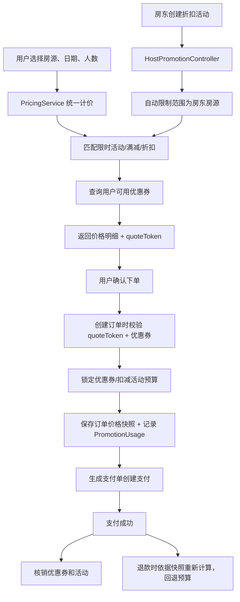

# 历史方案：营销促销架构与数据模型

这是 2026-04 的阶段记录，保留原方案、清单和当时结论，不代表全部重新核对。当前说明见 [[技术设计-统一计价与优惠券]]。

## 二、当前系统改造

当前系统已具备民宿预订的基础能力，本次改造聚焦解决以下问题：

| 问题 | 改造前现状 | 影响 |
|---|---|---|
| 下单计价 | `OrderLifecycleServiceImpl.createOrder` 用 `单价 * 天数 + 清洁费 + 服务费` 计算 | 不支持活动、周末/节假日加价 |
| 实时报价 | `OrderServiceImpl.calculatePrice` 不支持满减、折扣、券 | 用户看到的价格和实际支付可能不一致 |
| 价格明细 | `orders` 只有 `price`、`total_amount` 等少数字段 | 缺少优惠明细和价格快照，难以追溯 |
| 房东收益 | `EarningServiceImpl` 用 `order.totalAmount * hostShareRate` 计算 | 无法区分平台承担和房东承担的优惠 |
| 管理后台 | 无活动管理、优惠券管理模块 | 不适合运营人员维护营销活动 |
| 房东营销 | 房东无法自主设置房源折扣 | 房东缺乏促销手段 |
| 预算控制 | 活动预算只有字段，无实际扣减 | 预算超支风险 |

**核心改造文件：**

- `homestay-backend/src/main/java/.../service/PricingService.java`
- `homestay-backend/src/main/java/.../service/impl/OrderLifecycleServiceImpl.java`
- `homestay-backend/src/main/java/.../service/impl/OrderServiceImpl.java`
- `homestay-backend/src/main/java/.../service/impl/EarningServiceImpl.java`
- `homestay-backend/src/main/java/.../service/impl/CouponServiceImpl.java`
- `homestay-backend/src/main/java/.../service/impl/PromotionMatchServiceImpl.java`
- `homestay-backend/src/main/java/.../controller/HostPromotionController.java`（新增）
- `homestay-backend/src/main/java/.../controller/AdminPromotionController.java`
- `homestay-backend/src/main/resources/db/migration/V32__promotion_phase2.sql`（新增）
- `homestay-front/src/views/host/HostPromotionManage.vue`（新增）
- `homestay-front/src/views/host/HostPromotionStats.vue`（新增）
- `homestay-front/src/views/host/HostLayout.vue`
- `homestay-front/src/api/hostPromotion.ts`（新增）
- `homestay-admin/src/views/marketing/CampaignList.vue`
- `homestay-admin/src/views/marketing/CouponTemplateList.vue`
- `homestay-admin/src/views/marketing/MarketingDashboard.vue`（新增）
- `homestay-admin/src/config/menu.ts`
- `homestay-admin/src/router/index.ts`


## 三、系统架构

### 价格计算链路



### 推荐服务分层

| 服务 | 职责 |
|---|---|
| `PricingService` | 唯一计价入口，计算价格明细和生成快照 |
| `PromotionMatchService` | 匹配活动规则，计算房源折扣/满减，预算扣减/回退 |
| `CouponService` | 领券/查券/计算/锁定/释放/核销，返回承担方信息 |
| `OrderPriceSnapshotService` | 订单价格快照持久化 |
| `PromotionAdminService` | 管理后台活动/券模板维护 |
| `HostPromotionController` | 房东端活动管理和统计 |


## 四、优惠类型设计

### 1. 平台优惠券（已实现 MVP）

用户领取后使用。

支持类型：

- 现金券（如 500 减 50）
- 折扣券（如 9 折，最高减 100）
- 满减券（如满 800 减 80）

关键流程：

- 用户领取后写入 `user_coupon`
- 下单前可查询可用券
- 下单过程中锁定券
- 支付成功后核销券
- 未支付取消时释放券
- 支付后退款时券默认不退（简化处理）

**承担方支持（第二期新增）：**
- 券模板增加 `subsidy_bearer` 字段（`PLATFORM`/`HOST`/`MIXED`）
- 默认 `PLATFORM`（兼容历史数据）
- `PricingService` 按承担方将券金额拆分到 `platformDiscountAmount` / `hostDiscountAmount`

### 2. 满减活动（已实现）

订单满额自动减免。

示例：

- 满 800 减 80
- 连住 3 晚减 100
- 指定房源满 1000 减 120

### 3. 限时活动（房东折扣，第二期已实现）

活动期间的房源折扣。

示例：

- 五一预售：指定房源 8.5 折
- 周末特惠：周五到周日下单减 50
- 新客首单：指定房源类型首单 9 折

关键能力：

- 房东在房东端创建活动（`HostPromotionController`）
- 自动限制范围为该房东的所有房源
- `subsidyBearer` 强制为 `HOST`
- 支持预算上限、预警、耗尽自动结束

### 4. 房东优惠承担（第二期已实现）

房东维度的促销。

关键能力：

- 房东折扣不影响房源展示价
- 平台收益按折扣前计算
- `hostReceivableAmount` = 原始房费 - 房东承担优惠
- 管理后台展示优惠承担方


## 五、统一计价模型

统一计价顺序（固定不变）：

```text
每日基础房价
  -> 周末/节假日加价系数
  -> 房源/活动折扣
  -> 满减
  -> 优惠券（按承担方拆分）
  -> 清洁费
  -> 服务费
  -> 实付金额
```

### 计价结果字段

| 字段 | 说明 |
|---|---|
| `roomOriginalAmount` | 未优惠前房费合计 |
| `dailyPriceJson` | 每日价格明细 |
| `activityDiscountAmount` | 限时活动优惠 |
| `fullReductionAmount` | 满减优惠 |
| `couponDiscountAmount` | 优惠券优惠 |
| `platformDiscountAmount` | 平台承担的优惠（活动+券） |
| `hostDiscountAmount` | 房东承担的优惠（活动+券） |
| `discountedRoomAmount` | 优惠后房费 |
| `cleaningFee` | 清洁费 |
| `serviceFee` | 服务费 |
| `payableAmount` | 用户最终支付金额 |
| `hostReceivableAmount` | 房东应收到金额 |
| `platformSubsidyAmount` | 平台补贴成本 |

### 计价公式

```text
roomOriginalAmount = sum(dailyPrices)
discountedRoomAmount = max(roomOriginalAmount - activityDiscount - fullReduction - couponDiscount, 0)
serviceFee = discountedRoomAmount * serviceFeeRate
payableAmount = discountedRoomAmount + cleaningFee + serviceFee
hostReceivableAmount = roomOriginalAmount - hostDiscountAmount
platformSubsidyAmount = platformDiscountAmount
```

> [!warning] 统一计价改造核心
> 当前"实时计算"和"下单计算"使用不同逻辑。营销系统落地前已把 `OrderLifecycleServiceImpl.createOrder` 和 `OrderServiceImpl.calculatePrice` 全部收敛到统一 `PricingService`，彻底解决报价不一致问题。


## 六、数据模型

### 1. 活动表 `promotion_campaign`

| 字段 | 类型 | 说明 |
|---|---|---|
| `id` | BIGINT | 主键 |
| `name` | VARCHAR | 活动名称 |
| `campaign_type` | VARCHAR | `FLASH_SALE`、`FULL_REDUCTION`、`HOMESTAY_DISCOUNT` |
| `status` | VARCHAR | `DRAFT`、`ACTIVE`、`PAUSED`、`ENDED` |
| `start_at` | DATETIME | 开始时间 |
| `end_at` | DATETIME | 结束时间 |
| `priority` | INT | 优先级，数值越大越优先 |
| `stackable` | BOOLEAN | 是否可与其他活动叠加 |
| `budget_total` | DECIMAL | 总预算，可为空 |
| `budget_used` | DECIMAL | 已使用预算 |
| `budget_alert_threshold` | DECIMAL(5,2) | 预算预警阈值，默认 0.80（第二期新增） |
| `budget_alert_triggered` | BOOLEAN | 是否已触发预算预警（第二期新增） |
| `subsidy_bearer` | VARCHAR | `PLATFORM`、`HOST`、`MIXED` |
| `host_id` | BIGINT | 房东用户ID，平台活动为 NULL（第二期新增） |
| `created_by` | VARCHAR | 创建人 |
| `created_at` | DATETIME | 创建时间 |
| `updated_at` | DATETIME | 更新时间 |

### 2. 活动规则表 `promotion_rule`

| 字段 | 类型 | 说明 |
|---|---|---|
| `id` | BIGINT | 主键 |
| `campaign_id` | BIGINT | 活动 ID |
| `rule_type` | VARCHAR | `AMOUNT_OFF`、`PERCENT_OFF`、`FULL_REDUCTION`、`PER_NIGHT_OFF` |
| `threshold_amount` | DECIMAL | 门槛金额 |
| `discount_amount` | DECIMAL | 固定优惠金额 |
| `discount_rate` | DECIMAL | 折扣率，如 0.9 |
| `max_discount` | DECIMAL | 最大优惠金额 |
| `min_nights` | INT | 最小入住天数 |
| `max_nights` | INT | 最大入住天数 |
| `scope_type` | VARCHAR | `ALL`、`CITY`、`HOMESTAY`、`GROUP`、`HOST`、`TYPE` |
| `scope_value_json` | TEXT | 适用范围 JSON |
| `first_order_only` | BOOLEAN | 是否首单 |

### 3. 优惠券模板表 `coupon_template`

| 字段 | 类型 | 说明 |
|---|---|---|
| `id` | BIGINT | 主键 |
| `name` | VARCHAR | 券名称 |
| `coupon_type` | VARCHAR | `CASH`、`DISCOUNT`、`FULL_REDUCTION` |
| `face_value` | DECIMAL | 面值 |
| `discount_rate` | DECIMAL | 折扣率 |
| `threshold_amount` | DECIMAL | 使用门槛 |
| `max_discount` | DECIMAL | 最大优惠金额 |
| `total_stock` | INT | 总库存 |
| `issued_count` | INT | 已领取数量 |
| `per_user_limit` | INT | 每用户领取上限 |
| `valid_type` | VARCHAR | `FIXED_TIME`、`AFTER_CLAIM_DAYS` |
| `valid_days` | INT | 领取后有效天数 |
| `valid_start_at` | DATETIME | 固定有效期开始 |
| `valid_end_at` | DATETIME | 固定有效期结束 |
| `scope_type` | VARCHAR | 适用范围 |
| `scope_value_json` | TEXT | 适用范围 JSON |
| `status` | VARCHAR | `DRAFT`、`ACTIVE`、`PAUSED`、`EXPIRED` |
| `subsidy_bearer` | VARCHAR | `PLATFORM`/`HOST`/`MIXED`，默认 `PLATFORM`（第二期新增） |
| `host_id` | BIGINT | 房东用户ID，平台券为 NULL（第二期新增） |

### 4. 用户优惠券表 `user_coupon`

| 字段 | 类型 | 说明 |
|---|---|---|
| `id` | BIGINT | 主键 |
| `template_id` | BIGINT | 券模板 ID |
| `user_id` | BIGINT | 用户 ID |
| `coupon_code` | VARCHAR | 券码 |
| `status` | VARCHAR | `AVAILABLE`、`LOCKED`、`USED`、`EXPIRED` |
| `locked_order_id` | BIGINT | 锁定订单 |
| `locked_at` | DATETIME | 锁定时间 |
| `used_order_id` | BIGINT | 使用订单 |
| `used_at` | DATETIME | 使用时间 |
| `expire_at` | DATETIME | 过期时间 |
| `snapshot_face_value` | DECIMAL(12,2) | 领取时模板面值快照 |
| `snapshot_discount_rate` | DECIMAL(3,2) | 领取时折扣率快照 |
| `snapshot_threshold_amount` | DECIMAL(12,2) | 领取时门槛金额快照 |
| `snapshot_max_discount` | DECIMAL(12,2) | 领取时最大优惠快照 |
| `snapshot_scope_type` | VARCHAR(50) | 领取时适用范围类型快照 |
| `snapshot_scope_value_json` | TEXT | 领取时适用范围值快照 |
| `snapshot_subsidy_bearer` | VARCHAR(50) | 领取时承担方快照 |
| `created_at` | DATETIME | 创建时间 |

### 5. 订单价格快照表 `order_price_snapshot`

| 字段 | 类型 | 说明 |
|---|---|---|
| `id` | BIGINT | 主键 |
| `order_id` | BIGINT | 订单 ID |
| `quote_token` | VARCHAR | 报价令牌 |
| `room_original_amount` | DECIMAL | 原始房费 |
| `daily_price_json` | TEXT | 每日价格 |
| `activity_discount_amount` | DECIMAL | 活动优惠 |
| `full_reduction_amount` | DECIMAL | 满减优惠 |
| `coupon_discount_amount` | DECIMAL | 券优惠 |
| `platform_discount_amount` | DECIMAL | 平台承担 |
| `host_discount_amount` | DECIMAL | 房东承担 |
| `cleaning_fee` | DECIMAL | 清洁费 |
| `service_fee` | DECIMAL | 服务费 |
| `payable_amount` | DECIMAL | 实付金额 |
| `host_receivable_amount` | DECIMAL | 房东应收金额 |
| `pricing_detail_json` | TEXT | 详细计价明细 |
| `created_at` | DATETIME | 创建时间 |

### 6. 优惠使用流水表 `promotion_usage`

| 字段 | 类型 | 说明 |
|---|---|---|
| `id` | BIGINT | 主键 |
| `order_id` | BIGINT | 订单 ID |
| `user_id` | BIGINT | 用户 ID |
| `campaign_id` | BIGINT | 活动 ID |
| `coupon_id` | BIGINT | 用户券 ID |
| `discount_amount` | DECIMAL | 优惠金额 |
| `bearer` | VARCHAR | `PLATFORM` 或 `HOST` |
| `status` | VARCHAR | `LOCKED`、`USED`、`RELEASED`、`REFUNDED` |
| `created_at` | DATETIME | 创建时间 |

### 推荐索引

- `promotion_campaign(status, start_at, end_at)`
- `promotion_campaign(host_id, status)`（第二期新增）
- `promotion_rule(campaign_id, rule_type)`
- `coupon_template(status, valid_start_at, valid_end_at)`
- `coupon_template(host_id, status)`（第二期新增）
- `user_coupon(user_id, status, expire_at)`
- `promotion_usage(order_id)`
- `promotion_usage(user_id, campaign_id)`
- `order_price_snapshot(order_id)`


## 七、后端接口设计

### 用户端接口

| 方法 | 路径 | 说明 |
|---|---|---|
| `POST` | `/api/pricing/quote` | 统一实时报价 |
| `GET` | `/api/coupons/available` | 查询当前可用优惠券 |
| `GET` | `/api/coupons/mine` | 查询我的优惠券 |
| `POST` | `/api/coupons/{templateId}/claim` | 领取优惠券 |
| `POST` | `/api/orders` | 创建订单（携带 `quoteToken` 和 `couponIds`） |

### 房东端接口（第二期新增）

| 方法 | 路径 | 说明 |
|---|---|---|
| `GET` | `/api/host/promotions/campaigns` | 查询当前房东的活动列表 |
| `POST` | `/api/host/promotions/campaigns` | 创建房东折扣活动 |
| `PUT` | `/api/host/promotions/campaigns/{id}` | 修改活动（仅自己创建） |
| `POST` | `/api/host/promotions/campaigns/{id}/pause` | 暂停活动 |
| `POST` | `/api/host/promotions/campaigns/{id}/end` | 结束活动 |
| `GET` | `/api/host/promotions/statistics` | 房东自己的活动效果统计 |

创建活动时的限制：
- `campaignType` 只允许 `HOMESTAY_DISCOUNT` 或 `FLASH_SALE`
- `subsidyBearer` 强制为 `HOST`
- 规则 `scope_type` 自动设为 `HOST`，范围自动填入房东所有房源ID
- `budget_total` 可为空（表示无限制）

### 管理端接口

| 方法 | 路径 | 说明 |
|---|---|---|
| `GET` | `/api/admin/promotions/campaigns` | 活动列表（支持搜索/筛选） |
| `POST` | `/api/admin/promotions/campaigns` | 创建活动 |
| `PUT` | `/api/admin/promotions/campaigns/{id}` | 更新活动 |
| `POST` | `/api/admin/promotions/campaigns/{id}/publish` | 发布活动 |
| `POST` | `/api/admin/promotions/campaigns/{id}/pause` | 暂停活动 |
| `DELETE` | `/api/admin/promotions/campaigns/{id}` | 删除活动（仅 DRAFT） |
| `GET` | `/api/admin/coupons/templates` | 券模板列表（支持搜索/筛选） |
| `POST` | `/api/admin/coupons/templates` | 创建券模板 |
| `PUT` | `/api/admin/coupons/templates/{id}` | 更新券模板 |
| `DELETE` | `/api/admin/coupons/templates/{id}` | 删除券模板（仅 DRAFT） |
| `GET` | `/api/admin/promotions/usages` | 优惠使用流水 |
| `GET` | `/api/admin/promotions/statistics` | 活动效果统计（支持时间/类型/承担方筛选） |


## 十、叠加规则

第一版本使用如下叠加规则：

| 组合 | 规则 |
|---|---|
| 平台活动 + 平台券 | 默认可叠加 ✅ |
| 满减活动 + 平台券 | 可叠加 ✅ |
| 限时折扣 + 满减 | 同类型默认不可叠加（取最优） |
| 多张优惠券 | 同一订单只使用一张 ✅ |
| 活动 + 房东券 | 互斥（默认不可叠加） |

**叠加优先级逻辑：**

1. 按优先级筛选最优活动
2. 如活动不可叠加，选择用户优惠最大的一项
3. 如活动可叠加，按固定顺序计算
4. 优惠总额不得出现负数或超过房费
5. 平台承担和房东承担分别记录


## 十一、安全和补偿

### 需要处理的安全问题：

- [x] 同一券码不能重复使用（数据库唯一约束 + 状态校验）
- [x] 活动预算不能超扣（乐观锁扣减 + 耗尽自动结束）
- [x] 活动状态不能越过边界（状态机校验）
- [x] 用户不能通过修改前端参数绕过优惠校验（后端以快照为准）
- [x] 价格不能为负数（校验逻辑）
- [x] 房东只能修改自己创建的活动（`hostId` 权限校验）

### 补偿机制：

- `quoteToken` 有效期 10 分钟
- 下单时后端重新校验优惠可用性
- 优惠券状态转换在数据库事务内完成
- 活动预算扣减使用数据库乐观锁
- 支付回调做幂等处理
- 取消订单时释放优惠券并回退活动预算
- 管理后台操作写 `operation_log`

### 关键校验清单：

```text
用户是否拥有该优惠券
优惠券状态是否 AVAILABLE
优惠券是否过期
订单金额是否满足门槛
房源/城市/类型是否在适用范围
活动状态是否 ACTIVE
活动时间是否覆盖当前下单时间
活动预算是否足够
优惠金额是否超过最大优惠限额
房东是否有权限操作该活动
```
